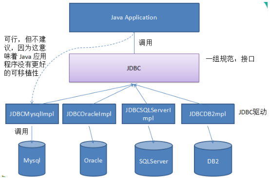

# 第一章  JDBC概述

之前我们学习了JavaSE，编写了Java程序，数据保存在变量、数组、集合等中，无法持久化，后来学习了IO流可以将数据写入文件，但不方便管理数据以及维护数据的关系；

后来我们学习了数据库管理软件MySQL，可以方便的管理数据。

那么如何将它俩结合起来呢？即Java程序<==>MySQL，实现数据的存储和处理。

答案：使用JDBC技术，后期可以使用MyBatis等持久层框架（底层仍然使用了JDBC）。

## 1.1 JDBC概述

JDBC：Java Database Connectivity，它是代表一组独立于任何数据库管理系统（DBMS）的API，声明在java.sql与javax.sql包中，是SUN(现在Oracle)提供的一组接口规范。由各个数据库厂商来提供实现类，这些实现类的集合构成了数据库驱动jar。



即JDBC技术包含两个部分：

（1）java.sql包和javax.sql包中的API

> 因为为了项目代码的可移植性，可维护性，SUN公司从最初就制定了Java程序连接各种数据库的统一接口规范。这样的话，不管是连接哪一种DBMS软件，Java代码可以保持一致性。

（2）各个数据库厂商提供的jar

> 因为各个数据库厂商的DBMS软件各有不同，那么内部如何通过sql实现增、删、改、查等管理数据，只有这个数据库厂商自己更清楚，因此把接口规范的实现交给各个数据库厂商自己实现。

```java
package com.atguigu.jdbc;

/*
一、JDBC的概述
1、之前学习了Java，又学习了MySQL数据库
JDBC 把  Java程序 和 MySQL数据库连起来，Java程序是负责数据的输入，业务的处理，数据的显示，MySQL负责数据的存储和管理。

2、JDBC：Java Database Connectivity
JDBC = JDK核心类库中的一套API（接口+部分工具类） + 数据库厂商提供的驱动jar


Java程序不仅仅能够连接MySQL数据库，可以连接很多数据库（Oracle，SQL Server，DB2，...）。
这就有一个问题？
    数据库不同，它们的操作方式会有所不同，因为它们的底层实现方式，实现的语言等都是不同的。
    那么Java去连接不同的数据库时，就会有不同的API。这样的话，就会导致：
    （1）程序员的学习成本增加
    （2）如果发生数据库迁移，Java代码就需要“重写”
    如果是这样的话，就非常麻烦，可移植性、可维护性等非常差。

SUN公司（现在Oracle）就说，必须统一一套API，可以操作各种数据库。但是SUN公司又不同知道所有数据库内部是如何实现的，
也无法要求所有的数据库厂商按照统一的标准来开发他们的数据库软件。
SUN公司（现在Oracle）就设计了一套接口 + 部分类。然后各个数据库厂商，来提供这些接口的实现类。

==>Java程序中面向接口编程，在程序运行时，又需要引入这些接口的实现类，这些实现类就是数据库驱动jar。


 */
public class TestJDBC {
}

```


## 1.2 Java程序连接MySQL数据库

### 1.2.1 引入mysql驱动jar

#### 方式一：单独某个模块使用mysql驱动

```
（1）在模块路径下建一个文件夹“jdbclibs”，把mysql的驱动jar放到里面
MySQL5.7：mysql-connector-java-5.1.36-bin.jar
MySQL8.0：mysql-connector-java-8.0.19.jar
（2）在jdbclibs文件夹上右键-->Add as Library...
（3）填写库名称、选择这个库应用范围（模块）-->选择使用的具体模块
```


#### 方式二：项目下多个模块使用mysql驱动

```
（1）在项目路径下建一个文件夹“jdbclibrary”，把mysql的驱动jar放到里面
mysql-connector-java-5.1.36-bin.jar
MySQL8.0：mysql-connector-java-8.0.19.jar
（2）项目设置-->libraries--> + ->java-->文件夹“jdbclibs”
（3）选择需要这个jar的模块
项目设置-->modules-->模块名-->dependencies--> + - >library->Java -> 库
```


后期其他模块也要使用mysql驱动，可以直接添加项目的jdbclibrary库即可：


#### 方式三：使用Maven仓库（后期大家学习）

### 12.2.2 Java代码连接MySQL数据库

```java
/*步骤：
1、模块添加了依赖的mysql驱动相关库

2、在内存中加载驱动类（可选）
        更早版本mysql驱动类：org.gjt.mm.mysql.Driver
        最近版本：com.mysql.jdbc.Driver
        MySQL8.0版本：com.mysql.cj.jdbc.Driver
 
  //新版的mysql驱动jar可以省略这步，旧版的mysql驱动jar必须加这一步。
  // 因为新版mysql驱动jar包下有一个META-INF/services/java.sql.Driver文件
  //里面有填写mysql驱动类的全名称，DriverManager会自动读取这个文件，并加载对应的驱动类
  //后期使用数据库连接池，或者MyBatis等框架时，在配置文件中加这个驱动类的配置即可
 Class.forName("com.mysql.cj.jdbc.Driver"); 

3、连接数据库：通过DriverManager工具类获取数据库连接Connection的对象。
此时的Java程序是MySQL的一个客户端
连接数据库：
     MySQL服务器主机的IP地址：
     端口号
     用户名
     密码
网址：http://www.atguigu.com

    String url = "jdbc:mysql://localhost:3306/test?serverTimezone=UTC";
    Connection conn = DriverManager.getConnection(url, "root", "123456");
    
    MySQL8使用时，url需要加参数：serverTimezone=UTC，否则会报错：
    Exception in thread "main" java.sql.SQLException: The server time zone value '�й���׼ʱ��' is unrecognized or represents more than one time zone. You must configure either the server or JDBC driver (via the 'serverTimezone' configuration property) to use a more specifc time zone value if you want to utilize time zone support.


4、断开连接：使用close方法。
 */
```


```java
package com.atguigu.jdbc;

import java.sql.Connection;
import java.sql.DriverManager;

public class TestJDBC {
    public static void main(String[] args)throws Exception {
        Class.forName("com.mysql.cj.jdbc.Driver");
        Connection conn =  DriverManager.getConnection("jdbc:mysql://localhost:3306/atguigu?serverTimezone=UTC","root","123456");
        System.out.println("conn = " + conn);
        conn.close();
    }
}
```


## 1.3 实现增删改查

```java
/*步骤：
1、模块添加了依赖的mysql驱动相关库

2、在内存中加载驱动类（可选）
 Class.forName("com.mysql.cj.jdbc.Driver"); 

3、连接数据库
通过DriverManager工具类获取数据库连接Connection的对象。
    String url = "jdbc:mysql://localhost:3306/test?serverTimezone=UTC";
    Connection conn = DriverManager.getConnection(url, "root", "123456");

 4、操作数据库
（1）通过Connection对象获取Statement或PreparedStatement对象
（2）通过Statement或PreparedStatement对象执行sql
执行增、删、改：int executeUpate()
执行查询：ResultSet executeQuery()
（3）如果服务器有查询结果返回，需要用ResultSet接收
遍历结果集的方法：
boolean next()：判断是否还有下一行
getString(字段名或序号),getInt(字段名或序号),getObject(字段名或序号)

5、释放资源（close）
 */
```

### 1.3.1 添加数据

```java
package com.atguigu.crud;

import java.sql.Connection;
import java.sql.DriverManager;
import java.sql.PreparedStatement;

/*
用JDBC实现添加一条记录到atguigu数据库的t_department表中。

mysql> desc t_department;
+-------------+--------------+------+-----+---------+----------------+
| Field       | Type         | Null | Key | Default | Extra          |
+-------------+--------------+------+-----+---------+----------------+
| did         | int          | NO   | PRI | NULL    | auto_increment |
| dname       | varchar(20)  | NO   | UNI | NULL    |                |
| description | varchar(200) | YES  |     | NULL    |                |
+-------------+--------------+------+-----+---------+----------------+
3 rows in set (0.01 sec)


mysql> select * from t_department;
+-----+--------+------------------+
| did | dname  | description      |
+-----+--------+------------------+
|   1 | 研发部 | 负责研发工作     |
|   2 | 人事部 | 负责人事管理工作 |
|   3 | 市场部 | 负责市场推广工作 |
|   4 | 财务部 | 负责财务管理工作 |
|   5 | 后勤部 | 负责后勤保障工作 |
|   6 | 测试部 | 负责测试工作     |
+-----+--------+------------------+
6 rows in set (0.00 sec)

步骤：
1、一个项目引入一次数据库驱动jar就可以
2、建立数据库连接
（1）加载驱动类：通过Class类的forName方法注册驱动
（2）获取数据库连接
通过DriverManager类的静态方法获取数据库连接对象
3、通过数据库连接对象获取Statement或PreparedStatement对象，用来执行sql
4、通过Statement或PreparedStatement对象调用
（1）int executeUpdate()：执行insert,update,delete等更新数据库数据的sql

5、关闭，释放各种资源
 */
public class TestInsert {
    public static void main(String[] args)throws Exception {
        //把驱动类加载到内存中
        Class.forName("com.mysql.cj.jdbc.Driver");
        //B：获取数据库连接对象
        String url = "jdbc:mysql://localhost:3306/atguigu?serverTimezone=UTC";
        Connection connection = DriverManager.getConnection(url,"root","123456");
        //Connection   ==> 网络编程的Socket

        String sql = "insert into t_department values(null,'测试数据部门','测试数据部门简介')";//发给服务器的sql
        PreparedStatement pst = connection.prepareStatement(sql);
        //PreparedStatement ==> IO流  网络编程的socket.getOutputStream()发生数据用的
        int len = pst.executeUpdate();
        //返回sql影响的记录数
        System.out.println(len>0 ? "添加成功" : "添加失败");

        pst.close();
        connection.close();
        /*
mysql> select * from t_department;
+-----+--------------+------------------+
| did | dname        | description      |
+-----+--------------+------------------+
|   1 | 研发部       | 负责研发工作     |
|   2 | 人事部       | 负责人事管理工作 |
|   3 | 市场部       | 负责市场推广工作 |
|   4 | 财务部       | 负责财务管理工作 |
|   5 | 后勤部       | 负责后勤保障工作 |
|   6 | 测试部       | 负责测试工作     |
|   7 | 测试数据部门 | 测试数据部门简介 |
+-----+--------------+------------------+
7 rows in set (0.00 sec)
         */
    }
}

```


### 1.3.2 修改数据

```java
package com.atguigu.crud;

import java.sql.Connection;
import java.sql.DriverManager;
import java.sql.PreparedStatement;

public class TestUpdate {
    public static void main(String[] args)throws Exception {
        //把驱动类加载到内存中
        Class.forName("com.mysql.cj.jdbc.Driver");
        //B：获取数据库连接对象
        String url = "jdbc:mysql://localhost:3306/atguigu?serverTimezone=UTC";
        Connection connection = DriverManager.getConnection(url, "root", "123456");
        //Connection   ==> 网络编程的Socket

        String sql = "update t_department set description = 'xx' where did = 7";//发给服务器的sql
        PreparedStatement pst = connection.prepareStatement(sql);
        //PreparedStatement ==> IO流  网络编程的socket.getOutputStream()发生数据用的
        int len = pst.executeUpdate();
        //返回sql影响的记录数
        System.out.println(len > 0 ? "修改成功" : "修改失败");

        pst.close();
        connection.close();
    }
}
/*
mysql> select * from t_department;
+-----+--------------+------------------+
| did | dname        | description      |
+-----+--------------+------------------+
|   1 | 研发部       | 负责研发工作     |
|   2 | 人事部       | 负责人事管理工作 |
|   3 | 市场部       | 负责市场推广工作 |
|   4 | 财务部       | 负责财务管理工作 |
|   5 | 后勤部       | 负责后勤保障工作 |
|   6 | 测试部       | 负责测试工作     |
|   7 | 测试数据部门 | xx               |
+-----+--------------+------------------+
7 rows in set (0.00 sec)
 */
```


### 1.3.3 删除数据

```java
package com.atguigu.crud;

import java.sql.Connection;
import java.sql.DriverManager;
import java.sql.PreparedStatement;

public class TestDelete {
    public static void main(String[] args)throws Exception {
        //把驱动类加载到内存中
        Class.forName("com.mysql.cj.jdbc.Driver");
        //B：获取数据库连接对象
        String url = "jdbc:mysql://localhost:3306/atguigu?serverTimezone=UTC";
        Connection connection = DriverManager.getConnection(url, "root", "123456");
        //Connection   ==> 网络编程的Socket

        String sql = "delete from t_department where did = 7";//发给服务器的sql
        PreparedStatement pst = connection.prepareStatement(sql);
        //PreparedStatement ==> IO流  网络编程的socket.getOutputStream()发生数据用的
        int len = pst.executeUpdate();
        //返回sql影响的记录数
        System.out.println(len > 0 ? "删除成功" : "删除失败");

        pst.close();
        connection.close();
    }
}
/*
mysql> select * from t_department;
+-----+--------+------------------+
| did | dname  | description      |
+-----+--------+------------------+
|   1 | 研发部 | 负责研发工作     |
|   2 | 人事部 | 负责人事管理工作 |
|   3 | 市场部 | 负责市场推广工作 |
|   4 | 财务部 | 负责财务管理工作 |
|   5 | 后勤部 | 负责后勤保障工作 |
|   6 | 测试部 | 负责测试工作     |
+-----+--------+------------------+
6 rows in set (0.00 sec)
 */
```


### 1.3.4 查询数据

```java
package com.atguigu.crud;

import java.sql.Connection;
import java.sql.DriverManager;
import java.sql.PreparedStatement;
import java.sql.ResultSet;

/*
步骤：
1、一个项目引入一次数据库驱动jar就可以
2、建立数据库连接
（1）加载驱动类：通过Class类的forName方法注册驱动
（2）获取数据库连接
通过DriverManager类的静态方法获取数据库连接对象
3、通过数据库连接对象获取Statement或PreparedStatement对象，用来执行sql
4、通过Statement或PreparedStatement对象调用
（1）int executeUpdate()：执行insert,update,delete等更新数据库数据的sql
（2）ResultSet executeQuery()：执行select查询的sql，返回一个结果集
（3）boolean execute()：可以用来执行DDL语句


遍历结果集ResultSet的方法：
boolean next()：判断是否还有下一行
getString(字段名或序号),getInt(字段名或序号),getObject(字段名或序号)

5、关闭，释放各种资源
 */
public class TestSelect {
    public static void main(String[] args)throws Exception {
        //把驱动类加载到内存中
        Class.forName("com.mysql.cj.jdbc.Driver");
        //B：获取数据库连接对象
        String url = "jdbc:mysql://localhost:3306/atguigu?serverTimezone=UTC";
        Connection connection = DriverManager.getConnection(url, "root", "123456");
        //Connection   ==> 网络编程的Socket

        String sql = "select * from t_department";//发给服务器的sql
        PreparedStatement pst = connection.prepareStatement(sql);
        //PreparedStatement ==> IO流  网络编程的socket.getOutputStream()发生数据用的

        ResultSet resultSet = pst.executeQuery();//==>IO流  输入流，又像是集合和迭代器的集成
        while(resultSet.next()){ //while循环一次，迭代一行，遍历一行
            int did = resultSet.getInt("did");//get一次得到一个单元格的数据
            String dname = resultSet.getString("dname");
            String decription = resultSet.getString("description");
            System.out.println(did +"\t" + dname +"\t" + decription);
        }

        resultSet.close();
        pst.close();
        connection.close();
    }
}
```


# 第二章 轻松处理各种问题

## 2.1 避免sql拼接问题

### 准备代码和sql

```mysql
        Scanner input = new Scanner(System.in);
        System.out.print("请输入姓名：");
        String ename = input.next();//李四

        System.out.print("请输入薪资：");
        double salary = input.nextDouble();//15000

        System.out.print("请输入出生日期：");
        String birthday = input.next();//1990-1-1

        System.out.print("请输入性别：");
        char gender = input.next().charAt(0);//男

        System.out.print("请输入手机号码：");
        String tel = input.next();//13578595685

        System.out.print("请输入邮箱：");
        String email = input.next();//zhangsan@atguigu.com
        
        input.close();
```

```mysql
INSERT INTO t_employee(ename,salary,birthday,gender,tel,email,hiredate)VALUES(值列表);
```


### 问题演示代码


```java
package com.atguigu.problem;

import org.junit.Test;

import java.sql.Connection;
import java.sql.DriverManager;
import java.sql.PreparedStatement;
import java.util.Date;
import java.util.Scanner;

/*
避免sql拼接问题

演示：从键盘输入数据，存储到atguigu数据库的t_employee表中。

mysql> desc t_employee;
+----------------+----------------------------------+------+-----+---------+----------------+
| Field          | Type                             | Null | Key | Default | Extra          |
+----------------+----------------------------------+------+-----+---------+----------------+
| eid            | int                              | NO   | PRI | NULL    | auto_increment |
| ename          | varchar(20)                      | NO   |     | NULL    |                |
| salary         | double                           | NO   |     | NULL    |                |
| commission_pct | decimal(3,2)                     | YES  |     | NULL    |                |
| birthday       | date                             | NO   |     | NULL    |                |
| gender         | enum('男','女')                  | NO   |     | 男      |                |
| tel            | char(11)                         | NO   |     | NULL    |                |
| email          | varchar(32)                      | NO   |     | NULL    |                |
| address        | varchar(150)                     | YES  |     | NULL    |                |
| work_place     | set('北京','深圳','上海','武汉') | NO   |     | 北京    |                |
| hiredate       | date                             | NO   |     | NULL    |                |
| job_id         | int                              | YES  | MUL | NULL    |                |
| mid            | int                              | YES  | MUL | NULL    |                |
| did            | int                              | YES  | MUL | NULL    |                |
+----------------+----------------------------------+------+-----+---------+----------------+
14 rows in set (0.00 sec)


PreparedStatement接口是Statement接口的子接口的。
Statement接口是不支持 ？ 形式的sql，只能拼接。
 */
public class TestSQLConcat {
    @Test
    public void test01()throws Exception{
        Scanner input = new Scanner(System.in);
        System.out.print("请输入姓名：");
        String ename = input.next();//李四

        System.out.print("请输入薪资：");
        double salary = input.nextDouble();//15000

        System.out.print("请输入出生日期：");
        String birthday = input.next();//1990-1-1

        System.out.print("请输入性别：");
        char gender = input.next().charAt(0);//男

        System.out.print("请输入手机号码：");
        String tel = input.next();//13578595685

        System.out.print("请输入邮箱：");
        String email = input.next();//zhangsan@atguigu.com

        //A:把驱动类加载到内存中
        Class.forName("com.mysql.cj.jdbc.Driver");
        //B：获取数据库连接对象
        String url = "jdbc:mysql://localhost:3306/atguigu?serverTimezone=UTC";
        Connection connection = DriverManager.getConnection(url,"root","123456");
        //Connection   ==> 网络编程的Socket

        //给t_employee表中的有非空约束的字段赋值，因为work_place有默认值，这里就没有管它
        String sql = "INSERT INTO t_employee(ename,salary,birthday,gender,tel,email,hiredate)VALUES(" +
                "'" + ename +"'," + //这里的'，是mysql中表示字符串和日期的单引号
                salary + "," +
                "'" + birthday +"'," +
                "'" + gender +"'," +
                "'" + tel +"'," +
                "'" + email +"'," +
                "curdate()" +   //mysql中日期函数，获取当前系统时间
                ")";
        //C：通过连接对象，获取PreparedStatement对象
        PreparedStatement pst = connection.prepareStatement(sql);

        //D：执行sql
        int len = pst.executeUpdate();
        System.out.println(len>0 ? "添加成功" : "添加失败");

        //E：释放连接等资源
        pst.close();
        connection.close();
         input.close();
    }

    @Test
    public void test02()throws Exception{
        Scanner input = new Scanner(System.in);
        System.out.print("请输入姓名：");
        String ename = input.next();//李四

        System.out.print("请输入薪资：");
        double salary = input.nextDouble();//15000

        System.out.print("请输入出生日期：");
        String birthday = input.next();//1990-1-1

        System.out.print("请输入性别：");
        char gender = input.next().charAt(0);//男

        System.out.print("请输入手机号码：");
        String tel = input.next();//13578595685

        System.out.print("请输入邮箱：");
        String email = input.next();//zhangsan@atguigu.com

        //A:把驱动类加载到内存中
        Class.forName("com.mysql.cj.jdbc.Driver");
        //B：获取数据库连接对象
        String url = "jdbc:mysql://localhost:3306/atguigu?serverTimezone=UTC";
        Connection connection = DriverManager.getConnection(url,"root","123456");
        //Connection   ==> 网络编程的Socket

        //给t_employee表中的有非空约束的字段赋值，因为work_place有默认值，这里就没有管它
        String sql = "INSERT INTO t_employee(ename,salary,birthday,gender,tel,email,hiredate)VALUES(?,?,?,?,?,?,?)";
        //这里的？就像占位符，表示要给几个字段赋值
        //C：通过连接对象，获取PreparedStatement对象
        PreparedStatement pst = connection.prepareStatement(sql);//此时对sql进行预编译，里面是带？的

        //要给每一个？指定具体的值
        /*
        PreparedStatement支持给每一个字段指定值时，确定数据类型，例如：
        pst.setString(1,ename);
        pst.setDouble(2,salary);
        ...
        但是这样有点麻烦，还要一一去确定数据类型
        PreparedStatement支持用Object统一处理
        pst.setObject(1,ename);
        pst.setObject(2,salary);
         */
        pst.setObject(1,ename);  //这里的1，表示第1个？
        pst.setObject(2,salary);  //这里的2，表示第2个？
        pst.setObject(3,birthday);  //这里的3，表示第3个？
        pst.setObject(4,gender);  //这里的4，表示第4个？
        pst.setObject(5,tel);  //这里的5，表示第5个？
        pst.setObject(6,email);  //这里的6，表示第6个？
        pst.setObject(7,"curdate()");  //这里的7，表示第7个？
        //每一个？与你要赋值的字段对应，不能对错了

        //D：执行sql
        int len = pst.executeUpdate();
        System.out.println(len>0 ? "添加成功" : "添加失败");

        /*
        (1)上面的代码执行出错了：java.sql.SQLException: Data truncated for column 'gender' at row 1
        原因： pst.setObject(4,gender); 把gender自动包装为Character对象
        解决方案：把char类型用String类型表示。

        (2)com.mysql.cj.jdbc.exceptions.MysqlDataTruncation: Data truncation: Incorrect date value: 'curdate()' for column 'hiredate' at row 1
         pst.setObject(7,"curdate()");  "curdate()"代表字符串，setObject把curdate()识别为一个字符串，而不是mysql函数， 这句代码给hiredate字段赋值的是一个String
        hiredate需要的是一个日期。

        解决方案：pst.setObject(7, new Date());
         */

        //E：释放连接等资源
        pst.close();
        connection.close();
        input.close();
    }

    @Test
    public void test03()throws Exception{
        Scanner input = new Scanner(System.in);
        System.out.print("请输入姓名：");
        String ename = input.next();//李四

        System.out.print("请输入薪资：");
        double salary = input.nextDouble();//15000

        System.out.print("请输入出生日期：");
        String birthday = input.next();//1990-1-1

        System.out.print("请输入性别：");
//        char gender = input.next().charAt(0);//男
        String gender = input.next();//男

        System.out.print("请输入手机号码：");
        String tel = input.next();//13578595685

        System.out.print("请输入邮箱：");
        String email = input.next();//zhangsan@atguigu.com

        //A:把驱动类加载到内存中
        Class.forName("com.mysql.cj.jdbc.Driver");
        //B：获取数据库连接对象
        String url = "jdbc:mysql://localhost:3306/atguigu?serverTimezone=UTC";
        Connection connection = DriverManager.getConnection(url,"root","123456");
        //Connection   ==> 网络编程的Socket

        //给t_employee表中的有非空约束的字段赋值，因为work_place有默认值，这里就没有管它
        String sql = "INSERT INTO t_employee(ename,salary,birthday,gender,tel,email,hiredate)VALUES(?,?,?,?,?,?,?)";
        //这里的？就像占位符，表示要给几个字段赋值
        //C：通过连接对象，获取PreparedStatement对象
        PreparedStatement pst = connection.prepareStatement(sql);//此时对sql进行预编译，里面是带？的

        //要给每一个？指定具体的值
        /*
        PreparedStatement支持给每一个字段指定值时，确定数据类型，例如：
        pst.setString(1,ename);
        pst.setDouble(2,salary);
        ...
        但是这样有点麻烦，还要一一去确定数据类型
        PreparedStatement支持用Object统一处理
        pst.setObject(1,ename);
        pst.setObject(2,salary);
         */
        pst.setObject(1,ename);  //这里的1，表示第1个？
        pst.setObject(2,salary);  //这里的2，表示第2个？
        pst.setObject(3,birthday);  //这里的3，表示第3个？
        pst.setObject(4,gender);  //这里的4，表示第4个？
        pst.setObject(5,tel);  //这里的5，表示第5个？
        pst.setObject(6,email);  //这里的6，表示第6个？
        pst.setObject(7, new Date());  //这里的7，表示第7个？
        //每一个？与你要赋值的字段对应，不能对错了

        //D：执行sql
        int len = pst.executeUpdate();
        System.out.println(len>0 ? "添加成功" : "添加失败");

        /*
        上面的代码执行出错了：java.sql.SQLException: Data truncated for column 'gender' at row 1
        原因： pst.setObject(4,gender); 把gender自动包装为Character对象
        解决方案：把char类型用String类型表示。
         */

        //E：释放连接等资源
        pst.close();
        connection.close();
         input.close();
    }
}
```

## 2.2 避免sql注入问题

### 准备代码和sql

```java
Scanner input = new Scanner(System.in);
System.out.print("请输入你要查询的员工的编号：");
String id = input.nextLine();
input.close();
```

```mysql
select * from t_employee where eid = 值;
//解决：
使用preparedStatement的方式去设置参数
通过pst.getGeneratedKeys();得到结果集，通过next()遍历得到结果。
```

### 问题演示代码

```java
package com.atguigu.problem;

import org.junit.Test;

import java.sql.Connection;
import java.sql.DriverManager;
import java.sql.PreparedStatement;
import java.sql.ResultSet;
import java.util.Scanner;

/*
避免sql注入问题

演示：从键盘输入员工编号，查询员工信息。每一个员工都可以输入自己的编号，查看自己的信息。
 */
public class TestSQLInject {
    @Test
    public void test01()throws Exception{
        Scanner input = new Scanner(System.in);
        System.out.print("请输入你要查询的员工的编号：");
        String id = input.nextLine();
        // 第一种正常输入：1
        // 第二种恶意输入：1 or 1=1  第一个1表示员工编号， 后面 or 1= 1表示条件，而1=1是永远成立，其他条件全部失效

        //把驱动类加载到内存中
        Class.forName("com.mysql.cj.jdbc.Driver");
        //B：获取数据库连接对象
        String url = "jdbc:mysql://localhost:3306/atguigu?serverTimezone=UTC";
        Connection connection = DriverManager.getConnection(url, "root", "123456");
        //Connection   ==> 网络编程的Socket

        String sql = "select * from t_employee where eid = " + id;
        System.out.println("sql = " + sql);//select * from t_employee where eid = 1 or 1=1
        PreparedStatement pst = connection.prepareStatement(sql);

        //执行查询
        ResultSet rs = pst.executeQuery();
        /*
        ResultSet接口提供了
        (1)boolean next()：判断是否有下一条记录
        (2)获取某个单元格的数据
        String getString(字段名)
        int getInt(字段名)
        double getDouble(字段名)
        ...

        有点麻烦，需要一一去对应字段名
        Object getObject(字段名)
        Object getObject(字段的序号)  从1开始。
         */
        while(rs.next()){//while循环一次，代表一行
            //t_employee有14个字段
            for(int i=1; i<=14; i++){//for循环一次，代表一行中的一个单元格
                System.out.print(rs.getObject(i)+"\t");
            }
            System.out.println();
        }

        rs.close();
        pst.close();
        connection.close();
        input.close();
/*
用户输入 1 or 1=1，盗取了表中的所有数据。
1	孙洪亮	28000.0	0.65	1980-10-08	男	13789098765	shl@atguigu.com	白庙村西街	北京,深圳	2011-07-28	1	1	1
2	何进	7001.0	0.10	1984-08-03	男	13456732145	hj@atguigu.com	半截塔存	深圳,上海	2015-07-03	2	1	1
3	邓超远	8000.0	null	1985-04-09	男	18678973456	dcy666@atguigu.com	宏福苑	北京,深圳,上海,武汉	2014-07-01	3	7	1
4	黄熙萌	9456.0	null	1986-09-07	女	13609876789	hxm@atguigu.com	白庙村东街	深圳,上海,武汉	2015-08-08	8	22	3
5	陈浩	8567.0	null	1978-08-02	男	13409876545	ch888@atguigu.com	回龙观	北京,深圳,上海	2015-01-01	3	7	1
6	韩庚年	12000.0	null	1985-04-03	男	18945678986	hgn@atguigu.com	龙泽	深圳,上海	2015-02-02	3	2	1
7	贾宝玉	15700.0	0.24	1982-08-02	男	15490876789	jby@atguigu.com	霍营	北京,武汉	2015-03-03	2	1	1
8	李晨熙	9000.0	0.40	1983-03-02	女	13587689098	lc@atguigu.com	东三旗	深圳,上海,武汉	2015-01-06	4	1	1
9	李易峰	7897.0	null	1984-09-01	男	13467676789	lyf@atguigu.com	西山旗	武汉	2015-04-01	3	7	1
10	陆风	8789.0	null	1989-04-02	男	13689876789	lf@atguigu.com	天通苑一区	北京	2014-09-03	2	1	1
11	黄冰茹	15678.0	null	1983-05-07	女	13787876565	hbr@atguigu.com	立水桥	深圳	2014-04-04	4	1	1
12	孙红梅	9000.0	null	1986-04-02	女	13576234554	shm@atguigu.com	立城苑	上海	2014-02-08	3	7	1
13	李冰冰	18760.0	null	1987-04-09	女	13790909887	lbb@atguigu.com	王府温馨公寓	北京	2015-06-07	3	2	1
14	谢吉娜	18978.0	0.25	1990-01-01	女	13234543245	xjn@atguigu.com	园中园	上海,武汉	2015-09-05	5	14	2
15	董吉祥	8978.0	null	1987-05-05	男	13876544333	djx@atguigu.com	小辛庄	北京,上海	2015-08-04	6	14	2
16	彭超越	9878.0	null	1988-03-06	男	18264578930	pcy@atguigu.com	西二旗	深圳,武汉	2015-03-06	8	22	3
17	李诗雨	9000.0	null	1990-08-09	女	18567899098	lsy@atguigu.com	清河	北京,深圳,武汉	2013-06-09	8	22	3
18	舒淇格	16788.0	0.10	1978-09-04	女	18654565634	sqg@atguigu.com	名流花园	北京,深圳,武汉	2013-04-05	9	18	4
19	周旭飞	7876.0	null	1988-06-13	女	13589893434	sxf@atguigu.com	小汤山	北京,深圳	2014-04-07	10	18	4
20	章嘉怡	15099.0	0.10	1989-12-11	女	15634238979	zjy@atguigu.com	望都家园	北京	2015-08-04	11	20	5
21	白露	9787.0	null	1989-09-04	女	18909876789	bl@atguigu.com	西湖新村	上海	2014-06-05	12	20	5
22	刘烨	13099.0	0.32	1990-11-09	男	18890980989	ly@atguigu.com	多彩公寓	北京,上海	2016-08-09	7	22	3
23	陈纲	13090.0	null	1990-02-04	男	18712345632	cg@atguigu.com	天通苑二区	深圳	2016-05-09	3	2	1
24	吉日格勒	10289.0	null	1990-04-01	男	17290876543	jrgl@163.com	北苑	北京	2017-02-06	12	20	5
25	额日古那	9087.0	null	1989-08-01	女	18709675645	ergn@atguigu.com	望京	北京,上海	2017-09-01	3	2	1
26	李红	5000.0	null	1995-02-15	女	15985759663	lihong@atguigu.com	冠雅苑	北京	2021-09-01	null	null	null
27	周洲	8000.0	null	1990-01-01	男	13574528569	zhouzhou@atguigu.com	冠华苑	北京,深圳	2020-08-15	3	2	null
28	张三	15000.0	null	1999-05-05	男	10086	zhangsan@atguigu.com	null	北京	2021-12-03	null	null	null
29	李四	14000.0	null	2000-09-09	女	10010	lisi@atguigu.com	null	北京	2021-12-03	null	null	null

 */
    }

    @Test
    public void test02()throws Exception {
        Scanner input = new Scanner(System.in);
        System.out.print("请输入你要查询的员工的编号：");
        String id = input.nextLine();
        // 第一种正常输入：1
        // 第二种恶意输入：1 or 1=1  第一个1表示员工编号， 后面 or 1= 1表示条件，而1=1是永远成立，其他条件全部失效

        //把驱动类加载到内存中
        Class.forName("com.mysql.cj.jdbc.Driver");
        //B：获取数据库连接对象
        String url = "jdbc:mysql://localhost:3306/atguigu?serverTimezone=UTC";
        Connection connection = DriverManager.getConnection(url, "root", "123456");
        //Connection   ==> 网络编程的Socket

        String sql = "select * from t_employee where eid = ? ";//不用拼接了
        PreparedStatement pst = connection.prepareStatement(sql);

        //给？指定值
        pst.setObject(1, id);
        //因为这里把 "2 or 1=1"当成一个整体赋值给eid
        //select * from t_employee where eid = '2 or 1=1';
        /*
        eid字段是int类型，mysql在解析时，发现给eid赋值了字符串，会把字符串尽量转为int类型的值。
        SELECT '2 or 1=1'+0;  得到结果是2。
        select * from t_employee where eid = '2 or 1=1';
        等价于
        select * from t_employee where eid = 2;
         */

        //执行查询
        ResultSet rs = pst.executeQuery();
        /*
        ResultSet接口提供了
        (1)boolean next()：判断是否有下一条记录
        (2)获取某个单元格的数据
        String getString(字段名)
        int getInt(字段名)
        double getDouble(字段名)
        ...

        有点麻烦，需要一一去对应字段名
        Object getObject(字段名)
        Object getObject(字段的序号)  从1开始。
         */
        while (rs.next()) {//while循环一次，代表一行
            //t_employee有14个字段
            for (int i = 1; i <= 14; i++) {//for循环一次，代表一行中的一个单元格
                System.out.print(rs.getObject(i) + "\t");
            }
            System.out.println();
        }

        rs.close();
        pst.close();
        connection.close();
        input.close();
    }
}
```


## 2.3 使用字节IO流读取图片等给blob等二进制类型数据赋值

### 准备代码和sql

```java
        Scanner input = new Scanner(System.in);
        System.out.print("请输入用户名：");
        String username = input.next();

        System.out.print("请输入密码：");
        String password = input.next();

        System.out.print("请选择照片：");
        String path = input.next();//这里没有图形化界面，只能输入路径，通过IO流读取图片的内容
        
		input.close();
```

```mysql
CREATE TABLE `t_user` (
  `id` int(11) NOT NULL AUTO_INCREMENT,
  `username` varchar(20) NOT NULL,
  `password` varchar(50) NOT NULL,
  `photo` blob,
  PRIMARY KEY (`id`)
);

添加记录：insert into t_user values(null,?,?,?);

修改表结构：ALTER TABLE t_user MODIFY photo MEDIUMBLOB;
```


### 问题演示代码

```java
package com.atguigu.problem;

import org.junit.Test;

import java.io.FileInputStream;
import java.sql.Connection;
import java.sql.DriverManager;
import java.sql.PreparedStatement;
import java.util.Scanner;

/*
CREATE TABLE `t_user` (
  `id` int(11) NOT NULL AUTO_INCREMENT,
  `username` varchar(20) NOT NULL,
  `password` varchar(50) NOT NULL,
  `photo` blob,
  PRIMARY KEY (`id`)
);

mysql> desc t_user;
+----------+-------------+------+-----+---------+----------------+
| Field    | Type        | Null | Key | Default | Extra          |
+----------+-------------+------+-----+---------+----------------+
| id       | int         | NO   | PRI | NULL    | auto_increment |
| username | varchar(20) | NO   |     | NULL    |                |
| password | varchar(50) | NO   |     | NULL    |                |
| photo    | blob        | YES  |     | NULL    |                |
+----------+-------------+------+-----+---------+----------------+
4 rows in set (0.00 sec)
 */
public class TestBlob {
    @Test
    public void test01()throws Exception{
        Scanner input = new Scanner(System.in);
        System.out.print("请输入用户名：");
        String username = input.next();

        System.out.print("请输入密码：");
        String password = input.next();

        System.out.print("请选择照片：");
        String path = input.next();//这里没有图形化界面，只能输入路径，通过IO流读取图片的内容

        //把驱动类加载到内存中
        Class.forName("com.mysql.cj.jdbc.Driver");
        //B：获取数据库连接对象
        String url = "jdbc:mysql://localhost:3306/atguigu?serverTimezone=UTC";
        Connection connection = DriverManager.getConnection(url, "root", "123456");
        //Connection   ==> 网络编程的Socket

        String sql = "insert into t_user values(null,?,?,?)";
        PreparedStatement pst = connection.prepareStatement(sql);

        //设置？的值
        pst.setObject(1, username);
        pst.setObject(2, password);
//        pst.setObject(3, path);//不对，因为path是一个路径
        pst.setObject(3, new FileInputStream(path)); //用字节IO流来表示二进制数据

        //执行sql
        int len = pst.executeUpdate();
        System.out.println(len >0 ? "添加成功" : "添加失败");

        pst.close();
        connection.close();

        input.close();
/*
当存储的图片特别大时：
（1）com.mysql.cj.jdbc.exceptions.PacketTooBigException: Packet for query is too large (6,638,795 > 4,194,304).
You can change this value on the server by setting the 'max_allowed_packet' variable.
解决方案：修改my.ini配置文件      max_allowed_packet变量的值
先停止服务，然后修改my.ini文件，再重启服务

（2）com.mysql.cj.jdbc.exceptions.MysqlDataTruncation: Data truncation: Data too long for column 'photo' at row 1
问题是：blob类型的数据，存不下这么大的图片
解决方案：修改字段的数据类型

alter table t_user modify photo mediumblob;

mysql> alter table t_user modify photo mediumblob;
ERROR 2013 (HY000): Lost connection to MySQL server during query
No connection. Trying to reconnect...
Connection id:    9
Current database: atguigu

Query OK, 1 row affected (0.08 sec)
Records: 1  Duplicates: 0  Warnings: 0

mysql> desc t_user;
+----------+-------------+------+-----+---------+----------------+
| Field    | Type        | Null | Key | Default | Extra          |
+----------+-------------+------+-----+---------+----------------+
| id       | int         | NO   | PRI | NULL    | auto_increment |
| username | varchar(20) | NO   |     | NULL    |                |
| password | varchar(50) | NO   |     | NULL    |                |
| photo    | mediumblob  | YES  |     | NULL    |                |
+----------+-------------+------+-----+---------+----------------+
4 rows in set (0.01 sec)
 */
    }
}

```


## 2.4 获取自增长键值

### 准备代码和sql

```mysql
INSERT INTO t_employee(ename,salary,birthday,gender,tel,email,hiredate)VALUES(?,?,?,?,?,?,?)

//通过在conn创建perparedState时,添加参数Statement.RETURN_GENERATED_KEYS（常量）
//
```

```java
		Scanner input = new Scanner(System.in);
        System.out.print("请输入姓名：");
        String ename = input.next();//李四

        System.out.print("请输入薪资：");
        double salary = input.nextDouble();//15000

        System.out.print("请输入出生日期：");
        String birthday = input.next();//1990-1-1

        System.out.print("请输入性别：");
        String gender = input.next();//男  mysql的gender是枚举类型，这里用String处理

        System.out.print("请输入手机号码：");
        String tel = input.next();//13578595685

        System.out.print("请输入邮箱：");
        String email = input.next();//zhangsan@atguigu.com

		input.close();
```


### 问题演示代码

```java
package com.atguigu.problem;

import org.junit.Test;

import java.sql.*;
import java.util.Date;
import java.util.Scanner;

/*
获取自增长键值：
mysql中很多表都是有自增长字段，特别是id。
当我们添加了一个员工、部门，添加成功后，需要立刻返回该员工、部门的自增长的id值。

（1）在用Connection数据库连接对象获取PreparedStatement对象时，要加一个参数
PreparedStatement pst = connection.prepareStatement(sql, Statement.RETURN_GENERATED_KEYS);
这里Statement.RETURN_GENERATED_KEYS表示，执行sql后，返回自增长键值

（2）执行完成之后，需要从PreparedStatement对象中获取自增长键值
 ResultSet rs = pst.getGeneratedKeys(); //方法别调错
if(rs.next()){ //因为只有一条记录，所以只有一个自增长键值，用if即可
    System.out.println("新员工编号是：" + rs.getObject(1));//因为自增长键值只有一个，所以这里直接getObject(1)即可
}
 */
public class TestGenerateKey {
    @Test
    public void test03()throws Exception{
        Scanner input = new Scanner(System.in);
        System.out.print("请输入姓名：");
        String ename = input.next();//李四

        System.out.print("请输入薪资：");
        double salary = input.nextDouble();//15000

        System.out.print("请输入出生日期：");
        String birthday = input.next();//1990-1-1

        System.out.print("请输入性别：");
        String gender = input.next();//男  mysql的gender是枚举类型，这里用String处理

        System.out.print("请输入手机号码：");
        String tel = input.next();//13578595685

        System.out.print("请输入邮箱：");
        String email = input.next();//zhangsan@atguigu.com

        //A:把驱动类加载到内存中
        Class.forName("com.mysql.cj.jdbc.Driver");
        //B：获取数据库连接对象
        String url = "jdbc:mysql://localhost:3306/atguigu?serverTimezone=UTC";
        Connection connection = DriverManager.getConnection(url,"root","123456");
        //Connection   ==> 网络编程的Socket

        //给t_employee表中的有非空约束的字段赋值，因为work_place有默认值，这里就没有管它
        String sql = "INSERT INTO t_employee(ename,salary,birthday,gender,tel,email,hiredate)VALUES(?,?,?,?,?,?,?)";
        //这里的？就像占位符，表示要给几个字段赋值
        //C：通过连接对象，获取PreparedStatement对象
        PreparedStatement pst = connection.prepareStatement(sql, Statement.RETURN_GENERATED_KEYS);//此时对sql进行预编译，里面是带？的
        //Statement.RETURN_GENERATED_KEYS表示，执行sql后，返回自增长键值

        //要给每一个？指定具体的值
        /*
        PreparedStatement支持给每一个字段指定值时，确定数据类型，例如：
        pst.setString(1,ename);
        pst.setDouble(2,salary);
        ...
        但是这样有点麻烦，还要一一去确定数据类型
        PreparedStatement支持用Object统一处理
        pst.setObject(1,ename);
        pst.setObject(2,salary);
         */
        pst.setObject(1,ename);  //这里的1，表示第1个？
        pst.setObject(2,salary);  //这里的2，表示第2个？
        pst.setObject(3,birthday);  //这里的3，表示第3个？
        pst.setObject(4,gender);  //这里的4，表示第4个？
        pst.setObject(5,tel);  //这里的5，表示第5个？
        pst.setObject(6,email);  //这里的6，表示第6个？
        pst.setObject(7, new Date());  //这里的7，表示第7个？
        //每一个？与你要赋值的字段对应，不能对错了

        //D：执行sql
        int len = pst.executeUpdate();
        System.out.println(len>0 ? "添加成功" : "添加失败");

        ResultSet rs = pst.getGeneratedKeys();
        if(rs.next()){
            System.out.println("新员工编号是：" + rs.getObject(1));//因为自增长键值只有一个，所以这里直接getObject(1)即可
        }

        //E：释放连接等资源
        rs.close();
        pst.close();
        connection.close();
        input.close();
    }
}

```

## 2.5 批处理

### 准备代码和sql

```mysql
insert into t_department values(null,?,?)
//必须在链接数据库时添加`&rewriteBatchedStatements=true`该参数，否则调用addBatch等方法没有用，还是一样的慢。
```

### 问题演示代码

```
/*
批处理：
    批量执行一组sql。大多数情况下都是批量执行insert语句。

    演示：给部门表批量添加1000条部门测试信息。

MySQL服务器端，默认批处理功能没有开启。需要通过参数告知mysql服务器，开启批处理功能。
在url后面再加一个参数 rewriteBatchedStatements=true

url的格式：
    jdbc:mysql://localhost:3306/atguigu
    如果要加参数，需要用一个?，表示后面是参数

    jdbc:mysql://localhost:3306/atguigu?serverTimezone=UTC

    如果有多个参数，参数之间使用&连接，
    每一个参数都是key=value的格式。

 jdbc:mysql://localhost:3306/atguigu?serverTimezone=UTC&rewriteBatchedStatements=true

 如何实现批处理？
 （1）url中加rewriteBatchedStatements=true
jdbc:mysql://localhost:3306/atguigu?serverTimezone=UTC&rewriteBatchedStatements=true

（2）PreparedStatement对象调用
A：addBatch()
B：executeBatch()

（3）不要把values写错value（学生问题）
 */
```


```java
package com.atguigu.problem;

import org.junit.Test;

import java.sql.Connection;
import java.sql.DriverManager;
import java.sql.PreparedStatement;


public class TestBatch {
    @Test
    //普通写法
    
    public void test01()throws Exception{
        long start = System.currentTimeMillis();

        //把驱动类加载到内存中
        Class.forName("com.mysql.cj.jdbc.Driver");
        //B：获取数据库连接对象
        String url = "jdbc:mysql://localhost:3306/atguigu?serverTimezone=UTC";
        Connection connection = DriverManager.getConnection(url, "root", "123456");
        //Connection   ==> 网络编程的Socket

        String sql = "insert into t_department values(null,?,?)";
        PreparedStatement pst = connection.prepareStatement(sql);
        //上面的sql是重复使用的，PreparedStatement对象也重复使用，不用new1000个对象。
        //mysql服务器端也可以优化，提高性能

        for(int i=1; i<=1000; i++){
            //设置1000次？的值
            pst.setObject(1,"测试"+i);
            pst.setObject(2,"测试简介"+i);

            pst.executeUpdate();//这里就不接收返回值了
            //逐条添加，每设置一次？，就立刻添加一条
            //设置完？是在内存中，添加到表中，是要用IO流写到文件中，
            // 添加1000条意味着要用IO流与文件通信1000次
        }

        pst.close();
        connection.close();

        long end = System.currentTimeMillis();
        System.out.println("耗时：" + (end-start));//耗时：4700
    }

    @Test
    //使用批处理但没有在连接时开启
    
    public void test02()throws Exception{
        long start = System.currentTimeMillis();

        //把驱动类加载到内存中
        Class.forName("com.mysql.cj.jdbc.Driver");
        //B：获取数据库连接对象
        String url = "jdbc:mysql://localhost:3306/atguigu?serverTimezone=UTC";
        Connection connection = DriverManager.getConnection(url, "root", "123456");
        //Connection   ==> 网络编程的Socket

        String sql = "insert into t_department values(null,?,?)";
        PreparedStatement pst = connection.prepareStatement(sql);
        //上面的sql是重复使用的，PreparedStatement对象也重复使用，不用new1000个对象。
        //mysql服务器端也可以优化，提高性能

        for(int i=1001; i<=2000; i++){
            //设置1000次？的值
            pst.setObject(1,"测试"+i);
            pst.setObject(2,"测试简介"+i);

//            pst.executeUpdate();//不用设置一次？，就执行一次
            pst.addBatch();//先攒着这些数据，设置完？，sql会重新编译一下，生成一条新的完整的sql
        }
        pst.executeBatch();//最后一口气执行

//        这里虽然调用了批处理执行sql的方法，但是url中没有告诉mysql开启批处理的功能，仍然是一条一条添加的

        pst.close();
        connection.close();

        long end = System.currentTimeMillis();
        System.out.println("耗时：" + (end-start));//耗时：4714
    }

    @Test
    //正确使用批处理
    
    public void test03()throws Exception{
        long start = System.currentTimeMillis();

        //把驱动类加载到内存中
        Class.forName("com.mysql.cj.jdbc.Driver");
        //B：获取数据库连接对象
        String url = "jdbc:mysql://localhost:3306/atguigu?serverTimezone=UTC&rewriteBatchedStatements=true";
        Connection connection = DriverManager.getConnection(url, "root", "123456");
        //Connection   ==> 网络编程的Socket

        String sql = "insert into t_department values(null,?,?)";
        PreparedStatement pst = connection.prepareStatement(sql);
        //上面的sql是重复使用的，PreparedStatement对象也重复使用，不用new1000个对象。
        //mysql服务器端也可以优化，提高性能

        for(int i=2001; i<=3000; i++){
            //设置1000次？的值
            pst.setObject(1,"测试"+i);
            pst.setObject(2,"测试简介"+i);

//            pst.executeUpdate();//不用设置一次？，就执行一次
            pst.addBatch();//先攒着这些数据，设置完？，sql会重新编译一下，生成一条新的完整的sql
        }
        pst.executeBatch();//最后一口气执行

        pst.close();
        connection.close();

        long end = System.currentTimeMillis();
        System.out.println("耗时：" + (end-start));//耗时：1625
    }
    
        @Test
    	//insert语句中错误将values设置为value.
    public void test04()throws Exception{
        long start = System.currentTimeMillis();

        //把驱动类加载到内存中
        Class.forName("com.mysql.cj.jdbc.Driver");
        //B：获取数据库连接对象
        String url = "jdbc:mysql://localhost:3306/atguigu?serverTimezone=UTC&rewriteBatchedStatements=true";
        Connection connection = DriverManager.getConnection(url, "root", "123456");
        //Connection   ==> 网络编程的Socket

        String sql = "insert into t_department values(null,?,?)";//如果把values写错value，批处理不起作用
        PreparedStatement pst = connection.prepareStatement(sql);
        //上面的sql是重复使用的，PreparedStatement对象也重复使用，不用new1000个对象。
        //mysql服务器端也可以优化，提高性能

        for(int i=2001; i<=3000; i++){
            //设置1000次？的值
            pst.setObject(1,"测试"+i);
            pst.setObject(2,"测试简介"+i);

//            pst.executeUpdate();//不用设置一次？，就执行一次
            pst.addBatch();//先攒着这些数据，设置完？，sql会重新编译一下，生成一条新的完整的sql
        }
        pst.executeBatch();//最后一口气执行

        pst.close();
        connection.close();

        long end = System.currentTimeMillis();
        System.out.println("耗时：" + (end-start));//耗时：4625
    }
}

```

## 2.6 事务处理

### 准备代码和sql

```mysql
演示：
	update t_department set description = 'xx' where did = 2;
	update t_department set description = 'yy' where did = 3;

	故意把其中一条sql语句写错。

    update t_department set description = 'xx' where did = 2;
	update t_department set description = 'yy' what did = 3;  #what是错误的
```

### 问题演示代码

```java
package com.atguigu.problem;

import org.junit.Test;

import java.sql.Connection;
import java.sql.DriverManager;
import java.sql.PreparedStatement;
import java.sql.SQLException;

/*
如果多条sql要组成一个事务，要么一起成功，要么一起失败。
例如：订单
    （1）修改商品表的商品库存和销量
    （2）订单表新建订单数据
    （3）订单明细表新建订单明细记录（多条）
    ....
    这些sql要么一起成功，要么都还原到最初。

演示：
	update t_department set description = 'xx' where did = 2;
	update t_department set description = 'yy' where did = 3;

	故意把其中一条sql语句写错。

    update t_department set description = 'xx' where did = 2;
	update t_department set description = 'yy' what did = 3;  #what是错误的，故意制造错误

JDBC如何管理事务？
（1）mysql默认是自动提交事务，每执行一条语句成功后，自动提交。
需要开启手动提交模式。

Connection连接对象.setAutoCommit(false);//取消自动提交模式，开始手动提交模式

(2)sql执行成功，别忘了提交事务
Connection连接对象.commit();

（3）sql执行失败，回滚事务
Connection连接对象.rollback();
 */
public class TestTransaction {
    @Test
    public void test01()throws Exception{
        //把驱动类加载到内存中
        Class.forName("com.mysql.cj.jdbc.Driver");
        //B：获取数据库连接对象
        String url = "jdbc:mysql://localhost:3306/atguigu?serverTimezone=UTC";
        Connection connection = DriverManager.getConnection(url, "root", "123456");
        //Connection   ==> 网络编程的Socket

        connection.setAutoCommit(false);//取消自动提交模式，开始手动提交模式

        String s1 = "update t_department set description = 'xx' where did = 2";
        String s2 = "update t_department set description = 'yy' what did = 3";

        try(PreparedStatement p1 = connection.prepareStatement(s1);
            PreparedStatement p2 = connection.prepareStatement(s2);) {

            p1.executeUpdate();
            p2.executeUpdate();
            System.out.println("两条更新成功");
            connection.commit();//提交事务
        }catch(SQLException e){
            e.printStackTrace();
            System.out.println("失败");
            connection.rollback();//回滚事务
        }finally {
            connection.close();
        }
    }
}

```

# 第三章 数据库连接池

## 1、什么是数据库连池

连接对象的缓冲区。负责申请，分配管理，释放连接的操作。

## 2、为什么要使用数据库连接池

（1）不使用数据库连接池，每次都通过DriverManager获取新连接，用完直接抛弃断开，连接的利用率太低，太浪费。
（2）对于数据库服务器来说，压力太大了。我们数据库服务器和Java程序对连接数也无法控制，很容易导致数据库服务器崩溃。

我们就希望能管理连接。

- 我们可以建立一个连接池，这个池中可以容纳一定数量的连接对象，一开始，我们可以先替用户先创建好一些连接对象，等用户要拿连接对象时，就直接从池中拿，不用新建了，这样也可以节省时间。然后用户用完后，放回去，别人可以接着用。
- 可以提高连接的使用率。当池中的现有的连接都用完了，那么连接池可以向服务器申请新的连接放到池中。
  直到池中的连接达到“最大连接数”，就不能在申请新的连接了，如果没有拿到连接的用户只能等待。

## 3、市面上有很多现成的数据库连接池技术

* JDBC 的数据库连接池使用 javax.sql.DataSource 来表示，DataSource 只是一个接口（通常被称为数据源），该接口通常由服务器(Weblogic, WebSphere, Tomcat)提供实现，也有一些开源组织提供实现：
  * **DBCP** 是Apache提供的数据库连接池，**速度相对c3p0较快**，但因自身存在BUG，Hibernate3已不再提供支持
  * **C3P0** 是一个开源组织提供的一个数据库连接池，**速度相对较慢，稳定性还可以**
  * **Proxool** 是sourceforge下的一个开源项目数据库连接池，有监控连接池状态的功能，**稳定性较c3p0差一点**
  * **BoneCP** 是一个开源组织提供的数据库连接池，速度快
  * **Druid** 是阿里提供的数据库连接池，据说是集DBCP 、C3P0 、Proxool 优点于一身的数据库连接池

## 4、如何使用德鲁伊数据库连接池

### （1）步骤

```java
(1)引入jar包
    和引入mysql驱动jar方式一样
（2）编写配置文件
    src下加一个druid.properties文件
（3）创建数据库连接池对象
（4）获取连接
```


### （2）druid.properties文件

```java
#key=value
driverClassName=com.mysql.cj.jdbc.Driver
url=jdbc:mysql://localhost:3306/atguigu?serverTimezone=UTC&rewriteBatchedStatements=true
username=root
password=123456
initialSize=5
maxActive=10
maxWait=1000
```


| 配置                          | **缺省** | **说明**                                                     |
| ----------------------------- | -------- | ------------------------------------------------------------ |
| name                          |          | 配置这个属性的意义在于，如果存在多个数据源，监控的时候可以通过名字来区分开来。 如果没有配置，将会生成一个名字，格式是：”DataSource-” + System.identityHashCode(this) |
| jdbcUrl                       |          | 连接数据库的url，不同数据库不一样。例如：mysql : jdbc:mysql://10.20.153.104:3306/druid2 oracle : jdbc:oracle:thin:@10.20.149.85:1521:ocnauto |
| username                      |          | 连接数据库的用户名                                           |
| password                      |          | 连接数据库的密码。如果你不希望密码直接写在配置文件中，可以使用ConfigFilter。详细看这里：<https://github.com/alibaba/druid/wiki/%E4%BD%BF%E7%94%A8ConfigFilter> |
| driverClassName               |          | 根据url自动识别 这一项可配可不配，如果不配置druid会根据url自动识别dbType，然后选择相应的driverClassName(建议配置下) |
| initialSize                   | 0        | 初始化时建立物理连接的个数。初始化发生在显示调用init方法，或者第一次getConnection时 |
| maxActive                     | 8        | 最大连接池数量                                               |
| maxIdle                       | 8        | 已经不再使用，配置了也没效果                                 |
| minIdle                       |          | 最小连接池数量                                               |
| maxWait                       |          | 获取连接时最大等待时间，单位毫秒。配置了maxWait之后，缺省启用公平锁，并发效率会有所下降，如果需要可以通过配置useUnfairLock属性为true使用非公平锁。 |
| poolPreparedStatements        | false    | 是否缓存preparedStatement，也就是PSCache。PSCache对支持游标的数据库性能提升巨大，比如说oracle。在mysql下建议关闭。 |
| maxOpenPreparedStatements     | -1       | 要启用PSCache，必须配置大于0，当大于0时，poolPreparedStatements自动触发修改为true。在Druid中，不会存在Oracle下PSCache占用内存过多的问题，可以把这个数值配置大一些，比如说100 |
| validationQuery               |          | 用来检测连接是否有效的sql，要求是一个查询语句。如果validationQuery为null，testOnBorrow、testOnReturn、testWhileIdle都不会其作用。 |
| testOnBorrow                  | true     | 申请连接时执行validationQuery检测连接是否有效，做了这个配置会降低性能。 |
| testOnReturn                  | false    | 归还连接时执行validationQuery检测连接是否有效，做了这个配置会降低性能 |
| testWhileIdle                 | false    | 建议配置为true，不影响性能，并且保证安全性。申请连接的时候检测，如果空闲时间大于timeBetweenEvictionRunsMillis，执行validationQuery检测连接是否有效。 |
| timeBetweenEvictionRunsMillis |          | 有两个含义： 1)Destroy线程会检测连接的间隔时间2)testWhileIdle的判断依据，详细看testWhileIdle属性的说明 |
| numTestsPerEvictionRun        |          | 不再使用，一个DruidDataSource只支持一个EvictionRun           |
| minEvictableIdleTimeMillis    |          |                                                              |
| connectionInitSqls            |          | 物理连接初始化的时候执行的sql                                |
| exceptionSorter               |          | 根据dbType自动识别 当数据库抛出一些不可恢复的异常时，抛弃连接 |
| filters                       |          | 属性类型是字符串，通过别名的方式配置扩展插件，常用的插件有： 监控统计用的filter:stat日志用的filter:log4j防御sql注入的filter:wall |
| proxyFilters                  |          | 类型是List，如果同时配置了filters和proxyFilters，是组合关系，并非替换关系 |

### （3）使用代码

1、数据库连接池：
    有一个缓冲区，存储一定量的数据库连接对象，
    这个缓冲区会事先准备好一些数据库连接对象，等用户需要时，就从池中拿一个现成的数据库连接对象给用户使用，
    用完之后，返回连接池，其他人下次也可以用。
    当池中的连接对象都被分配出去了，会申请新的数据库连接对象加入，但是也不是无限量申请，
    会有一个上限，如果池中的数据库连接对象的个数到达上限，那么不能在增加了，
    如果此时池中的连接对象都被分配出去了，有新用户要申请连接对象，只能等待或者失败。
2、为什么要用数据库连接池？
（1）Java程序 和 mysql服务器相当于C/S结构的网络应用程序，而且是基于TCP/IP协议的网络应用程序，
每一次Java程序要与mysql服务器通信（执行sql），都需要先建立连接，然后才能通信。
TCP/IP协议（面向连接的可靠的基于字节流的传输控制协议）：要求先三次握手，通过后才能正式建立连接，用完了，还要四次挥手，释放连接。

A：如果这样费劲才建立的连接，执行了一个sql之后，就释放了，太浪费了。
B：每一次建立连接，过程都很麻烦，响应就比较慢
C：如果服务器端没有限制，来一个请求建立连接，mysql服务器就响应，那么mysql服务器会因为需要分配太多的连接，而内存泄漏。

（2）建立连接池的好处：
A：事先准备好一些连接的话，用户来了就分配给它，不用现建立连接，更快。
B：连接用完，放回池中，可以重复利用，连接的利用率增加。
C：池可以限制上限，这样服务器就不会轻易崩溃，更安全。

数据库连接池是在应用程序服务器中，不是mysql服务器中。

3、市面上有很多现成的数据库连接池技术。
JDBC 的数据库连接池使用 javax.sql.DataSource 来表示，DataSource 只是一个接口（通常被称为数据源），
该接口通常由服务器(Weblogic, WebSphere, Tomcat)提供实现，也有一些开源组织提供实现。

Druid：是阿里提供的数据库连接池，据说是集DBCP 、C3P0 、Proxool 优点于一身的数据库连接池

```java
package com.atguigu.pool;

import com.alibaba.druid.pool.DruidDataSourceFactory;

import javax.sql.DataSource;
import java.sql.Connection;
import java.sql.SQLException;
import java.util.Properties;

/*

4、如何使用德鲁伊数据库连接池技术
（1）引入jar
A：把druid-1.1.10.jar放到jdbclibs目录下
B：项目设置->modules->当前模块-->dependencies-->选择上面引入过的jdbclibs库，去掉
C：重新选择模块下jdbclibs文件夹->右键->Add as library...

（2）通过配置文件配置相关属性信息
基本：驱动类名、url、用户名、密码、要连接的数据名等，数据库连接池就是用来管理数据库连接，那么必须要有能够建立连接的基本属性
其他：初始化的数据库连接对象的数量、最大的数据库连接对象的数量等
在src下建议 druid.properties

可以单独在项目目录下新建config文件，并将该文件夹改为源码文件夹放入druid.properties

注意，这些属性参数的key不能随意命名，必须和它要求的一样。
driverClassName=com.mysql.cj.jdbc.Driver
url=jdbc:mysql://localhost:3306/atguigu?serverTimezone=UTC&rewriteBatchedStatements=true
username=root
password=123456
initialSize=5  初始化5个连接
maxActive=10   最多10个连接
maxWait=1000    如果10个都分配出去了，新用户等待1000毫秒再看有没有，如果有，获取，没有就报异常

（3）创建数据库连接池对象
工厂模式，通过工厂类的静态方法，创建连接池对象。

（4）获取连接对象

讲解数据库连接池的内容，只是改变了，获取连接的位置和方式，其他代码不变。
 */
public class TestPool {
    public static void main(String[] args)throws Exception {
        Properties pro = new Properties();//这是一个map
        //因为druid.properties文件是在src下，最后会随着.java文件一起编译到类路径下（class）
        //可以通过类加载器帮我们加载资源配置文件
        pro.load(TestPool.class.getClassLoader().getResourceAsStream("druid.properties"));
        DataSource ds = DruidDataSourceFactory.createDataSource(pro);

/*        Connection connection = ds.getConnection();
        System.out.println("connection = " + connection);*/

        //演示获取15个连接对象
        for(int i=1; i<=15; i++){
            //多线程，每一个线程代表一个用户来获取连接
            new Thread(){
                public void run(){
                    try {
                        Connection conn = ds.getConnection();
                        System.out.println(conn);

                        //......增删改查代码，省略

                        //这里没有close方法，说明没有还回去
                        //如果加一句close
                        conn.close();//此时不是断开连接，是还给连接池
                    } catch (SQLException e) {
                        e.printStackTrace();
                    }
                }
            }.start();
        }

    }
}
/*
如果上面线程中没有conn.close()，相当于没有还回去，10个分配完了，就没有了
com.mysql.cj.jdbc.ConnectionImpl@3eed96a1       1
com.mysql.cj.jdbc.ConnectionImpl@15e9413a       2
com.mysql.cj.jdbc.ConnectionImpl@57c61316       3
com.mysql.cj.jdbc.ConnectionImpl@1015657a       4
com.mysql.cj.jdbc.ConnectionImpl@521d5e1e       5
com.mysql.cj.jdbc.ConnectionImpl@58e2511d       6
com.mysql.cj.jdbc.ConnectionImpl@11c7d30        7
com.mysql.cj.jdbc.ConnectionImpl@53791eb8       8
com.mysql.cj.jdbc.ConnectionImpl@48914ff6       9
com.mysql.cj.jdbc.ConnectionImpl@1686f135       10
com.alibaba.druid.pool.GetConnectionTimeoutException: wait millis 1015, active 10, maxActive 10, creating 0

 第11个来拿连接报错，后面没有第12个
 */


/*
如果上面线程中有conn.close()，相当于有还回去，10个连接可以重复使用
com.mysql.cj.jdbc.ConnectionImpl@1accbdbb
com.mysql.cj.jdbc.ConnectionImpl@3b74ade1
com.mysql.cj.jdbc.ConnectionImpl@5901f646
com.mysql.cj.jdbc.ConnectionImpl@15e9413a
com.mysql.cj.jdbc.ConnectionImpl@1015657a
com.mysql.cj.jdbc.ConnectionImpl@5901f646  重复使用1次
com.mysql.cj.jdbc.ConnectionImpl@15e9413a   重复使用1次
com.mysql.cj.jdbc.ConnectionImpl@3b74ade1  重复使用1次
com.mysql.cj.jdbc.ConnectionImpl@1015657a   重复使用1次
com.mysql.cj.jdbc.ConnectionImpl@1accbdbb   重复使用1次
com.mysql.cj.jdbc.ConnectionImpl@5901f646   重复使用2次
com.mysql.cj.jdbc.ConnectionImpl@15e9413a   重复使用2次
com.mysql.cj.jdbc.ConnectionImpl@3b74ade1   重复使用2次
com.mysql.cj.jdbc.ConnectionImpl@1accbdbb   重复使用2次
十二月 03, 2021 2:33:47 下午 com.alibaba.druid.pool.DruidDataSource info
com.mysql.cj.jdbc.ConnectionImpl@1accbdbb
 */
```


# 第四章 封装DAO层代码

## 4.1 DAO

Java是面向对象语言，数据在Java中通常以对象的形式存在。

把数据库中的记录<---->Java的对象对应起来。

我们把访问数据库的代码封装起来，这些类称为DAO（Data Access Object）。它相当于是一个数据访问接口，夹在业务逻辑与数据库资源中间。


### 1、部门类和DAO接口

#### 部门类1.0版（有mysql<-->Java类型问题）

```java
package com.atguigu.bean;

public class Department {
    private int did;
    private String dname;
    private String description;

    public Department(int did, String dname, String description) {
        this.did = did;
        this.dname = dname;
        this.description = description;
    }

    public Department() {
    }

    public int getDid() {
        return did;
    }

    public void setDid(int did) {
        this.did = did;
    }

    public String getDname() {
        return dname;
    }

    public void setDname(String dname) {
        this.dname = dname;
    }

    public String getDescription() {
        return description;
    }

    public void setDescription(String description) {
        this.description = description;
    }

    @Override
    public String toString() {
        return "Department{" +
                "did=" + did +
                ", dname='" + dname + '\'' +
                ", description='" + description + '\'' +
                '}';
    }
}

```

#### 部门类2.0版

```java
package com.atguigu.bean;

public class Department {
    private Integer did;//把int修改为Integer
    private String dname;
    private String description;

    public Department(String dname, String description) {
        this.dname = dname;
        this.description = description;
    }

    public Department() {
    }

    public Integer getDid() {
        return did;
    }

    public void setDid(Integer did) {
        this.did = did;
    }

    public String getDname() {
        return dname;
    }

    public void setDname(String dname) {
        this.dname = dname;
    }

    public String getDescription() {
        return description;
    }

    public void setDescription(String description) {
        this.description = description;
    }

    @Override
    public String toString() {
        return "Department{" +
                "did=" + did +
                ", dname='" + dname + '\'' +
                ", description='" + description + '\'' +
                '}';
    }
}

```


#### 部门DAO接口

```java
package com.atguigu.dao;

import com.atguigu.bean.Department;

import java.util.List;

public interface DepartmentDAO {
    //添加一个部门
    boolean addDepartment(Department department);
    //修改部分信息
    boolean updateDepartment(Department department);
    //根据部门编号，查询一个部门对象
    Department getByDid(int did);
    //查询所有部门对象
    List<Department> getAll();
    //根据主键did删除一个部门
    boolean removeByDid(int did);
    //其他方法略
}

```

### 2、员工类和DAO接口

#### 员工类1.0版（有mysql<-->Java类型问题）

```java
package com.atguigu.bean;

import java.util.Date;

public class Employee {
    private int eid;
    private String ename;
    private double salary;
    private double commissionPct;
    private Date birthday;
    private char gender;
    private String tel;
    private String email;
    private String address;
    private String workPlace;
    private Date hiredate;
    private int jobId;
    private int mid;
    private int did;

    public int getEid() {
        return eid;
    }

    public void setEid(int eid) {
        this.eid = eid;
    }

    public String getEname() {
        return ename;
    }

    public void setEname(String ename) {
        this.ename = ename;
    }

    public double getSalary() {
        return salary;
    }

    public void setSalary(double salary) {
        this.salary = salary;
    }

    public double getCommissionPct() {
        return commissionPct;
    }

    public void setCommissionPct(double commissionPct) {
        this.commissionPct = commissionPct;
    }

    public Date getBirthday() {
        return birthday;
    }

    public void setBirthday(Date birthday) {
        this.birthday = birthday;
    }

    public char getGender() {
        return gender;
    }

    public void setGender(char gender) {
        this.gender = gender;
    }

    public String getTel() {
        return tel;
    }

    public void setTel(String tel) {
        this.tel = tel;
    }

    public String getEmail() {
        return email;
    }

    public void setEmail(String email) {
        this.email = email;
    }

    public String getAddress() {
        return address;
    }

    public void setAddress(String address) {
        this.address = address;
    }

    public String getWorkPlace() {
        return workPlace;
    }

    public void setWorkPlace(String workPlace) {
        this.workPlace = workPlace;
    }

    public Date getHiredate() {
        return hiredate;
    }

    public void setHiredate(Date hiredate) {
        this.hiredate = hiredate;
    }

    public int getJobId() {
        return jobId;
    }

    public void setJobId(int jobId) {
        this.jobId = jobId;
    }

    public int getMid() {
        return mid;
    }

    public void setMid(int mid) {
        this.mid = mid;
    }

    public int getDid() {
        return did;
    }

    public void setDid(int did) {
        this.did = did;
    }

    @Override
    public String toString() {
        return "Employee{" +
                "eid=" + eid +
                ", ename='" + ename + '\'' +
                ", salary=" + salary +
                ", commissionPct=" + commissionPct +
                ", birthday=" + birthday +
                ", gender=" + gender +
                ", tel='" + tel + '\'' +
                ", email='" + email + '\'' +
                ", address='" + address + '\'' +
                ", workPlace='" + workPlace + '\'' +
                ", hiredate=" + hiredate +
                ", jobId=" + jobId +
                ", mid=" + mid +
                ", did=" + did +
                '}';
    }
}

```

#### 员工类2.0版

```java
package com.atguigu.bean;

import java.math.BigDecimal;
import java.util.Date;

public class Employee {
    private Integer eid;
    private String ename;
    private Double salary;
    private BigDecimal commissionPct;
    private Date birthday;
    private String gender;
    private String tel;
    private String email;
    private String address;
    private String workPlace;
    private Date hiredate;
    private Integer jobId;
    private Integer mid;
    private Integer did;

    public Integer getEid() {
        return eid;
    }

    public void setEid(Integer eid) {
        this.eid = eid;
    }

    public String getEname() {
        return ename;
    }

    public void setEname(String ename) {
        this.ename = ename;
    }

    public Double getSalary() {
        return salary;
    }

    public void setSalary(Double salary) {
        this.salary = salary;
    }

    public BigDecimal getCommissionPct() {
        return commissionPct;
    }

    public void setCommissionPct(BigDecimal commissionPct) {
        this.commissionPct = commissionPct;
    }

    public Date getBirthday() {
        return birthday;
    }

    public void setBirthday(Date birthday) {
        this.birthday = birthday;
    }

    public String getGender() {
        return gender;
    }

    public void setGender(String gender) {
        this.gender = gender;
    }

    public String getTel() {
        return tel;
    }

    public void setTel(String tel) {
        this.tel = tel;
    }

    public String getEmail() {
        return email;
    }

    public void setEmail(String email) {
        this.email = email;
    }

    public String getAddress() {
        return address;
    }

    public void setAddress(String address) {
        this.address = address;
    }

    public String getWorkPlace() {
        return workPlace;
    }

    public void setWorkPlace(String workPlace) {
        this.workPlace = workPlace;
    }

    public Date getHiredate() {
        return hiredate;
    }

    public void setHiredate(Date hiredate) {
        this.hiredate = hiredate;
    }

    public Integer getJobId() {
        return jobId;
    }

    public void setJobId(Integer jobId) {
        this.jobId = jobId;
    }

    public Integer getMid() {
        return mid;
    }

    public void setMid(Integer mid) {
        this.mid = mid;
    }

    public Integer getDid() {
        return did;
    }

    public void setDid(Integer did) {
        this.did = did;
    }

    @Override
    public String toString() {
        return "Employee{" +
                "eid=" + eid +
                ", ename='" + ename + '\'' +
                ", salary=" + salary +
                ", commissionPct=" + commissionPct +
                ", birthday=" + birthday +
                ", gender=" + gender +
                ", tel='" + tel + '\'' +
                ", email='" + email + '\'' +
                ", address='" + address + '\'' +
                ", workPlace='" + workPlace + '\'' +
                ", hiredate=" + hiredate +
                ", jobId=" + jobId +
                ", mid=" + mid +
                ", did=" + did +
                '}';
    }
}

```


#### 员工DAO接口

```java
package com.atguigu.dao;

import com.atguigu.bean.Employee;

import java.util.List;

public interface EmployeeDAO {
    //添加一个员工
    boolean addEmployee(Employee employee);
    //根据员工编号查询一个员工对象
    Employee getByEid(int eid);
    //根据员工编号删除一个员工对象，即删除一条记录
    boolean removeEmployee(int eid);
    //查询所有的员工对象
    List<Employee> getAll();
    //其他方法略
}
```

## 4.2 JDBCTools工具类1.0版

发现所有对数据库的操作（增、删、改、查）都要获取数据库连接，数据库连接可以通过DriverManager工具类获取，也可以从数据库连接池中获取。

所以把数据库连接对象的获取和释放封装到JDBCTools工具类中。

```java
package com.atguigu.tools;

import com.alibaba.druid.pool.DruidDataSourceFactory;

import javax.sql.DataSource;
import java.io.IOException;
import java.sql.Connection;
import java.sql.SQLException;
import java.util.Properties;

/*
这个类专门封装获取数据库连接对象的方法，和释放数据库连接对象的方法。
因为我们已经讲了数据库连接池的好处，所以，就直接用数据库连接池的方式来创建连接。
 */
public class JDBCTools {
    // 1、数据源,即连接池
    private static DataSource ds;

    //静态变量的初始化，可以使用静态代码块
    static{
        try {
            Properties pro = new Properties();
            pro.load(JDBCTools.class.getClassLoader().getResourceAsStream("druid.properties"));
            ds = DruidDataSourceFactory.createDataSource(pro);
        } catch (IOException e) {
            e.printStackTrace();
        } catch (Exception e) {
            e.printStackTrace();
        }
    }

    public static Connection getConnection() throws SQLException {
        return ds.getConnection();
    }

    public static void freeConnection(Connection conn) throws SQLException {
        if(conn != null){
            //因为有的用户会把数据库连接设置为手动提交模式  conn.setAutoCommit(false)
            //为了不影响其他用户使用，默认将 事务提交模式还原成自动提交模式
            //因为这里close是把连接放回池中，大家重复使用
            conn.setAutoCommit(true);//事务提交模式还原成自动提交模式
            conn.close();
        }
    }
}

```

```
```

## 4.3 反射封装BaseDAOImpl类

基本上每一个数据表都应该有一个对应的DAO接口及其实现类，发现对所有表的操作（增、删、改、查）代码重复度很

高，所以可以抽取公共代码，给这些DAO的实现类可以抽取一个公共的父类，我们称为BaseDAOImpl.

```java
package com.atguigu.dao.impl;
import com.atguigu.tools.JDBCTools;

import java.lang.reflect.Field;
import java.sql.PreparedStatement;
import java.sql.ResultSet;
import java.sql.ResultSetMetaData;
import java.sql.SQLException;
import java.util.ArrayList;
import java.util.List;

/*
这里抽取的是所有DAO接口的实现类的公共父类，声明为抽象的，目的是希望程序员不要直接创建BaseDAOImpl的对象，
而是创建它的子类对象来使用具体的功能。
 */
public abstract class BaseDAOImpl {

    /**
     * 通用的增删改的方法
     * @param sql String 要执行的sql
     * @param args Object... 如果sql中有？，就传入对应个数的？要设置值
     * @return int 执行的结果
     */
    protected int update(String sql,Object... args) {
        try {
            PreparedStatement pst = JDBCTools.getConnection().prepareStatement(sql);
            //这个sql可能带？
            //设置这些？
            for(int i=1; i<=args.length; i++){
                pst.setObject(i, args[i-1]);//虽然？的序号是从1开始，args[i-1]因为数组的下标是从0开始
            }
            return pst.executeUpdate();
        } catch (SQLException e) {
            throw new RuntimeException(e);//把编译时异常转为运行时异常
        }
    }

    /**
     * 查询单个对象的方法
     * @param clazz Class 记录对应的类类型
     * @param sql String 查询语句
     * @param args Object... 如果sql中有？，即根据条件查询，可以设置？的值
     * @param <T> 泛型方法声明的泛型类型
     * @return  T 一个对象
     */
    protected <T> T getBean(Class<T> clazz, String sql, Object... args){
		List<T> list = getList(clazz, sql, args);
		if(list != null && list.size()>0) {
			return getList(clazz, sql, args).get(0);
		}
		return null;
	}
}

```

```

    /**
     * 通用查询多个对象的方法
     * @param clazz Class 记录对应的类类型
     * @param sql String 查询语句
     * @param args Object... 如果sql中有？，即根据条件查询，可以设置？的值
     * @param <T> 泛型方法声明的泛型类型
     * @return List<T> 把多个对象放到了List集合
     */
    
protected <T> List<T> getList(Class<T> clazz, String sql, Object... args){
        ArrayList<T> list = new ArrayList<>();

        try {
            PreparedStatement pst = JDBCTools.getConnection().prepareStatement(sql);
            //这个sql可能带？
            //设置这些？
            for(int i=1; i<=args.length; i++){
                pst.setObject(i, args[i-1]);//虽然？的序号是从1开始，args[i-1]因为数组的下标是从0开始
            }

            ResultSet rs = pst.executeQuery();

            //ResultSet结果集中不仅仅有数据，还有表头（字段名）以及字段的数量（就是属性的数量）
            //表和Javabean是对应关系
            //t_department表和Department类是对应关系
            //t_employee表和Employee类是对应关系
            ResultSetMetaData metaData = rs.getMetaData();//元数据，就是表头那些信息

            while(rs.next()){//while循环循环一次，表示有一行记录，对应的是Java的一个对象
                //T t = T.class.newInstance();//未知类型T，是不能通过T.class获取它的Class对象
                T t = clazz.newInstance();//要求这个Javabean的类型必须有无参构造

                //无参构造创建的对象，所有属性都是默认值
                //需要从结果集中把记录中单元格的数据取出来给对象的属性赋值
//                Field field = clazz.getDeclaredField("属性名");
//                field.set(t, "属性值");
                int columnCount = metaData.getColumnCount();//列的数量，字段的数量，属性的数量
                for(int i=1; i<=columnCount; i++){//for循环循环一次，是获取一条记录的一个单元格
                    Object value = rs.getObject(i);//属性值

                   // String columnName = metaData.getColumnName(i);//获取第i个单元格的标题，字段名，属性名
                    //getColumnName是表结构中字段名
                    //而我们bean中的属性名和表中的字段名可能不对应，通过取别名的方式对应了
                    String columnName = metaData.getColumnLabel(i);//如果字段没有取别名，那么就用原名，有取别名就用别名
                    //即getColumnLabel真正获取 结果集的表头（显示的表头

                    Field field = clazz.getDeclaredField(columnName);
                    field.setAccessible(true);//属性私有化，需要设置setAccessible(true)才能操作
                    field.set(t, value);
                }
                list.add(t);
            }


        } catch (Exception e) {
            throw new RuntimeException(e);//把编译时异常转为运行时异常
        }

        return list;
    }

```


## 4.4 DAO实现类

### 1、部门DAO实现类

#### sql

```mysql
insert into t_department values(null,?,?);
select * from t_department;
update t_department set dname=?,description=? where did=?;
select * from t_department where did = ?;
delete from t_department where did = ?;
```

#### 部门DAO实现类

```java
package com.atguigu.dao.impl;

import com.atguigu.bean.Department;
import com.atguigu.dao.DepartmentDAO;

import java.util.List;

public class DepartmentDAOImpl extends BaseDAOImpl implements DepartmentDAO {
    @Override
    public boolean addDepartment(Department department) {
        String sql = "insert into t_department values(null,?,?)";//第一个null是因为部门表的第一个字段did是自增的
        return update(sql,department.getDname(),department.getDescription())>0;
    }

    @Override
    public boolean updateDepartment(Department department) {
        String sql = "update t_department set dname=? , description=? where did =?";//根据did可以定位到一条记录，主键
        return update(sql,department.getDname(),department.getDescription(),department.getDid())>0;
    }

    @Override
    public Department getByDid(int did) {
        String sql ="select * from t_department where did =?";
        return getBean(Department.class,sql,did);
    }

    @Override
    public List<Department> getAll() {
        String sql = "select * from t_department";
        return getList(Department.class,sql);
    }

    @Override
    public boolean removeByDid(int did) {
        String sql = "delete from t_department where did = ?";
        return update(sql,did)>0;
    }
}

```

#### 测试部门DAO实现类

```java
package com.atguigu.test;

import com.atguigu.bean.Department;
import com.atguigu.dao.impl.DepartmentDAOImpl;
import org.junit.Test;

import java.util.List;

public class TestDepartmentDAOImpl {
    @Test
    public void test01(){
        DepartmentDAOImpl dao = new DepartmentDAOImpl();
        List<Department> all = dao.getAll();
        all.forEach(System.out::println);
    }

    @Test
    public void test02(){
        Department dept = new Department(0,"测试部门3","测试数据");//因为did是自增长’
        DepartmentDAOImpl dao = new DepartmentDAOImpl();
        System.out.println(dao.addDepartment(dept));
    }

    @Test
    public void test03(){
        //打算修改did为1的部门
        DepartmentDAOImpl dao = new DepartmentDAOImpl();
        Department dept = dao.getByDid(1);
        System.out.println("原来的数据：" + dept);

        //这里就简化了，不从键盘输入了
        dept.setDescription("研发部门的描述信息xxxx");
        //这里没有修改部门的名称

        System.out.println(dao.updateDepartment(dept));

        System.out.println("-----------------");
        List<Department> all = dao.getAll();
        all.forEach(System.out::println);
    }

    @Test
    public void test04(){
        //删除3008部门
        DepartmentDAOImpl dao = new DepartmentDAOImpl();
        System.out.println(dao.removeByDid(3008));
    }
}

```

### 2、员工DAO实现类

#### sql

```mysql
INSERT INTO t_employee(`eid`,`ename`,`salary`,`commission_pct`,`birthday`,`gender`,`tel`,`email`,`address`,`work_place`,`hiredate`,`job_id`,`mid`,`did`)VALUES(NULL,?,?,?,?,?,?,?,?,?,?,?,?,?);

delete from t_employee where eid = ?;

SELECT * FROM t_employee;

SELECT `eid`,`ename`,`salary`,`commission_pct` AS commissionPct,`birthday`,`gender`,`tel`,`email`,`address`,`work_place` AS workPlace,`hiredate`,`job_id` AS jobId,`mid`,`did` FROM t_employee;


SELECT `eid`,`ename`,`salary`,`commission_pct` AS commissionPct,`birthday`,`gender`,`tel`,`email`,`address`,`work_place` AS workPlace,`hiredate`,`job_id` AS jobId,`mid`,`did` FROM t_employee where eid=?
```

#### 员工DAO实现类

```java
package com.atguigu.dao.impl;

import com.atguigu.bean.Employee;
import com.atguigu.dao.EmployeeDAO;

import java.util.List;

public class EmployeeDAOImpl extends BaseDAOImpl implements EmployeeDAO {
    @Override
    public boolean addEmployee(Employee employee) {
        String sql = "insert into t_employee(`eid`,`ename`,`salary`,`commission_pct`,`birthday`," +
                "`gender`,`tel`,`email`,`address`,`work_place`,`hiredate`,`job_id`,`mid`,`did`)" +
                "values(null,?,?,?,?,?,?,?,?,?,?,?,?,?)";//null表示eid是自增的
        return update(sql,employee.getEname(),
                employee.getSalary(),
                employee.getCommissionPct(),
                employee.getBirthday(),
                employee.getGender(),
                employee.getTel(),
                employee.getEmail(),
                employee.getAddress(),
                employee.getWorkPlace(),
                employee.getHiredate(),
                employee.getJobId(),
                employee.getMid(),
                employee.getDid()
        )>0;
    }

    @Override
    public Employee getByEid(int eid) {
//        String sql = "select * from t_employee where eid = ?";
        String sql = "SELECT `eid`,`ename`,`salary`,`commission_pct` AS commissionPct,`birthday`,`gender`,`tel`,`email`,`address`,`work_place` AS workPlace,`hiredate`,`job_id` AS jobId,`mid`,`did` FROM t_employee where eid = ?";
        return getBean(Employee.class,sql,eid);
    }

    @Override
    public boolean removeEmployee(int eid) {
        String sql = "delete from t_employee where eid = ?";
        return update(sql,eid)>0;
    }

    @Override
    public List<Employee> getAll() {
//        String sql = "select * from t_employee";
        String sql = "SELECT `eid`,`ename`,`salary`,`commission_pct` AS commissionPct,`birthday`,`gender`,`tel`,`email`,`address`,`work_place` AS workPlace,`hiredate`,`job_id` AS jobId,`mid`,`did` FROM t_employee";
        return getList(Employee.class,sql);
    }
}

```


#### 测试员工DAO实现类

```
常见问题
        /*
        （1）java.lang.RuntimeException: java.lang.NoSuchFieldException: commission_pct
            原因：mysql的atguigu库，t_employee表中 奖金比例字段名是  commission_pct
        而Javabean Employee类中奖金比例是commissionPct
        如何解决？
        编写特殊的sql，在select语句中给表的字段取别名，
            select commission_pct as commissionPct

        公共的查询方法getList和getBean方法中，反射获取Field对象是根据ResultSet结果集中的表头来确定属性名。
        String columnName = metaData.getColumnName(i);
        换成
        String columnName = metaData.getColumnLabel(i);

        （2）java.lang.RuntimeException: java.lang.IllegalArgumentException:
        Can not set double field com.atguigu.bean.Employee.commissionPct to java.math.BigDecimal。
        原因：mysql的atguigu库，t_employee表中 奖金比例字段数据类型是decimal，对应Java的java.math.BigDecimal，不是double。

        （3）java.lang.RuntimeException: java.lang.IllegalArgumentException:
        Can not set char field com.atguigu.bean.Employee.gender to java.lang.String
        原因：mysql的atguigu库，t_employee表中 gender是enum('男','女')，对应Java的String类型
        其实就算是  t_employee表中 gender是char类型，也是对应Java的String类型，因为mysql的char可以存储多个字符char(M)，必须用String类型

        （4）java.lang.RuntimeException: java.lang.IllegalArgumentException:
        Can not set int field com.atguigu.bean.Employee.jobId to null value
        原因：mysql的atguigu库，t_employee表中 job_id是int类型，但是mysql中的int类型可以设置NULL中，
        而Java中的int类型是不能设置为null，所以的mysql中的int要用Java的Integer对应

        类似的还有：double等
         */
所以一般都直接用引用类型
```


```java
package com.atguigu.test;

import com.atguigu.bean.Employee;
import com.atguigu.dao.impl.EmployeeDAOImpl;
import org.junit.Test;

import java.text.SimpleDateFormat;
import java.util.Date;
import java.util.List;
import java.util.Scanner;

public class TestEmployeeDAOImpl {
    @Test
    public void test01(){
        //先测试查询所有员工对象
        EmployeeDAOImpl dao = new EmployeeDAOImpl();
        List<Employee> all = dao.getAll();
        all.forEach(System.out::println);
    }

    @Test
    public void test02(){
        //测试查询一个员工的方法
        EmployeeDAOImpl dao = new EmployeeDAOImpl();

        Scanner input = new Scanner(System.in);
        System.out.print("请输入要查询的员工的编号：");
        int eid = input.nextInt();
        Employee employee = dao.getByEid(eid);
        System.out.println(employee);

        input.close();
    }

    @Test
    public void test03(){
        //测试删除一个员工的方法
        EmployeeDAOImpl dao = new EmployeeDAOImpl();

        Scanner input = new Scanner(System.in);
        System.out.print("请输入要删除的员工的编号：");
        int eid = input.nextInt();

        System.out.println(dao.removeEmployee(eid));
        input.close();
    }

    @Test
    public void test04()throws Exception{
        //测试添加员工方法
        Scanner input = new Scanner(System.in);
        System.out.print("请输入姓名：");
        String ename = input.next();//李四

        System.out.print("请输入薪资：");
        double salary = input.nextDouble();//15000

        System.out.print("请输入出生日期：");
        String birthday = input.next();//1990-1-1
        SimpleDateFormat sf = new SimpleDateFormat("yyyy-MM-dd");

        System.out.print("请输入性别：");
        String gender = input.next();

        System.out.print("请输入手机号码：");
        String tel = input.next();//13578595685

        System.out.print("请输入邮箱：");
        String email = input.next();//zhangsan@atguigu.com

        EmployeeDAOImpl dao = new EmployeeDAOImpl();
        //sf.parse(birthday)把字符串的日期转为Date类型的日期
        Employee emp = new Employee(ename,salary,sf.parse(birthday),gender,tel,email,"北京",new Date());

        System.out.println(dao.addEmployee(emp));

        input.close();
    }
}

```

# 第五章 最终版

## 5.1 JDBCTools工具类2.0版

### 5.1.1 演示事务问题

```java
需求：
    （1）修改did=1的部门简介为“部门1的简介”
    （2）修改did=2的部门名称  = 部门1的名称（故意制造错误，因为t_department表的dname有唯一键元素，这条修改会失败）
    要求（1）（2）同时成功或同时失败，即在一个事务中完成。
```

```java
package com.atguigu.test;

import com.atguigu.bean.Department;
import com.atguigu.dao.impl.DepartmentDAOImpl;
import com.atguigu.tools.JDBCTools;
import org.junit.Test;

import java.sql.Connection;

public class TestTransaction {
    @Test
    public void test01()throws Exception{
        DepartmentDAOImpl dao = new DepartmentDAOImpl();
        Connection connection = JDBCTools.getConnection();
        connection.setAutoCommit(false);

        try {
            Department dept1 = dao.getByDid(1);
            dept1.setDescription("部门1的简介");
            System.out.println("第一条记录修改：" +dao.updateDepartment(dept1));

            Department dept2 = dao.getByDid(2);
            dept2.setDname(dept1.getDname());//故意修改为和部门1的名称一样，制造异常
            System.out.println("第一条记录修改：" +dao.updateDepartment(dept2));

            System.out.println("都成功");
            connection.commit();
        } catch (Exception e) {
            e.printStackTrace();
            System.out.println("失败");
            connection.rollback();
        }

        JDBCTools.freeConnection(connection);
    }
}
```


运行报错：

```java
第一条记录修改：true
java.lang.RuntimeException: java.sql.SQLIntegrityConstraintViolationException: Duplicate entry '研发部' for key 't_department.dname'
	at com.atguigu.dao.impl.BaseDAOImpl.update(BaseDAOImpl.java:35)
	at com.atguigu.dao.impl.DepartmentDAOImpl.updateDepartment(DepartmentDAOImpl.java:24)
	at com.atguigu.test.TestTransaction.test01(TestTransaction.java:25)
	at sun.reflect.NativeMethodAccessorImpl.invoke0(Native Method)
	at sun.reflect.NativeMethodAccessorImpl.invoke(NativeMethodAccessorImpl.java:62)
	at sun.reflect.DelegatingMethodAccessorImpl.invoke(DelegatingMethodAccessorImpl.java:43)
	at java.lang.reflect.Method.invoke(Method.java:498)
	at org.junit.runners.model.FrameworkMethod$1.runReflectiveCall(FrameworkMethod.java:50)
	at org.junit.internal.runners.model.ReflectiveCallable.run(ReflectiveCallable.java:12)
	at org.junit.runners.model.FrameworkMethod.invokeExplosively(FrameworkMethod.java:47)
	at org.junit.internal.runners.statements.InvokeMethod.evaluate(InvokeMethod.java:17)
	at org.junit.runners.ParentRunner.runLeaf(ParentRunner.java:325)
	at org.junit.runners.BlockJUnit4ClassRunner.runChild(BlockJUnit4ClassRunner.java:78)
	at org.junit.runners.BlockJUnit4ClassRunner.runChild(BlockJUnit4ClassRunner.java:57)
	at org.junit.runners.ParentRunner$3.run(ParentRunner.java:290)
	at org.junit.runners.ParentRunner$1.schedule(ParentRunner.java:71)
	at org.junit.runners.ParentRunner.runChildren(ParentRunner.java:288)
	at org.junit.runners.ParentRunner.access$000(ParentRunner.java:58)
	at org.junit.runners.ParentRunner$2.evaluate(ParentRunner.java:268)
	at org.junit.runners.ParentRunner.run(ParentRunner.java:363)
	at org.junit.runner.JUnitCore.run(JUnitCore.java:137)
	at com.intellij.junit4.JUnit4IdeaTestRunner.startRunnerWithArgs(JUnit4IdeaTestRunner.java:68)
	at com.intellij.rt.execution.junit.IdeaTestRunner$Repeater.startRunnerWithArgs(IdeaTestRunner.java:47)
	at com.intellij.rt.execution.junit.JUnitStarter.prepareStreamsAndStart(JUnitStarter.java:242)
	at com.intellij.rt.execution.junit.JUnitStarter.main(JUnitStarter.java:70)
Caused by: java.sql.SQLIntegrityConstraintViolationException: Duplicate entry '研发部' for key 't_department.dname'
	at com.mysql.cj.jdbc.exceptions.SQLError.createSQLException(SQLError.java:117)
	at com.mysql.cj.jdbc.exceptions.SQLError.createSQLException(SQLError.java:97)
	at com.mysql.cj.jdbc.exceptions.SQLExceptionsMapping.translateException(SQLExceptionsMapping.java:122)
	at com.mysql.cj.jdbc.ClientPreparedStatement.executeInternal(ClientPreparedStatement.java:953)
	at com.mysql.cj.jdbc.ClientPreparedStatement.executeUpdateInternal(ClientPreparedStatement.java:1092)
	at com.mysql.cj.jdbc.ClientPreparedStatement.executeUpdateInternal(ClientPreparedStatement.java:1040)
	at com.mysql.cj.jdbc.ClientPreparedStatement.executeLargeUpdate(ClientPreparedStatement.java:1347)
	at com.mysql.cj.jdbc.ClientPreparedStatement.executeUpdate(ClientPreparedStatement.java:1025)
	at com.alibaba.druid.pool.DruidPooledPreparedStatement.executeUpdate(DruidPooledPreparedStatement.java:256)
	at com.atguigu.dao.impl.BaseDAOImpl.update(BaseDAOImpl.java:33)
	... 24 more
失败
```

### 5.1.2  使用ThreadLocal类

其中ThreadLocal的介绍如下：

JDK 1.2的版本中就提供java.lang.ThreadLocal，为解决多线程程序的并发问题提供了一种新的思路。使用这个工具类可以很简洁地编写出优美的多线程程序。通常用来在在多线程中管理共享数据库连接、Session等

ThreadLocal用于保存某个线程共享变量，原因是在Java中，每一个线程对象中都有一个ThreadLocalMap<ThreadLocal, Object>，其key就是一个ThreadLocal，而Object即为该线程的共享变量。而这个map是通过ThreadLocal的set和get方法操作的。对于同一个static ThreadLocal，不同线程只能从中get，set，remove自己的变量，而不会影响其他线程的变量。

1、ThreadLocal对象.get: 获取ThreadLocal中当前线程共享变量的值。

2、ThreadLocal对象.set: 设置ThreadLocal中当前线程共享变量的值。

3、ThreadLocal对象.remove: 移除ThreadLocal中当前线程共享变量的值。


线程（事务）结束后别忘了移除共享对象。

### 5.1.3 JDBCTools2.0版

```java
package com.atguigu.tools;

import com.alibaba.druid.pool.DruidDataSourceFactory;

import javax.sql.DataSource;
import java.io.IOException;
import java.sql.Connection;
import java.sql.SQLException;
import java.util.Properties;

public class JDBCTools {
    //数据库连接池
    private static DataSource ds;

    //静态变量的初始化，可以使用静态代码块
    static{
        try {
            Properties pro = new Properties();
            pro.load(JDBCTools.class.getClassLoader().getResourceAsStream("druid.properties"));
            ds = DruidDataSourceFactory.createDataSource(pro);
        } catch (IOException e) {
            e.printStackTrace();
        } catch (Exception e) {
            e.printStackTrace();
        }
    }
    private static ThreadLocal<Connection> threadLocal = new ThreadLocal<>();
    //<Connection>表示  ThreadLocalMap中(key,value)的value是Connection类型的对象

    public static Connection getConnection()throws SQLException {
        Connection connection = threadLocal.get();
        //每一个线程调用这句代码，都会到自己的ThreadLocalMap中，以threadLocal对象为key，找到value
        //如果value为空，说明当前线程还未获取过Connection对象，那么就从连接池中拿一个数据库连接对象给你
        //并且通过threadLocal的set方法把Connection对象放到当前线程ThreadLocalMap中
        if(connection == null){
            connection = ds.getConnection();
            //通过threadLocal的set方法把Connection对象放到当前线程ThreadLocalMap中
            threadLocal.set(connection);
        }
        return connection;
    }

    public static void freeConnection()throws SQLException{
        Connection connection = threadLocal.get();
        if(connection != null){
            connection.setAutoCommit(true);//还原自动提交模式
            threadLocal.remove();//从当前线程的ThreadLocalMap中删除这个连接
            connection.close();
        }
    }
}

```

## 5.2  BaseDAOImpl类2.0版

### 5.2.1 使用Dbutils

commons-dbutils 是 Apache 组织提供的一个开源 JDBC工具类库，它是对JDBC的简单封装，学习成本极低，并且使用dbutils能极大简化jdbc编码的工作量，同时也不会影响程序的性能。

其中QueryRunner类封装了SQL的执行，是线程安全的。

（1）可以实现增、删、改、查、批处理、

（2）考虑了事务处理需要共用Connection。

（3）该类最主要的就是简单化了SQL查询，它与ResultSetHandler组合在一起使用可以完成大部分的数据库操作，能够大大减少编码量。

（4）不需要手动关闭连接，runner会自动关闭连接，释放到连接池中

**（1）更新**

public int update(Connection conn, String sql, Object... params) throws SQLException:用来执行一个更新（插入、更新或删除）操作。

......

**（2）插入**

public <T> T insert(Connection conn,String sql,ResultSetHandler<T> rsh, Object... params) throws SQLException：只支持INSERT语句，其中 rsh - The handler used to create the result object from the ResultSet of auto-generated keys.  返回值: An object generated by the handler.即自动生成的键值

....

**（3）批处理**

public int[] batch(Connection conn,String sql,Object[][] params)throws SQLException： INSERT, UPDATE, or DELETE语句

public <T> T insertBatch(Connection conn,String sql,ResultSetHandler<T> rsh,Object[][] params)throws SQLException：只支持INSERT语句

.....

**（4）使用QueryRunner类实现查询**

public Object query(Connection conn, String sql, ResultSetHandler rsh,Object... params) throws SQLException：执行一个查询操作，在这个查询中，对象数组中的每个元素值被用来作为查询语句的置换参数。该方法会自行处理 PreparedStatement 和 ResultSet 的创建和关闭。

....

ResultSetHandler接口用于处理 java.sql.ResultSet，将数据按要求转换为另一种形式。ResultSetHandler 接口提供了一个单独的方法：Object handle (java.sql.ResultSet  rs)该方法的返回值将作为QueryRunner类的query()方法的返回值。

该接口有如下实现类可以使用：

* BeanHandler：将结果集中的第一行数据封装到一个对应的JavaBean实例中。
* BeanListHandler：将结果集中的每一行数据都封装到一个对应的JavaBean实例中，存放到List里。
* ScalarHandler：查询单个值对象
* MapHandler：将结果集中的第一行数据封装到一个Map里，key是列名，value就是对应的值。
* MapListHandler：将结果集中的每一行数据都封装到一个Map里，然后再存放到List
* ColumnListHandler：将结果集中某一列的数据存放到List中。
* KeyedHandler(name)：将结果集中的每一行数据都封装到一个Map里，再把这些map再存到一个map里，其key为指定的key。
* ArrayHandler：把结果集中的第一行数据转成对象数组。
* ArrayListHandler：把结果集中的每一行数据都转成一个数组，再存放到List中。


### 5.2.2 使用Dbutils组件封装BaseDAOImpl

```java
package com.atguigu.dao.impl;

import com.atguigu.tools.JDBCTools;
import org.apache.commons.dbutils.QueryRunner;
import org.apache.commons.dbutils.handlers.BeanListHandler;
import org.apache.commons.dbutils.handlers.ScalarHandler;

import java.sql.SQLException;
import java.util.List;

/*

如何使用DBUtils？
（1）导入jar
commons-dbutils-1.6.jar
druid-1.1.10.jar
mysql-connector-java-5.1.36-bin.jar

（2）QueryRunner有各种执行sql方法
public int update(Connection conn, String sql, Object... params) throws SQLException:用来执行一个更新（插入、更新或删除）操作。
public Object query(Connection conn, String sql, ResultSetHandler rsh,Object... params) throws SQLException：执行一个查询操作，在这个查询中，对象数组中的每个元素值被用来作为查询语句的置换参数。该方法会自行处理 PreparedStatement 和 ResultSet 的创建和关闭。

查询的方法query方法，需要配合ResultSetHandler接口的实现类使用。
ResultSetHandler接口有很多实现类：
A：BeanListHandler：将结果集中的每一行数据都封装到一个对应的JavaBean实例中，存放到List里。
B:BeanHandler：将结果集中的第一行数据封装到一个对应的JavaBean实例中
C：ScalarHandler：查询单个值对象

 */
public abstract class BaseDAOImpl {
    private QueryRunner queryRunner = new QueryRunner();

    /**
     * 通用的增删改的方法
     * @param sql String 要执行的sql
     * @param args Object... 如果sql中有？，就传入对应个数的？要设置值
     * @return int 执行的结果
     */
    protected int update(String sql,Object... args) {
        try {
            return queryRunner.update(JDBCTools.getConnection(),sql,args);
        } catch (SQLException e) {
            throw new RuntimeException(e);
        }
    }

    /**
     * 查询单个对象的方法
     * @param clazz Class 记录对应的类类型
     * @param sql String 查询语句
     * @param args Object... 如果sql中有？，即根据条件查询，可以设置？的值
     * @param <T> 泛型方法声明的泛型类型
     * @return  T 一个对象
     */
    protected <T> T getBean(Class<T> clazz, String sql, Object... args){
		List<T> list = getList(clazz, sql, args);
		if(list != null && list.size()>0) {
			return getList(clazz, sql, args).get(0);
		}
		return null;
	}

    /**
     * 通用查询多个对象的方法
     * @param clazz Class 记录对应的类类型
     * @param sql String 查询语句
     * @param args Object... 如果sql中有？，即根据条件查询，可以设置？的值
     * @param <T> 泛型方法声明的泛型类型
     * @return List<T> 把多个对象放到了List集合
     */
    protected <T> List<T> getList(Class<T> clazz, String sql, Object... args){
        try {
            return queryRunner.query(JDBCTools.getConnection(),sql,new BeanListHandler<T>(clazz),args);
        } catch (SQLException e) {
            throw new RuntimeException(e);
        }
    }

    protected Object getValue(String sql,Object... args){
        try {
            return queryRunner.query(JDBCTools.getConnection(),sql,new ScalarHandler<>(),args);
        } catch (SQLException e) {
            throw new RuntimeException(e);
        }
    }

}

```

## 5.3 其他的DAO和DAO实现类不变

1、再次运行部门DAO测试类：OK

2、再次运行员工DAO测试类：OK

3、再次测试之前的事务问题：OK（就修改最后一句关闭代码）

```java
package com.atguigu.test;

import com.atguigu.bean.Department;
import com.atguigu.dao.impl.DepartmentDAOImpl;
import com.atguigu.tools.JDBCTools;
import org.junit.Test;

import java.sql.Connection;

public class TestTransaction {
    @Test
    public void test01()throws Exception{
        DepartmentDAOImpl dao = new DepartmentDAOImpl();
        Connection connection = JDBCTools.getConnection();
        connection.setAutoCommit(false);

        try {
            Department dept1 = dao.getByDid(1);
            dept1.setDescription("部门1的简介");
            System.out.println("第一条记录修改：" +dao.updateDepartment(dept1));

            Department dept2 = dao.getByDid(2);
            dept2.setDname(dept1.getDname());//故意修改为和部门1的名称一样，制造异常
            System.out.println("第一条记录修改：" +dao.updateDepartment(dept2));

            System.out.println("都成功");
            connection.commit();
        } catch (Exception e) {
            e.printStackTrace();
            System.out.println("失败");
            connection.rollback();
        }

        JDBCTools.freeConnection();//方法调用不用传参数了
    }
}
```


## 5.4 给员工DAO增加一个查询所有员工数量的方法

### 5.4.1 员工DAO接口

```java
package com.atguigu.dao;

import com.atguigu.bean.Employee;

import java.util.List;

public interface EmployeeDAO {
    //添加一个员工
    boolean addEmployee(Employee employee);
    //根据员工编号查询一个员工对象
    Employee getByEid(int eid);
    //根据员工编号删除一个员工对象，即删除一条记录
    boolean removeEmployee(int eid);
    //查询所有的员工对象
    List<Employee> getAll();

    //查询所有员工数量的方法
    long getEmployeeCount(); 
    //其他方法略
}
```

### 5.4.2 员工DAO接口实现类

```java
package com.atguigu.dao.impl;

import com.atguigu.bean.Employee;
import com.atguigu.dao.EmployeeDAO;

import java.util.List;

public class EmployeeDAOImpl extends BaseDAOImpl implements EmployeeDAO {
    @Override
    public boolean addEmployee(Employee employee) {
        String sql = "insert into t_employee(`eid`,`ename`,`salary`,`commission_pct`,`birthday`," +
                "`gender`,`tel`,`email`,`address`,`work_place`,`hiredate`,`job_id`,`mid`,`did`)" +
                "values(null,?,?,?,?,?,?,?,?,?,?,?,?,?)";//null表示eid是自增的
        return update(sql,employee.getEname(),
                employee.getSalary(),
                employee.getCommissionPct(),
                employee.getBirthday(),
                employee.getGender(),
                employee.getTel(),
                employee.getEmail(),
                employee.getAddress(),
                employee.getWorkPlace(),
                employee.getHiredate(),
                employee.getJobId(),
                employee.getMid(),
                employee.getDid()
        )>0;
    }

    @Override
    public Employee getByEid(int eid) {
//        String sql = "select * from t_employee where eid = ?";
        String sql = "SELECT `eid`,`ename`,`salary`,`commission_pct` AS commissionPct,`birthday`,`gender`,`tel`,`email`,`address`,`work_place` AS workPlace,`hiredate`,`job_id` AS jobId,`mid`,`did` FROM t_employee where eid = ?";
        return getBean(Employee.class,sql,eid);
    }

    @Override
    public boolean removeEmployee(int eid) {
        String sql = "delete from t_employee where eid = ?";
        return update(sql,eid)>0;
    }

    @Override
    public List<Employee> getAll() {
//        String sql = "select * from t_employee";
        String sql = "SELECT `eid`,`ename`,`salary`,`commission_pct` AS commissionPct,`birthday`,`gender`,`tel`,`email`,`address`,`work_place` AS workPlace,`hiredate`,`job_id` AS jobId,`mid`,`did` FROM t_employee";
        return getList(Employee.class,sql);
    }

    @Override
    public long getEmployeeCount() {
        String sql = "select count(*) from t_employee";
        return (Long) getValue(sql);//Object不能直接强转为long，只能转为Long包装类，然后在自动拆箱
    }
}

```

### 5.5.3 测试员工DAO实现类

```java
package com.atguigu.test;

import com.atguigu.bean.Employee;
import com.atguigu.dao.impl.EmployeeDAOImpl;
import org.junit.Test;

import java.text.SimpleDateFormat;
import java.util.Date;
import java.util.List;
import java.util.Scanner;

public class TestEmployeeDAOImpl {
    @Test
    public void test01(){
        //先测试查询所有员工对象
        EmployeeDAOImpl dao = new EmployeeDAOImpl();
        List<Employee> all = dao.getAll();
        all.forEach(System.out::println);
        /*
        （1）java.lang.RuntimeException: java.lang.NoSuchFieldException: commission_pct
            原因：mysql的atguigu库，t_employee表中 奖金比例字段名是  commission_pct
        而Javabean Employee类中奖金比例是commissionPct
        如何解决？
        编写特殊的sql，在select语句中给表的字段取别名，
            select commission_pct as commissionPct

        公共的查询方法getList和getBean方法中，反射获取Field对象是根据ResultSet结果集中的表头来确定属性名。
        String columnName = metaData.getColumnName(i);
        换成
        String columnName = metaData.getColumnLabel(i);

        （2）java.lang.RuntimeException: java.lang.IllegalArgumentException:
        Can not set double field com.atguigu.bean.Employee.commissionPct to java.math.BigDecimal。
        原因：mysql的atguigu库，t_employee表中 奖金比例字段数据类型是decimal，对应Java的java.math.BigDecimal，不是double。

        （3）java.lang.RuntimeException: java.lang.IllegalArgumentException:
        Can not set char field com.atguigu.bean.Employee.gender to java.lang.String
        原因：mysql的atguigu库，t_employee表中 gender是enum('男','女')，对应Java的String类型
        其实就算是  t_employee表中 gender是char类型，也是对应Java的String类型，因为mysql的char可以存储多个字符char(M)，必须用String类型

        （4）java.lang.RuntimeException: java.lang.IllegalArgumentException:
        Can not set int field com.atguigu.bean.Employee.jobId to null value
        原因：mysql的atguigu库，t_employee表中 job_id是int类型，但是mysql中的int类型可以设置NULL中，
        而Java中的int类型是不能设置为null，所以的mysql中的int要用Java的Integer对应

        类似的还有：double等
         */
    }

    @Test
    public void test02(){
        //测试查询一个员工的方法
        EmployeeDAOImpl dao = new EmployeeDAOImpl();

        Scanner input = new Scanner(System.in);
        System.out.print("请输入要查询的员工的编号：");
        int eid = input.nextInt();
        Employee employee = dao.getByEid(eid);
        System.out.println(employee);

        input.close();
    }

    @Test
    public void test03(){
        //测试删除一个员工的方法
        EmployeeDAOImpl dao = new EmployeeDAOImpl();

        Scanner input = new Scanner(System.in);
        System.out.print("请输入要删除的员工的编号：");
        int eid = input.nextInt();

        System.out.println(dao.removeEmployee(eid));
        input.close();
    }

    @Test
    public void test04()throws Exception{
        //测试添加员工方法
        Scanner input = new Scanner(System.in);
        System.out.print("请输入姓名：");
        String ename = input.next();//李四

        System.out.print("请输入薪资：");
        double salary = input.nextDouble();//15000

        System.out.print("请输入出生日期：");
        String birthday = input.next();//1990-1-1
        SimpleDateFormat sf = new SimpleDateFormat("yyyy-MM-dd");

        System.out.print("请输入性别：");
        String gender = input.next();

        System.out.print("请输入手机号码：");
        String tel = input.next();//13578595685

        System.out.print("请输入邮箱：");
        String email = input.next();//zhangsan@atguigu.com

        EmployeeDAOImpl dao = new EmployeeDAOImpl();
        //sf.parse(birthday)把字符串的日期转为Date类型的日期
        Employee emp = new Employee(ename,salary,sf.parse(birthday),gender,tel,email,"北京",new Date());

        System.out.println(dao.addEmployee(emp));

        input.close();
    }

    @Test
    public void test05(){
        EmployeeDAOImpl dao = new EmployeeDAOImpl();
        System.out.println(dao.getEmployeeCount());
    }
}

```


# 补充学生问题： jar包版本不兼容

```
Exception in thread "main" com.mysql.jdbc.exceptions.jdbc4.MySQLNonTransientConnectionException: Could not create connection to database server.
	at sun.reflect.NativeConstructorAccessorImpl.newInstance0(Native Method)
	at sun.reflect.NativeConstructorAccessorImpl.newInstance(NativeConstructorAccessorImpl.java:62)
	at sun.reflect.DelegatingConstructorAccessorImpl.newInstance(DelegatingConstructorAccessorImpl.java:45)
	at java.lang.reflect.Constructor.newInstance(Constructor.java:423)
	at com.mysql.jdbc.Util.handleNewInstance(Util.java:408)
	at com.mysql.jdbc.Util.getInstance(Util.java:383)
	at com.mysql.jdbc.SQLError.createSQLException(SQLError.java:1023)
	at com.mysql.jdbc.SQLError.createSQLException(SQLError.java:997)
	at com.mysql.jdbc.SQLError.createSQLException(SQLError.java:983)
	at com.mysql.jdbc.SQLError.createSQLException(SQLError.java:928)
	at com.mysql.jdbc.ConnectionImpl.connectOneTryOnly(ConnectionImpl.java:2576)
	at com.mysql.jdbc.ConnectionImpl.createNewIO(ConnectionImpl.java:2309)
	at com.mysql.jdbc.ConnectionImpl.<init>(ConnectionImpl.java:834)
	at com.mysql.jdbc.JDBC4Connection.<init>(JDBC4Connection.java:46)
	at sun.reflect.NativeConstructorAccessorImpl.newInstance0(Native Method)
	at sun.reflect.NativeConstructorAccessorImpl.newInstance(NativeConstructorAccessorImpl.java:62)
	at sun.reflect.DelegatingConstructorAccessorImpl.newInstance(DelegatingConstructorAccessorImpl.java:45)
	at java.lang.reflect.Constructor.newInstance(Constructor.java:423)
	at com.mysql.jdbc.Util.handleNewInstance(Util.java:408)
	at com.mysql.jdbc.ConnectionImpl.getInstance(ConnectionImpl.java:419)
	at com.mysql.jdbc.NonRegisteringDriver.connect(Loading class `com.mysql.jdbc.Driver'. This is deprecated. The new driver class is `com.mysql.cj.jdbc.Driver'. The driver is automatically registered via the SPI and manual loading of the driver class is generally unnecessary.
Exception in thread "main" java.sql.SQLException: The server time zone value '�й���׼ʱ��' is unrecognized or represents more than one time zone. You must configure either the server or JDBC driver (via the serverTimezone configuration property) to use a more specifc time zone value if you want to utilize time zone support.
	at com.mysql.cj.jdbc.exceptions.SQLError.createSQLException(SQLError.java:129)
	at com.mysql.cj.jdbc.exceptions.SQLError.createSQLException(SQLError.java:97)
	at com.mysql.cj.jdbc.exceptions.SQLError.createSQLException(SQLError.java:89)
	at com.mysql.cj.jdbc.exceptions.SQLError.createSQLException(SQLError.java:63)
	at com.mysql.cj.jdbc.exceptions.SQLError.createSQLException(SQLError.java:73)
	at com.mysql.cj.jdbc.exceptions.SQLExceptionsMapping.translateException(SQLExceptionsMapping.java:76)
	at com.mysql.cj.jdbc.ConnectionImpl.createNewIO(ConnectionImpl.java:835)
	at com.mysql.cj.jdbc.ConnectionImpl.<init>(ConnectionImpl.java:455)
	at com.mysql.cj.jdbc.ConnectionImpl.getInstance(ConnectionImpl.java:240)
	at com.mysql.cj.jdbc.NonRegisteringDriver.connect(NonRegisteringDriver.java:199)
	at java.sql.DriverManager.getConnection(DriverManager.java:664)
	at java.sql.DriverManager.getConnection(DriverManager.java:247)
.java:344)
	at java.sql.DriverManager.getConnection(DriverManager.java:664)
	at java.sql.DriverManager.getConnection(DriverManager.java:247)
```

看异常好像是无事务连接异常，无法创建连接。将MySQL驱动改为了最新的8.0版本的MySQL驱动。显示那个驱动类已经过时了，新的驱动类是“com.mysql.cj.jdbc.Driver”，而不是“com.mysql.jdbc.Driver”了，并且还说我没有配置时区，查了一下，原来从JDBC6.0开始驱动类使用了新的，并且url中必须要设置时区，否侧会报错。

```
第一步：使用最新的MySQL驱动jar包。
第二步：把驱动的类名改为:
static String driver="com.mysql.cj.jdbc.Driver";
第三步：在访问mysql的url后加入时区设置：
static String url="jdbc:mysql://localhost:3306/test?useUnicode=true&characterEncoding=UTF8&serverTimezone=UTC"
```

