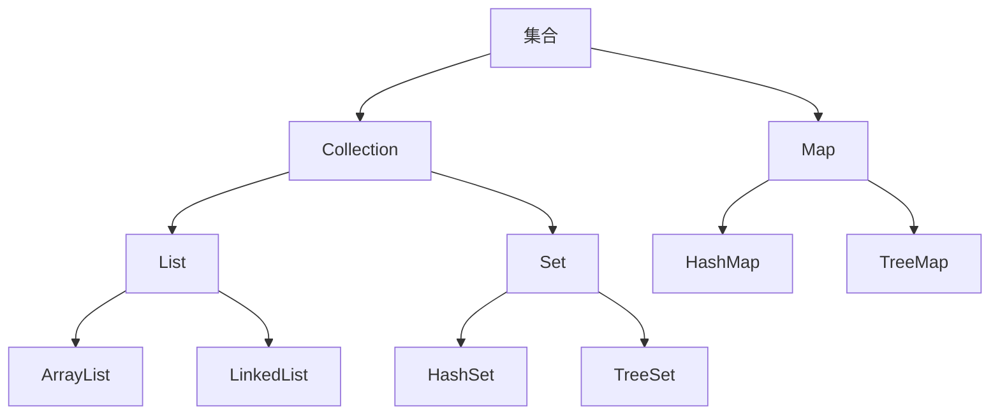

## 类和对象

### 1.什么是类和对象

* 类是现实生活中一类具有**共同属性**和**行为**的事物的抽象
* 类的组成：属性和行为(方法)

* 对象是由类实例化而来
* 一个类可以有多个对象
* 创建对象的方法：`类名 对象名 = new 类名();`

### 2.成员变量和局部变量

* 成员变量：类中方法外的变量

* 局部变量：方法中的变量

* 区别

  |      区别      |                成员变量                |                    局部变量                    |
  | :------------: | :------------------------------------: | :--------------------------------------------: |
  |  类中位置不同  |               类中方法外               |          方法内或或者方法声明上(形参)          |
  | 内存中位置不同 |                 堆内存                 |                     栈内存                     |
  |    生命周期    | 随对象的存在而存在，随对象的消失而消失 | 随着方法的调用而存在，随着方法的调用完毕而消失 |
  |  初始化值不同  |            有默认的初始化值            |  没有默认的初始化值，必须先定义，赋值才能使用  |

### 3.封装

a.private修饰符：

* 权限修饰符，可以用来修饰成员(变量、方法)
* 特点：只能在本类当中进行访问
* 针对被private修饰的成员变量，如需被其它类使用，提供相应的操作：
  1. 提供`get变量名()`方法，用于获取成员变量的值，方法用**public**修饰
  2. 提供`set变量名(参数)`方法，用于设置成员变量的值，方法用**public**修饰

b.this关键字

* 在类的方法内如果局部变量和成员变量出现同名的情况下，Java会使用“就近原则”，将同名的成员变量当作局部变量
* 为了在方法内使用到成员变量，可以使用**this**关键字
* this关键字的作用：可以调用本类的成员(变量、方法)，解决局部变量和成员变量重名的问题
* this代表所在类的对象引用，方法被哪个对象调用，this就代表哪个对象

c.封装的思想

* 隐藏实现的细节，仅对外暴露公共的访问方式
* 封装的常见体现：
  1. 私有化成员变量，提供setXxx()和getXxx()方法
  2. 将代码抽取到方法中，这是对代码的一种封装
  3. 将属性抽取到类当中，这是对数据的一种封装
* 封装的好处：
  1. 提高代码安全性
  2. 提高代码复用性

### 4.构造方法

* 构造方法是构造、创建对象时所调用的方法
* 格式：
  1. 方法名与类名相同，大小写一致
  2. 没有返回值类型，连void都没有
  3. 没有具体的返回值(不能由return带回结果数据)
* 执行时机：
  1. 创建对象时调用，每创建一次对象，就会执行一次构造方法
  2. 不能手动调用构造方法
* 作用：用于给对象的数据(属性)进行**初始化**
* 注意事项：
  1. 如果没有定义构造方法，系统将会给出一个**默认**的**无参构造方法**
  2. 如果定义了构造方法，系统将不再提供默认的构造方法
* 构造方法的重载：如果自定义了带参的构造方法，还需要使用无参的构造方法，就必须再手动给出无参构造方法
* 推荐使用方式：无论是否使用，都手动给出无参构造方法和带参构造方法

### 4.分包的思想

a.包的概念

* 如果将所有的类文件都放在同一个包下，不利于管理和后期维护，所以对于不同功能的类文件，可以放在不同的包下进行管理
* 包的本质就是文件夹
* 创建包(单级包和多级包)：
  1. 多级包之间使用“.”进行分割
  2. 包名规范：域名的翻转
* 包的定义：`package 包名`
* 注意事项：
  1. package语句必须是程序的第一条可执行的代码
  2. package语句在一个java文件中只能有一个
  3. 如果没有package，默认表示无包名

b.类与类之间的访问

* 同一个包下的访问：不需要导包，直接使用即可
* 不同包下的访问：
  1. import导包后访问
  2. 通过全类名(包名+类名)访问，应用场景是当有多个包下存在相同的类名并且需要同时使用这些类时，可以使用全类名来区分
* 注意事项：
  1. package必须是程序的第一条可执行的代码
  2. import需要写在package下面

### 5.static关键字

a.概念

* static是静态的意思，是Java中的一个修饰符，可以修饰成员变量和成员方法
* static修饰的成员变量称为**静态变量**
* static修饰的成员方法称为**静态方法**

b.特点

* 被类的所有对象共享，这是我们判断是否使用静态关键字的条件
* 随着类的加载而加载，**优先于**对象存在，而对象是需要类被加载后才能创建
* 可以通过类名调用，也可以通过对象名调用，但是推荐使用类名

c.注意事项

* 静态方法只能访问静态成员，不能访问非静态成员
* 非静态方法可以访问静态成员，也可以访问非静态成员
* **静态方法中不能使用this关键字 **

### 6.继承

a.概念

* 继承是类与类之间的关系
* 子类继承了父类所有的**非私有**成员，除了构造器
* 子类可以**直接**访问父类中**非私有**的成员
* 子类不能直接访问父类的私有成员，但是可以通过父类中的公有方法来访问，例如**set**和**get**方法
* 使用`extends`关键字来实现继承
* 父类又称为基类、超类，子类又称为派生类

b.好处和弊端

好处：

* 提高代码的复用性、维护性
* 让类与类之间产生关系，这是多态的前提

弊端：

* 继承是侵入性的
* 降低代码灵活性，继承关系导致子类必须拥有父类非私有属性和方法，让子类自由的世界中多了些约束
* 增强了代码的耦合性，耦合是指代码与代码之间存在关联

使用继承的时机：

* 当类与类之间存在相同(共性)内容，并且产生了**is a**的关系，就可以考虑使用继承来优化代码

c.继承的特点

* Java只支持单继承，不支持多继承，但是支持多重继承

* 继承的成员变量访问特点

  在子类方法中访问一个变量的顺序是

  1. 先在局部范围找
  2. 在子类成员范围中找
  3. 在父类成员范围中找

  注意：如果在子类和父类中出现重名的成员变量，通过就近原则，会优先使用子类的，如果一定要使用父类的可以通过**super**关键字来区分

* 继承的成员方法的访问特点

  通过子类对象访问一个方法的顺序是

  1. 子类范围找
  2. 父类范围找

d.super关键字

* super和this用法相似

* this代表本类对象的引用

* super代表父类存储空间的标识(可以理解为父类对象的引用)

* 区别

  | 关键字 |            访问成员变量            |               访问成员方法               |          访问构造方法           |
  | :----: | :--------------------------------: | :--------------------------------------: | :-----------------------------: |
  |  this  | **this.成员变量**访问本类成员变量  | **this.成员方法(参数)**访问本类成员方法  | **this(参数)**访问本类构造方法  |
  | super  | **super.成员变量**访问父类成员变量 | **super.成员方法(参数)**访问父类成员方法 | **super(参数)**访问父类构造方法 |

e.方法重写和应用场景

* 当子类需要父类的功能，而子类的功能主体比父类又多了特有的功能或者完全不同的功能时，可以**重写**父类中的方法
* 注意：
  1. 方法重写（overrite）：在继承体系中，子类出现和父类一摸一样的方法声明（方法名，参数列表，返回值类型）
  2. 方法重载（overlode）：在同一个类中，方法名相同，参数列表不同，与返回值无关
  3. 父类中私有方法不能重写
  4. 父类中的静态方法，子类必须通过静态的方法进行重写（**实际上静态方法不能被重写，但是子类中可以有一个与父类静态方法相同方法声明的静态方法，可以理解为子类将父类中同名的方法隐藏了起来，而不是方法重写**）
  5. 父类中的非静态方法，子类也必须通过非静态方法重写
  6. 子类重写父类方法时，方法的访问权限必须**大于或等于**父类的

f.访问权限修饰符

|  修饰符   | 同一个类中 | 同一个包中的子类或其他类 | 不同包中的子类 | 不同包中的其他类 |
| :-------: | :--------: | :----------------------: | :------------: | :--------------: |
|  private  |     ✔      |                          |                |                  |
|   默认    |     ✔      |            ✔             |                |                  |
| protected |     ✔      |            ✔             |       ✔        |                  |
|  public   |     ✔      |            ✔             |       ✔        |        ✔         |

g.继承中构造方法的访问特点

* 子类中**所有**构造方法默认都会访问父类中的**无参**构造方法

* 子类在初始化的时候可能需要用到父类中的数据，如果父类没有初始化，子类就无法使用父类的数据，所以**子类初始化前一定要先完成父类的初始化**

* 构造方法的第一条语句默认都是**super()**

* 如果编写的类没有指定父类，系统也会自动继承**Object**（最顶层父类）

  如果父类不提供无参的构造方法？解决方法是

* 子类通过super手动调用父类**带参构造方法**

* 子类通过this调用本类的其他构造方法，其他构造方法再通过super去调用父类的带参构造方法

* 注意：**this()和super()**在构造方法中必须处于第一行的位置，所以二者不能共存

### 7.抽象类

a.概述

* 抽象方法：将共性的行为（方法）抽取到父类后，发现该方法的实现逻辑无法在父类中给出具体的含义，该方法就可以定义为抽象方法
* 抽象类：如果一个类中存在抽象方法，那么该类必须声明为抽象类

b.注意事项

* 抽象类不允许实例化
* 抽象类中**存在**构造方法
* 抽象类的子类**必须**重写所有的抽象方法，或者子类也是一个抽象类
* 抽象类中可以没有抽象方法，但是存在抽象方法一定是抽象类

### 8.final关键字

* final可以修饰**类，方法，变量**
* final修饰类：表明该类是最终类，不能被继承
* final修饰方法：表明该方法是最终方法，不能被重写
* final修饰变量：
  1. 变量是基本数据类型：数据值不能改变
  2. 变量是引用类型：引用指向的地址不允许改变，但是地址里面的内容可以
* final修饰成员变量时建议直接赋值或者在构造方法中赋值

### 9.代码块

* 局部代码块
  1. 位置：方法内
  2. 特点：在**方法内代码块外**的地方访问不到代码块里边的变量
  3. 作用：限定变量生命周期，及早释放，提高内存利用率
* 构造代码块
  1. 位置：类中方法外
  2. 特点：每次构造方法执行时，都会执行改代码块中的代码，并且**在构造方法执行前执行**
  3. 作用：将多个构造方法中相同的代码抽取到代码块中，提高代码复用性
* 静态代码块
  1. 位置：类中方法外
  2. 特点：需要用**static**关键字修饰，随着类的加载而加载，**只执行一次**
  3. 作用：在类加载时做一些数据初始化的操作
* 执行顺序（对于一个类中）：**静态代码块->父类构造方法->构造代码块->子类构造方法**

### 10.接口

* 接口使用**interface**关键字来定义`public interface 接口名{}`
* 接口通过**implements**关键字来实现接口`public classs 类名 implements 接口名{}`
* 实现接口的类需要需要重写接口中**所有**的抽象方法或者实现接口的类是抽象类
* 接口不能实例化
* 接口允许多实现，即一个类可以实现多个接口
* 接口中成员特点
  1. 成员变量：只能是常量，默认是**public static final**修饰
  2. 成员方法：只能是抽象方法，默认是**public abstract**修饰
  3. 没有构造方法
* JDK8中接口成员特点
  * 默认方法
    1. 允许在接口中定义非抽象的方法，但是需要关键字**default**修饰，称为默认方法，作用是解决接口升级的问题
    2. 定义格式`public default 返回值类型 方法名(参数列表){}`
    3. public是默认的可以省略，但default不能省略
    4. 默认方法不是抽象方法，不强制重写，但是允许重写，**重写时去掉default关键字**
    5. 如果某个类实现了多个接口，接口中出现**相同方法声明的默认方法**，则必须对该方法重写
  * 静态方法
    1. 允许在接口中定义静态方法，需要关键字**static**修饰
    2. 定义格式`public static 返回值类型 方法名(参数列表){}`
    3. public是默认的可以省略，static不能省略
    4. 接口中的静态方法只能通过`接口名.方法名()`来调用，不能通过实现该接口的类的类名和对象来调用
* JDK9中接口成员特点
  1. 接口中允许有私有方法，使用关键字**private**修饰
  2. 定义格式`private 返回值类型 方法名(参数列表){}`或者`private static 返回值类型 方法名(参数列表){}`
* 接口使用思路
  1. 如果某个类全是抽象方法，那么该类可以改进为一个接口
  2. 设计大面积接口更新（添加新的方法）时不想去修改每一个实现该接口的类，可以将更新的方法定义为带方法体的默认方法
  3. 希望默认方法调用更加简洁，可以考虑定义静态方法
  4. 默认方法中出现重复的代码，可以考虑抽取出一个私有方法
* 接口与接口的关系
  1. 可以单继承，使用关键字**extends**修饰
  2. 可以实现多继承，即一个接口可以继承多个接口
  3. 多继承时如果被继承的多个接口中存在**相同方法声明的默认方法**，则需要在继承时重写该方法

### 11.多态

a.多态指同一个对象，在不同时刻表现出来的不同形态

b.多态的前提和体现

* 有继承/实现关系
* 有方法重写
* 有父类引用指向子类对象

c.多态中成员访问特点

* 成员变量：编译时看**=**号左边（父类），运行时看**=**号左边（父类）
* 成员方法：编译时看**=**号左边（父类），运行时看**=**号右边边（子类）
* 成员变量和方法的访问不一样，理由是成员方法存在动态绑定机制，而成员变量没有

d.多态的好处和弊端

* 好处是提高了程序的扩展性
* 弊端是不能使用子类特有的功能

e.向上转型

* 父类引用指向子类对象
* 语法：`父类类型 引用名 = new 子类类型();  `
* 可以调用父类的所有成员，需要遵循访问权限
* 不能调用子类**特有**的成员

f.向下转型

* 父类引用转为子类对象
* 语法：`子类类型 引用名 = (子类类型)父类引用;`
* 只能强转父类的引用，不能强转父类的对象
* 父类的引用强转前必须指向的是子类类型的对象，否则出现**ClassCastException**
* 可以调用子类中所有的成员

g.instanceof关键字

* 用于判断对象的**运行类型**是否为XX类或XX类的子类

### 12.内部类

a.内部类指在一个类中定义一个类

b.成员内部类

* 位置：在类的成员位置
* 内部类可以直接访问外部类中的成员，包括私有
* 外部类要访问内部类的成员，必须创建对象
* 在外界创建内部类对象的语法是`外部类名.内部类名 引用名 = new 外部类名().new 内部类名();`
* private修饰的成员内部类（私有成员内部类）
  1. 不能在外界创建该内部类，因为private修饰
  2. 只能在自己所在的外部类中创建对象来访问
* static修饰的成员内部类（静态成员内部类）
  1. 可以在外界创建
  2. 创建语法与普通的成员内部类不同`外部类名.内部类名 引用名 = new 外部类名.内部类名();`
  3. 静态成员内部类中的静态方法使用语法是`外部类名.内部类名.方法名();`

c.局部内部类

* 局部内部类是在方法中定义的内部类，所以外界无法访问，需要在方法内部创建对象并使用
* 该类可以直接访问外部类的成员，也可以访问方法内的局部变量

d.匿名内部类

* 匿名内部类本质上是一个特殊的局部内部类

* 前提：需要存在一个接口/类

* 语法是`new 类名/接口名(){重写方法};`

* 匿名内部类是将（继承/实现）（方法重写）（创建对象）三个步骤放在了一步进行

* 实例：

  ```java
  public class Test {
      public static void main(String[] args){
          /*情况1,当接口中只有一个方法*/
          new Inner1(){
              
              @Override
              public void show() {
                  System.out.println("重写方法");
              }
          }.show();//可以通过这种方式直接调用方法
  
          /*情况2,当接口中有多个方法*/
          Inner2 i = new Inner2(){//这里实际上是多态
  
              @Override
              public void show1() {
                  System.out.println("重写方法1");
              }
  
              @Override
              public void show2() {
                  System.out.println("重写方法2");
              }
          };
          //存在多个方法,不能使用情况1中的方式调用多个方法
           i.show1();
           i.show2();
      }
  }
  //接口
  interface Inner1{
      public abstract void show();
  }
  interface Inner2{
      public abstract void show1();
      public abstract void show2();
  }
  ```

* 使用场景：当方法的形式参数是接口或者抽象类时可以将匿名内部类作为实际参数进行传参

### 13.Lambda表达式

* Lambda表达式是函数式编程思想的体现，函数式编程思想尽量忽略面向对象的复杂语法，强调“做什么”而不是以什么形式去做
* Lambda表达式格式：`(形式参数) -> {代码}`
  1. 如果有多个参数，参数之间用逗号隔开，如果没有参数则留空
  2. ->代表指向动作
  3. 代码指具体实现的内容
* Lambda表达式使用前提
  1. 存在接口
  2. 接口中有且仅有一个抽象方法
* Lambda表达式分类
  1. 无参无返回值
  2. 有参无返回值
  3. 无参有返回值
  4. 有参数有返回值
* Lambda表达式省略模式
  1. 参数类型可以省略，如果有多个参数，要么不省略要么全部省略
  2. 如果参数有且仅有一个，那么参数的括号可以省略
  3. 如果代码块中只有一条语句，那么大括号和语句的分号可以省略，return关键字也可以省略
* Lambda表达式和匿名内部类的区别
  1. 所需类型不同
     * 匿名内部类：可以是接口，可以是抽象类，还可以是具体的类
     * Lambda表达式：只能是接口
  2. 使用限制不同
     * 如果接口中只有一个抽象方法，则可以使用Lambda表达式也可以使用匿名内部类
     * 接口中有多于一个抽象方法，只能使用匿名内部类，不能使用Lambda表达式
  3. 实现原理不同
     * 匿名内部类：编译之后，产生单独的.class字节码文件
     * Lambda表达式：编译之后，没有产生单独的.class字节码文件，对应的字节码会在运行的时候动态生成

## 常用API

### 1.**==**号比较注意事项

* **==**用于比较基本数据类型时，比较的是**内容**
* **==**用于比较引用类型时，比较的是**地址**

### 2.String类

* String类代表字符串，Java程序中所有字符串文字（例如“abc”）都被实现为此类的实例，也就是说，Java程序中所有的双引号字符串，都是String类的对象

* 字符串不可变，他们的值在创建后不能被更改

* 使用双引号创建字符串对象和使用new创建字符串对象的区别

  1. 使用双引号创建字符串对象时，系统检查该字符串是否存在于字符串常量池中，如果不存在则创建，如果存在则复用
  2. 使用new来创建字符串对象，每一次new都会申请一个内存空间，虽然字符串内容相同，但是地址值不同
  3. 双引号创建的字符串对象在**字符串常量池**中存储，构造方法创建的字符串对象在**堆内存**中存储

* 常见面试题

  ```java
  public class Test {
      public static void main(String[] args){
          String s1 = "abc";
          String s2 = "abc";
          System.out.println(s1 == s2);//比较地址，输出true
      }
  }
  ```

  ```java
  public class Test {
      public static void main(String[] args){
          String s1 = "abc";
          String s2 = new String("abc");//使用构造方法创建字符串对象
          System.out.println(s1 == s2);//比较地址，输出false
      }
  }
  ```

  ```java
  public class Test {
      public static void main(String[] args){
          String s1 = "abc";
          String s2 = "ab";
          String s3 = s2 + "c";
          /*这里系统自动创建StringBuilder对象，然后再调用append()方法完成拼接，最后调用toString()方法转换为String类型*/
          System.out.println(s1 == s3);//比较地址，由于创建新的对象，输出false
      }
  }
  ```

  ```java
  public class Test {
      public static void main(String[] args){
          String s1 = "abc";
          String s2 = "ab";
          String s3 = "ab" + "c";
          /*使用常量优化机制，当拼接的字符串均是双引号创建的字符串对象时，不会创建新的对象*/
          System.out.println(s1 == s3);//比较地址，没有创建新的对象，输出true
      }
  }
  ```

* 字符串比较内容

  1. 使用**equals()**方法来比较内容，严格区分大小写，返回true或者false
  2. 如果比较字符串时需要忽略大小写，则可以使用**equalsIgnoreCase()**方法

### 3.StringBuilder类

* StringBuilder是一个可变的字符串类，可以将它看成一个容器
* StringBuilder可以提高字符串操作效率，**体现在字符串拼接上**
* 常用方法 
  1. **append()**方法，完成字符串拼接，返回值是自己本身
  2. **reverse()**方法，返回相反的字符串序列
  3. **toString()**方法，把StringBuilder类型转为String类型

### 4.Math类

* 有关数学运算的类，构造方法被私有化所以不能被实例化，提供的方法全是静态方法

* 常用的方法

  | 方法名                                      | 说明                                |
  | ------------------------------------------- | ----------------------------------- |
  | public static int abs(int a)                | 返回参数的绝对值                    |
  | public static double ceil(double a)         | 向上取整                            |
  | public static double floor(double a)        | 向下取整                            |
  | public static int round(float a)            | 四舍五入                            |
  | public static int max(int a,int b)          | 返回两个参数值最大的                |
  | public static int min(int a,int b)          | 返回两个参数值最小的                |
  | public static double pow(double a,double b) | 返回a的b次幂的值                    |
  | public static double random()               | 返回值为double类型的正值，[0.0,1.0) |

### 5.System类

* 与系统相关的类，构造方法私有化所以不能被实例化，提供的方法都是静态方法

* 常用方法

  | 方法名                                                       | 说明                                           |
  | ------------------------------------------------------------ | ---------------------------------------------- |
  | public static void exit(int status)                          | 终止当前运行的Java虚拟机，参数非零表示异常终止 |
  | public static long currentTimeMillis()                       | 返回当前距离1970年1月1日 00:00:00的毫秒值      |
  | public static arraycopy(源数组,起始索引,目的数组,起始索引,拷贝个数) | 数组copy                                       |

### 6.Object类

* 所有类的超类，所有的对象（包括数组）都实现这个类中的方法

* toString()方法

  1. 直接打印一个对象就是打印这个对象的toString()方法的返回值
  2. Object类的toString()方法得到的是这个对象的字符串表示`全类名+@+哈希值的十六进制`
  3. 一般情况下会对toString()方法进行重写，建议所有子类都重写该方法

* equals()方法

  1. 与另一个对象比较
  2. 默认是比较地址
  3. 重写可以比较内容，例如String类和Integer类

* 面试题

  ```java
  public class Test {
      public static void main(String[] args){
          String s1 = "abc";
          StringBuilder sb = new StringBuilder("abc");
          //1.使用String中的equals()方法比较时会先判断参数是否是String类再判断内容，如果不是则直接返回false
          System.out.println(s1.equals(sb));//false
          //2.由于StringBuilder没有重写equals()方法，所以比较的是地址值
          System.out.println(sb.equals(s1));//false
      }
  }
  ```

### 7.**Objects**类

* 构造方法被私有化所以不能实例化，提供的方法都是静态方法，注意与Object类的区别

* 常用方法

  | 方法名                                                     | 说明                                                         |
  | ---------------------------------------------------------- | ------------------------------------------------------------ |
  | public static String toString(Object o)                    | 返回参数中对象的字符串表示形式                               |
  | public static String toString(Object o,String nullDefault) | 返回参数中对象的字符串表示形式，如果对象为空，返回第二个参数的默认字符串 |
  | public static boolean isNull(Object o)                     | 判断对象是否为空                                             |
  | public static boolean nonNull(Object o)                    | 判断对象是否为非空                                           |

### 8.BigDecimal类

* 常用两种构造方法

  1. `BigDecimal bd1 = new BigDecimal(数值参数);`
  2. `BigDecimal bd2 = new BigDecimal(字符串);`

* 四则运算（用于精确运算）

  | 方法名                                   | 说明 |
  | ---------------------------------------- | ---- |
  | public BigDecimal add(BigDecimal b)      | 加法 |
  | public BigDecimal subtract(BigDecimal b) | 减法 |
  | public BigDecimal multiply(BigDecimal b) | 乘法 |
  | public BigDecimal divide(BigDecimal b)   | 除法 |

* 一种特殊的方法

  1. 语法：`public BigDecimal divide(参数1，参数2，参数3);`
  2. 用于除法中除不尽的情况
  3. 参数1表示另一个参与运算的数，参数2表示小数点后精确到的位数，参数3表示舍入模式
  4. 舍入模式有
     * `BigDecimal.ROUND_UP`，进一法
     * `BigDecimal.ROUND_FLOOR`，去尾法
     * `BigDecimal.ROUND_HALF_UP`，四舍五入

* 总结

  1. BigDecimal用于精确计算
  2. 创建BigDecimal对象，构造方法使用参数类型为字符串的
  3. 除法除不尽使用三个参数的方法

### 9.包装类

* 八个包装类

  | 基本数据类型 | 包装类    |
  | ------------ | --------- |
  | byte         | Byte      |
  | short        | Short     |
  | int          | Integer   |
  | long         | Long      |
  | float        | Float     |
  | double       | Double    |
  | char         | Character |
  | boolean      | Boolean   |

* Integer类

  1. 该对象中包装了一个基本数据类型为int的值

  2. 获取一个Integer对象的方法

     | 方法名                                  | 说明                              |
     | --------------------------------------- | --------------------------------- |
     | public Integer(int value)               | 根据int值创建Integer对象（过时）  |
     | public Integer(String s)                | 根据String值创建对象（过时）      |
     | public static Integer valueOf(int i)    | 返回表示指定int值的Integer对象    |
     | public static Integer valueOf(String s) | 返回表示指定String值的Integer对象 |

  3. 自动装箱和自动拆箱

     ```java
     Integer i = 100;//自动装箱，把基本数据类型转换为对应的包装类型
     int ii = i;//自动拆箱，把包装类型转换为对应的基本数据类型
     ```

  4. 注意：在使用包装类型时如果有对应的操作，最好先判断是否为空

  5. int转String的方法

     * 方式1：int值加空字符串，例如

       ```java
       int a = 2;
       String s = a + "";
       ```

     * 方式2：使用方法`public static String valueOf(int i);`这是String类中的静态方法

       ```java
       int a = 2;
       String s = String.valueOf(a);
       ```

  6. String转int的方法

     * 使用方法`public static int parseInt(String s);`这是Integer类中的静态方法

       ```java
       String s = "12";
       int a = Integer.parseInt(s);
       ```

### 10.Arrays类

* 私有化构造方法所以不能实例化，提供的方法都是静态方法，用于数组的操作

* 常用方法

  | 方法名                                        | 说明                                                         |
  | --------------------------------------------- | ------------------------------------------------------------ |
  | public static String toString(数组)           | 返回数组的字符串形式                                         |
  | public static void sort(数组)                 | 对给定的数组排序                                             |
  | public static int binarySearch(int[],int key) | 二分查找，注意数组必须有序，找到返回索引，找不到返回（-插入点-1） |

### 11.时间日期类

* 计算机中的时间原点是1970年1月1日 00:00:00

* Date类

  * 表示一个特定的时间

  * 构造方法

    | 方法名                 | 说明                                                         |
    | ---------------------- | ------------------------------------------------------------ |
    | public Date()          | 创建一个Date对象，表示默认事件（计算机当前时间）             |
    | public Date(long date) | 创建一个Date对象，表示指定时间（从时间原点开始，过了指定毫秒的时间，需要考虑时差问题） |

  * 常用方法

    | 方法名                         | 说明                       |
    | ------------------------------ | -------------------------- |
    | public long getTime()          | 获取时间对象的毫秒值       |
    | public void setTime(long time) | 设置时间为参数内指定的时间 |

* SimpleDateFormat类

  * 可以对Date对象进行**格式化和解析**

  * 常用模式字母以及对应关系

    | 字母 | 含义 |
    | ---- | ---- |
    | y    | 年   |
    | M    | 月   |
    | d    | 日   |
    | H    | 时   |
    | m    | 分   |
    | s    | 秒   |

    巧记为“小大，小大，小小”

  * 构造方法

    | 方法名                                  | 说明                   |
    | --------------------------------------- | ---------------------- |
    | public SimpleDateFormat()               | 构造一个默认格式的对象 |
    | public SimpleDateFormat(String pattern) | 构造一个指定格式的对象 |

  * 格式化和解析的方法

    | 方法名                                | 说明                           |
    | ------------------------------------- | ------------------------------ |
    | public final String format(Date date) | 将日期格式化为指定格式的字符串 |
    | public Date parse(String source)      | 将字符串解析为日期类对象       |

* JDK8新增的时间日期类

  * LocalDate日期类、LocalTime时间类、**LocalDateTime时间日期类**，使用方法类似

  * LocalDateTime创建方法

    | 方法名                                            | 说明                               |
    | ------------------------------------------------- | ---------------------------------- |
    | public static LocalDateTime now()                 | 获取当前计算机的时间               |
    | public static LocalDateTime of(年,月,日,时,分,秒) | 使用指定的年月日时分秒创建一个对象 |

  * LocalDateTime常用方法

    | 方法名                          | 说明                         |
    | ------------------------------- | ---------------------------- |
    | public int getYear()            | 获取年                       |
    | public int getMonthValue()      | 获取月份（1-12）             |
    | public int getDayOfMonth()      | 获取月份中第几天（1-31）     |
    | public Month getMonth()         | 获取月份，返回值类型是枚举类 |
    | public int getDayOfYear()       | 获取一年中第几天（1-366）    |
    | public DayOfWeek getDayOfWeek() | 获取星期，返回值类型是枚举类 |
    | public int getMinute()          | 获取分钟                     |
    | public int getHour()            | 获取小时                     |

  * LocalDateTime对象转为LocalDate对象或者LocalTime对象的方法

    | 方法名                         | 说明                    |
    | ------------------------------ | ----------------------- |
    | public LocalDate toLocalDate() | 转换成一个LocalDate对象 |
    | public LocalTime toLocalTime() | 转换成一个LocalTime对象 |

  * LocalDateTime的格式化和解析

    | 方法名                                                     | 说明                                    |
    | ---------------------------------------------------------- | --------------------------------------- |
    | public String format(指定格式)                             | 将LocalDateTime对象格式化为指定的字符串 |
    | public static LocalDateTime parse(待解析的字符串,解析格式) | 将时间日期字符串解析为LocalDateTime对象 |

    JDK8中使用**DateTimeFormatter**类作为时间日期格式化器，使用的方法如下：

    `public static DateTimeFormatter ofPattern(String pattern)`，作用是获取一个指定格式的DateTimeFormatter对象
    
  * LocalDateTime中plus系列的方法

    | 方法名                                         | 说明                                      |
    | ---------------------------------------------- | ----------------------------------------- |
    | public LocalDateTime plusYears(long years)     | 添加或者减去年，返回新的LocalDateTime对象 |
    | public LocalDateTime plusMonths(long months)   | 添加或者减去月，返回新的LocalDateTime对象 |
    | public LocalDateTime plusDays(long days)       | 添加或者减去日，返回新的LocalDateTime对象 |
    | public LocalDateTime plusHours(long hours)     | 添加或者减去时，返回新的LocalDateTime对象 |
    | public LocalDateTime plusMinutes(long minutes) | 添加或者减去分，返回新的LocalDateTime对象 |
    | public LocalDateTime plusSeconds(long seconds) | 添加或者减去秒，返回新的LocalDateTime对象 |
    | public LocalDateTime plusWeeks(long weeks)     | 添加或者减去周，返回新的LocalDateTime对象 |

    注意：参数为正表示添加，参数为负表示减去

  * LocalDateTime中minus系列的方法

    1. 该系列方法与plus系列方法相反，作用是减去对应的年月日时分秒周
    2. 参数为正数表示减去的值，负数表示加上的值
    3. 例如`public LocalDateTime minusYears(long years)`是minus系列方法之一，其他方法类似

  * LocalDateTime中with系列方法

    with系列方法用于直接修改LocalDateTime对象中的年月日时分秒

    | 方法名                                              | 说明                                            |
    | --------------------------------------------------- | ----------------------------------------------- |
    | public LocalDateTime withYear(int year)             | 直接修改年，返回新的LocalDateTime对象           |
    | public LocalDateTime withMonth(int month)           | 直接修改月，返回新的LocalDateTime对象           |
    | public LocalDateTime withDayOfMonth(int dayofmonth) | 直接修改一月中第几天，返回新的LocalDateTime对象 |
    | public LocalDateTime withDayOfYear(int dayofyear)   | 直接修改一年中第几天，返回新的LocalDateTime对象 |
    | public LocalDateTime withHour(int hour)             | 直接修改小时，返回新的LocalDateTime对象         |
    | public LocalDateTime withMinute(int minute)         | 直接修改分钟，返回新的LocalDateTime对象         |
    | public LocalDateTime withSecond(int second)         | 直接修改秒，返回新的LocalDateTime对象           |

  * Period日期间隔类

    常用方法

    | 方法名                                                      | 说明                       |
    | ----------------------------------------------------------- | -------------------------- |
    | public static Period between(LocalDate start,LocalDate end) | 返回两个日期的Period间隔类 |
    | public int getYears()                                       | 返回间隔的年数             |
    | public int getMonths()                                      | 返回间隔的月数             |
    | public int getDays()                                        | 返回间隔的天数             |
    | public long toTotalMonths()                                 | 返回间隔的总月数           |

  * Duration时间间隔类

    可以获取时间的间隔

    | 方法名                                            | 说明                                 |
    | ------------------------------------------------- | ------------------------------------ |
    | public static Duration between(开始时间,结束时间) | 计算两个时间的间隔，返回Duration对象 |
    | public long toSeconds()                           | 获取时间间隔的秒                     |
    | public long toMillis()                            | 获取时间间隔的毫秒                   |
    | public long toNanos()                             | 获取时间间隔的纳秒                   |

## 异常

### 1.概念

* Exception类称为异常类，它的子类有RuntimeException（运行时异常）和其他子类（编译时异常）
* RuntimeException也有许多子类
* 编译时异常是在编译成class文件时必须要处理的异常，也称为受检异常
* 运行时异常是在运行字节码文件时出现的异常，也称为非受检异常

### 2.虚拟机默认处理异常的方式

* 在产生异常的代码处生成一个**异常对象**，接着查看是否有处理异常的代码，如果没有就交给调用者处理，如果调用者也不处理则最终交给虚拟机

* 虚拟机将异常的名称，异常原因以及异常出现的位置等信息输出在控制台
* 程序停止运行

### 3.使用throws方式处理异常

* 格式：`throws 异常类名`
* 注意：写在**方法的定义处**，表示显式声明一个异常
* 这种异常异常处理方式主要**用于编译时异常**，如果声明的异常是运行时异常则声明处的代码可以省略
* throws声明一个异常表示当前方法内不处理这个异常，而是交给**调用者**处理，如果调用者也不处理则**最终**交给虚拟机采用**默认**的处理方式

### 4.使用throw抛出异常对象

* 格式：`throw new 异常类名();`
* 注意：写在**方法内部**，表示在当前的代码处手动抛出一个异常，下面的代码不用再执行
* 给方法的调用者抛出了一个异常

### 5.使用try..catch方式处理异常

* 格式

  ```java
  try{
      //可能出现异常的代码
  }catch(异常类名 变量名){
      //处理异常的代码
  }
  ```

* 作用是可以让程序继续执行下去

* 如果try块中没有出现异常，则程序会将try块的代码执行完毕，然后跳过catch块的代码继续执行下去

* 如果try块中某行代码出现异常，则该行后面的代码不再执行转而去执行catch块中的代码，然后继续执行下去

* 如果try块中出现的异常没有被捕获，则直接在出现异常的代码处停止执行，将异常交给虚拟机处理，程序不再执行下去

* 如果try块中出现多个异常，那么只需要添加多个catch块处理，如果多个异常存在继承关系，那么父类catch块需要写在**最下方**，发生异常时只会匹配一个catch块

* 写多个catch块的好处是可以针对不同的异常有不同的处理方式

### 6.Throwable的成员方法

* Throwable是所有异常类的父类，所以所有异常对象都能使用该类的方法

* 常用方法

  | 方法名                        | 说明                       |
  | ----------------------------- | -------------------------- |
  | public String getMessage()    | 返回详细消息字符串         |
  | public String toString()      | 返回简短描述字符串         |
  | public void printStackTrace() | 将异常信息打印输出在控制台 |

### 7.自定义异常

* 自定义异常的目的：为了使异常信息更加的见名知义

* 自定义异常类的步骤

  1. 定义类名，建议为xxExtception

  2. 继承**Exception**类或者**RuntimeException**类

  3. 写一个空参构造方法

  4. 写一个带参构造方法，例如

     ```java
     public XXException(String message){
         super(message);
     }
     ```

## 集合

### 1.集合简易体系结构



* 上图中**Collection、Map、List、Set**都是接口，其余都是实现类
* 其中Collection及其实现类存放的是**单列数据**，Map及其实现类存放的是**双列数据**
* 该体系结构只列出较常使用的类

### 2.Collection

* Collection是单列集合的顶层接口，表示一组对象，这些对象也称为Collection元素

* JDK不提供此接口的**任何直接实现类**，而是提供更具体的**子接口**如List和Set

* 由于是接口，所以创建Collection对象需要使用**多态**的方式

* Collection常用方法

  | 方法名                     | 说明                         |
  | -------------------------- | ---------------------------- |
  | boolean add(E e)           | 添加元素                     |
  | boolean remove(Object o)   | 从集合中移除指定的元素       |
  | boolean removeif(Object o) | 根据条件进行删除             |
  | void clear()               | 清空集合                     |
  | boolean contains(Object o) | 判断集合中是否存在指定的元素 |
  | boolean isEmpty()          | 判断集合是否为空             |
  | int size()                 | 集合的长度（元素个数）       |

* 迭代器

  1. 迭代器**Iterator**，用于集合的遍历方式

  2. `Iterator<E> iterator();`是**Iterable**接口提供的一个抽象方法，用于返回一个迭代器对象，而Collection接口继承了该接口，所以实现**Collection**接口的实现类中根据每个实现类存放数据的方式不同重写各自的Iterator()方法，从而获得不同的迭代器对象

  3. Iterator中的常用方法

     * `boolean hasNext();`用于判断集合中当前位置是否有元素可以被取出
     * `E next();`获取当前位置的元素，并将迭代器对象移向下一个位置
     * `void remove();`删除上一次调用next()方法时返回的元素，每次调用next()方法只能调用一次此方法

  4. 迭代器使用案例

     ```java
     Iterator<String> it = collection.iterator();//获取集合中的迭代器对象
     while(it.hasNext()){//当前索引位置是否存在元素
         String s = it.next();//将索引位置处的元素获取出来，并且将索引移动到下一位置
         System.out.println(s);//打印输出
     }
     ```

     ```java
     while(it.hasNext()){
         String s = it.next();
         if("abc".equals(s)){
             it.remove();//将迭代器返回的最后一个元素删除
         }
     }
     ```

  5. 增强for循环

     * 作用是简化数组和Collection集合的遍历

     * 内部原理依然是Iterator迭代器

     * 实现**Iterable**接口的类才可以使用**增强for循环和Iterator迭代器**

     * 注意避免在增强for循环中对数组或集合元素删除或更改

     * 三种循环的使用场景

       需要操作索引使用普通for循环

       需要遍历过程中删除元素，使用迭代器

       仅仅遍历元素使用增强for循环

### 3.List

* 存取有序，存元素的顺序和取元素顺序一致，类似数组

* 可以根据索引精确操作元素

* 与Set集合不同，允许存放重复的元素

* List中特有的方法

  | 方法名                        | 说明                                     |
  | ----------------------------- | ---------------------------------------- |
  | void add(int index,E element) | 在指定位置插入元素                       |
  | E remove(int index)           | 删除指定位置的元素并返回                 |
  | E set(int index,E element)    | 修改指定位置的元素并返回**被修改**的元素 |
  | E get(int index)              | 返回指定索引处的元素                     |

* List的实现类ArrayList

  * 底层数据结构是**数组**，查询快，增删慢
  * 实现自动扩容的机制
  * 每次扩容的容量是之前的1.5倍

* List的实现类LinkedList

  * 底层数据结构是**双向链表**，查询慢，增删快

  * LinkedList特有方法

    | 方法名                 | 说明                   |
    | ---------------------- | ---------------------- |
    | public void addFirst() | 在开头插入元素         |
    | public void addLast()  | 在末尾插入元素         |
    | public E getFirst()    | 获取第一个元素         |
    | public E getLast()     | 获取最后一个元素       |
    | public E removeFirst() | 删除并返回第一个元素   |
    | public E removeLast()  | 删除并返回最后一个元素 |

### 4.Set

* Set集合可以**去除重复的元素**，而且**不保证元素存取顺序**

* Set集合没有带索引的方法，所以不能使用普通for循环遍历，也不能通过索引来获取、删除元素

* Set集合可以通过迭代器或者增强for循环遍历

* Set的实现类TreeSet

  * 底层数据结构是**红黑树**

  * 特点是可以将元素**按照规则**进行排序，如果想要使用TreeSet需要制定**排序**规则

  * 自然排序

    * 使用空参构造器创建TreeSet集合时，会默认调用自然排序

    * 存放在TreeSet集合的类需要实现**Comparable接口**然后重写里面的**compareTo()方法**，一般用在自定义的类中，比如定义一个学生类，按照学生的年龄排序

    * 例如
  
      ```java
      class Student implements Comparable<Student> {
      
          private String name;
          private int age;
          
          @Override
          public int compareTo(Student o) {
              int result = this.age-o.age;//this表示当前需要存入的元素，o表示集合中存在的元素
              return result;
          }
    }
      ```
  
      ```java
      class Student implements Comparable<Student> {
      
          private String name;
          private int age;
      
          @Override
          public int compareTo(Student o) {
              int result = this.age-o.age;
              result = result == 0 ? this.name.compareTo(o.name) : result;//如果年龄出现相同的情况可以比较姓名，按照字母字典排序，注意这里使用到了String类的CompareTo()方法
              return result;
          }
    }
      ```

  * 比较器排序

    * TreeSet的**带参构造方法**使用的是比较器排序对元素进行排序

    * 比较器排序就是在TreeSet的带参构造方法中传入一个**Comparator接口**的实现类对象，重写**Compare(T o1,T o2)方法**

    * 例如
  
      ```java
      public class Test {
          public static void main(String[] args) throws ParseException {
              TreeSet<Student> students = new TreeSet<>(new Comparator<Student>() {
                  @Override
                  public int compare(Student o1, Student o2) {
                      int result = o1.getAge()-o2.getAge();//比较年龄
                      result = result == 0 ? o1.getName().compareTo(o2.getName()) : result;//年龄相同时比较姓名
                      return result;
                  }
              });
      
              Student s1 = new Student("zhansan",18);
              Student s2 = new Student("wangwu",18);
              Student s3 = new Student("lisi",22);
              Student s4 = new Student("wuliu",16);
      
              students.add(s1);
              students.add(s2);
              students.add(s3);
              students.add(s4);
      
              System.out.println(students);
              //输出:[{wuliu,16}, {wangwu,18}, {zhansan,18}, {lisi,22}]
          }
      }
      
      class Student implements Comparable<Student> {
      
          private String name;
          private int age;
      
          public Student() {
          }
      
          public Student(String name, int age) {
              this.name = name;
              this.age = age;
          }
      
          public String getName() {
              return name;
          }
      
          public int getAge() {
              return age;
          }
      
          public void setName(String name) {
              this.name = name;
          }
      
          public void setAge(int age) {
              this.age = age;
          }
      
          @Override
          public String toString(){
              return "{"+
                      this.getName()+
                      ","+
                      this.getAge()+
                      "}";
          }
    }
      ```

  * 两种比较方式总结
  
    * 自然排序：自定义类实现Comparable接口，重写compareTo()方法，根据返回值进行排序
    * 比较器排序：创建TreeSet对象的时候传递Comparator的实现类对象，重写compare()方法，根据返回值排序
    * 使用的时候，默认使用自然排序（**当TreeSet集合中存的元素对象已经实现了Comparable接口并且重写compareTo()方法**），当自然排序不满足需求时（**当TreeSet集合中存的元素对象是自定义的类并且没有实现Comparable接口**）必须使用比较器排序，还有一种情况是自定义的类已经实现了Comparable接口并且重写了compareTo()方法，那么也可以通过比较器排序来改变排序规则
    * 两种方式中，关于compareTo()方法和compare()方法的返回值有如下规则
      1. 如果返回值是负数，表示当前存入的元素是较小值，存左边
      2. 如果返回值是0，表示当前存入的元素跟集合中的元素重复了，不存
      3. 如果返回值是正数，表示当前存入的元素是较大值，存右边
  
* Set的实现类HashSet

  * 底层数据结构是**哈希表**
  * 不保证数据的存取顺序一致
  * 没有带索引的方法所以不能使用普通的for循环遍历
  * 由于是Set集合，所以元素唯一
  * 哈希值
    * 哈希值是JDK根据对象的地址或者属性值，算出来的int类型的整数
    * Object类中有一个`public int hasCode()`方法可以根据对象的地址值计算并返回哈希值，同一个对象多次调用这个方法返回的哈希值是一样的
    * 如果没有重写HashCode()方法，那么默认哈希值是根据对象的**地址**计算得出，不同的对象哈希值不同
    * 如果重写了HashCode()方法，则哈希值是根据对象的**属性**计算得出，如果有不同的对象属性值一样那么哈希值相同
  * JDK7版本中HashSet底层原理
    * 底层结构：哈希表（数组加链表）
    * 数组默认长度为16，加载因子为0.75，当数组存储了16*0.75=12个位置时则扩容为原来容量的两倍
    * 存入元素时，首先获取元素的**哈希值**，计算出在数组中应该存放的索引，接着判断该索引处是否为null，如果是null直接添加，如果不是null则与该索引处的链表中每一个元素通过**equals()**方法比较属性值，只要存在一个相同的就不存，否则存入该链表
  * JDK8版本中HashSet底层原理
    * 底层结构：哈希表（数组加链表加红黑树）
    * 当链表长度超过8时将链表转为红黑树，目的是提高效率
    * 存储流程与之前相同，只是当存入的是红黑树时不需要比较完全部元素
  * 结论：如果HashSet要存储自定义的类，那么需要重写HashCode()方法和equals()方法

### 5.Map

* `interface Map<K,V>`是双列集合的顶层接口，K表示键的数据类型，V表示值的数据类型

* 键不能重复，值允许重复，键值是对应的，一个键只能对应一个值

* （键+值）这个整体称为“键值对”或者“键值对对象”，在Java中叫做“Entry对象”

* 由于Map是接口，所以创建Map对象可以通过多态的方式

* Map常用方法

  | 方法名                         | 说明                                                 |
  | ------------------------------ | ---------------------------------------------------- |
  | V put(K k,V v)                 | 添加元素                                             |
  | V remove(K k)                  | 根据键删除键值对元素，并且将被删除的键值对中的值返回 |
  | void clear()                   | 清空所有的键值对                                     |
  | boolean containsKey(K k)       | 判断集合是否包含指定的键                             |
  | boolean containsValue(V v)     | 判断集合是否包含指定的值                             |
  | boolean isEmpty()              | 判断集合是否为空                                     |
  | int size()                     | 返回集合的长度（键值对个数）                         |
  | Set<K> keySet()                | 获取所有键的集合                                     |
  | V get(K k)                     | 根据键获取值                                         |
  | Set<Map.Entry<K,V>> entrySet() | 获取所有键值对对象的集合                             |

  * put()方法注意事项：如果添加的键值对中的键在集合中**不存在**，则直接添加进去，返回的是null；如果添加的键值对中的键在集合中**已经存在**，那么会**替换**掉键值对中原来的**值**，并且将被替换的值返回

* Map遍历方式1

  * 由**keySet()**方法获取所有的键，然后遍历键，在遍历键的同时通过**get()**方法实现键值对的遍历

  * 例如

    ```java
    Set<String> set = map.keySet();
    for(String key:set){
        map.get(key);
    }
    ```

* Map遍历方式2

  * 由**entrySet()**方法获得键值对对象的集合，**Map.Entry<K,V>**接口中有两个方法`K getKey()`和`V getValue()`分别可以获取键值对的键和值

  * 例如

    ```java
    Set<Map.Entry<String, String>> entries = map.entrySet();
    for(Map.Entry<String,String> entry:entries){
        String k = entry.getKey();
        String v = entry.getValue();
    }
    ```

* Map的实现类HashMap

  * HashMap底层是哈希表
  * 存放的方式与HashSet类似，但是需要将键值对封装成Entry对象再进行存放
  * 依赖HashCode()方法和equals()方法保证**键**的唯一，由**键**的哈希值决定存放位置，由**键**的equals()方法判断元素是否重复
  * 如果键的类型是**自定义的类**，那么需要重写HashCode()方法和equals()方法

* Map的实现类TreeMap

  * TreeMap底层是红黑树
  * 依赖自然排序或比较器排序，对**键**进行排序
  * 如果键是**自定义类型**的对象，则该类需要实现Comparable接口或者在创建TreeMap对象时候给出比较器排序规则

### 6.可变参数

* 可变参数是指形参个数可以改变

* 格式：`修饰符 返回值类型 方法名(数据类型...变量名){}`

* 范例：

  ```java
  public void func(int...arr){}
  ```

* 可变参数其实是一个数组

* 如果方法参数还含有其他参数，**可变参数需要放在最后边**

### 7.创建不可变集合

* 在**List、Set、Map**接口中，存在静态方法**of(可变参数)**，可以创建一个不可变集合

* 这个不可变集合不能添加、删除、修改

* 可以结合集合的带参构造，实现集合的批量添加

* Map接口中还有一个**ofEntries(可变参数)**方法可以提高代码阅读性，作用和Map.of()相同，但是ofEntries()中的可变参数会先封装成一个Entry对象

* 范例

  ```java
  List<String> list = List.of("a","b","c");//利用可变参数创建不可变集合
  ArrayList<String> list1 = new ArrayList<>(list);//利用不可变集合创建集合
  ```

### 8.Stream流

* Stream流中的三类方法

  1. 获取Stream流的方法：创建一条类似于流水线的流，并且将数据放上流中准备进行处理
  2. 中间方法：流水线上的操作，一次操作结束后还能继续进行其他操作
  3. 终结方法：一个Stream流只能有一个终结方法，是流水线上最后的一个操作

* 获取Stream流的方法

  1. 单列集合：可以使用**Collection**接口的默认方法stream()生成流

     `default Stream<E> stream()`

  2. 双列集合：间接生成流，可以先通过keySet或entrySet获取一个Set集合，再获取Stream流

  3. 数组：Arrays中的静态方法stream()生成

  4. 同种类型的多个数据：使用Stream.of(T...value)方法获取，其中参数是**可变参数**

* 常用中间方法

  1. `Stream<T> filter(Predicate<? super T> predicate)`，用于按照某规则过滤流中的数据，其中Predicate接口含有抽象方法test(T t)，形参是流中的数据，重写该方法时可以指定过滤规则，当返回值是true时保留数据，当false时过滤掉数据，由于Predicate是只含有一个抽象方法的接口，所以可以使用Lambda表达式，也可以使用匿名内部类
  2. `Stream<T> limit(long maxsize)`，将流中前maxsize个数据截取出来
  3. `Stream<T> skip(long n)`，跳过n个数据
  4. `static Stream<T> concat(Stream a,Stream b)`，Stream中的静态方法，用于合并两个流
  5. `Stream<T> distinct()`，去除流中重复的数据，依赖hashCode()方法和equals()方法

* 常用终结方法

  1. `void forEach(Consumer<? super T> consumer)`，用于遍历流中的数据，其中Consumer接口含有一个抽象方法accpet(T t)，该方法的形参就是流中的数据，所以可以在重写该方法时设计对流中数据的操作，比如打印输出，由于该接口只有一个抽象方法所以可以使用Lambda表达式
  2. `long count()`，返回流中的元素个数

* Stream流无法修改集合或者数组等数据源中的数据

* Stream流中的收集操作

  1. `R collect(Collector collector)`，用于将流中的数据收集一个集合中并返回这个集合，集合的类型由Collector决定，R表示集合类型
  2. **Collectors**工具类
     * 该类可以由静态方法**获取collector对象**
     * `public static <T> Collector toList()`，收集到List集合中
     * `public static <T> Collector toSet()`，收集到Set集合中
     * `public static <T> Collector toMap(Function keyMapper,Function valueMapper)`，收集到Map集合中，注意toMap()方法中的两个参数，可以理解为获取键和值的方式，可以使用Lambda表达式

## 泛型

### 1.概述

* 泛型提供编译时类型安全检测机制
* 好处是把运行时的可能出现的错误提前到编译期间
* 泛型分类：**泛型类**、**泛型方法**、**泛型接口**

### 2.自定义泛型类

* 格式`修饰符 class 类名<标识>{}`
* 范例`public class Generic<T>`
* 上述T是标识，其他的还有如T、E、K、V等标识

### 3.自定义泛型方法

* 格式`修饰符 <标识> 返回值类型 方法名(类型 变量){}`
* 范例`public <T> void show(T t){}`

### 4.自定义泛型接口

* 格式`修饰符 interface 接口名<标识>{}`
* 范例`public interface Generic<T>{}`
* 与泛型类相似
* 泛型接口有两种使用方式，一种是在实现类给出确定的T，一种是写成泛型类（即不给出具体的T）

### 5.类型通配符

* 类型通配符为：**<?>**
* 例如ArrayList：表示元素类型未知的ArrayList，它的元素可以匹配任何类型
* 通配符上限：`<? extends 某个类型>`表示匹配的类型应该是某个类型或者某个类型的**子类**
* 通配符下限：`<? super 某个类型>`表示匹配的类型应该是某个类型或者某个类型的**父类**

## 文件和IO流

### 1.File类

* 文件和目录可以通过File封装成对象

* Flie封装的仅仅是一个路径名，可以是存在的也可以是不存在的

* 构造方法

  | 方法名                           | 说明                                           |
  | -------------------------------- | ---------------------------------------------- |
  | File(String pathname)            | 通过路径名字符串创建一个File对象               |
  | File(String parent,String child) | 通过父路径和子路径拼接创建一个File对象         |
  | File(File parent,String child)   | 通过父路径File对象和子路径拼接创建一个File对象 |

* 相对路径和绝对路径

  * 绝对路径是从**盘符**开始给出文件的路径
  * 相对路径是相对当前项目下的文件路径

* 常用方法

  | 方法名                         | 说明                                                         |
  | ------------------------------ | ------------------------------------------------------------ |
  | public boolean createNewFile() | 创建一个文件，如果该文件已存在返回false，如果不存在则创建该文件并且返回true，注意该文件所在文件夹必须存在 |
  | public boolean mkdir()         | 创建一个单级文件夹，如果文件夹已存在则返回false，如果不存在则创建文件夹并且返回true |
  | public boolean mkdirs()        | 创建一个单级或多级文件夹，如果文件夹已存在则返回false，如果不存在则创建文件夹并且返回true（常用，既能创建单级也能创建多级） |
  | public boolean delete()        | 删除一个文件或者一个空文件夹，不能删除含有文件的文件夹       |
  | public boolean isDirectory()   | 判断该路径表示的File对象是不是目录                           |
  | public boolean isFile()        | 判断该路径表示的File对象是不是文件                           |
  | public boolean exists()        | 判断该路径表示的File对象是否存在                             |
  | public String getName()        | 返回该路径表示的File对象的文件名（含后缀）或者文件夹名       |

* 特殊方法

  | 方法名                    | 说明                                           |
  | ------------------------- | ---------------------------------------------- |
  | public File[] listFiles() | 返回一个File数组，里面装有该路径下的文件和目录 |

  * 当调用者不存在时，返回null
  * 当调用者是一个文件是，返回null
  * 当调用者是一个空文件夹时，返回长度为0的数组
  * 当调用者是一个非空的文件夹时，返回一个装有该目录下所有的文件（含隐藏文件）和文件夹的File数组
  * 当调用者是一个需要权限的文件夹时，返回null

* 范例，如何删除含有文件和文件夹的文件夹？

  ```java
  public static void deleteDir(File src){
      //先删除文件夹里面的内容，再删除文件夹
      //使用递归思路
      File[] files = src.listFiles();
      for(File file:files){
          if(file.isFile()){
              //如果是文件则删除
              file.delete();
          }else{
              //如果是文件夹则递归删除
              deleteDir(file);
          }
      }
      src.delete();//最后删除文件夹
  }
  ```


### 2.IO流的分类

* 按流向分

  ```mermaid
  graph TB;
  IO流-->输入流
  IO流-->输出流
  ```

* 按数据类型分

  ```mermaid
  graph TB;
  IO流-->字节流
  IO流-->字符流
  字节流-->操作所有类型的文件
  字符流-->只能操作纯文本文件
  ```

### 3.字节流

* 字节输出流**FileOutputStream**

  1. 常用构造方法

     | 方法名                                                  | 说明                             |
     | ------------------------------------------------------- | -------------------------------- |
     | public FileOutputStream(String finepath)                | 根据文件路径创建字节输出流对象   |
     | public FileOutputStream(File file)                      | 根据文件对象创建字节输出流对象   |
     | public FileOutputStream(String filepath,boolean append) | append指定是否允许在文件追加数据 |
     | public FileOutputStream(File file,boolean append)       | append指定是否允许在文件追加数据 |

  2. 写数据的三种方式

     | 方法名                               | 说明                                                   |
     | ------------------------------------ | ------------------------------------------------------ |
     | void write(int b)                    | 一次写一个字节数据，**这里的int值对应成ASCII中的字符** |
     | void write(byte[] b)                 | 一次写一个字节数组数据                                 |
     | void write(byte[] b,int off,int len) | 一次写一个字节数组某长度的数据                         |

     * 如果在写数据时需要换行，可以使用`write("\r\n".getBytes())`在windows系统中写入一个换行符，linux使用**\n**，mac使用**\r**
     * 默认情况下每次打开文件写数据时会将文件内容清空，如果需要实现追加的功能，可以使用带有**append**参数的构造方法来创建FileOutputStream对象

  3. 字节输出流写文件的步骤

     * 创建字节输出流对象

       文件不存在会自动创建，文件存在如果不使用含有append参数的构造方法则会清空文件

     * 写数据

     * 释放资源

  4. 异常处理，使用finally块

     ```java
     //try..catch..finally块处理异常的模板
     FileOutputStream fos = null;
     try {
         fos = new FileOutputStream("a.txt");
         fos.write(98);
     } catch (IOException e) {
         e.printStackTrace();
     } finally {
         //finally块的代码无论是否产生异常，都会执行
         if(fos != null){
             try {
                 fos.close();
             } catch (IOException e) {
                 e.printStackTrace();
             }
         }
     }
     ```

* 字节输入流**FileInputStream**

  1. 常用构造方法

     | 方法名                                  | 说明                           |
     | --------------------------------------- | ------------------------------ |
     | public FileInputStream(String filepath) | 根据文件路径创建字节输入流对象 |
     | public FileInputStream(File file)       | 根据文件对象创建字节输入流对象 |

  2. 读数据的方法

     | 方法名                     | 说明                                                         |
     | -------------------------- | ------------------------------------------------------------ |
     | int read()                 | 从输入流中读一个字节，返回的是该字符的ASCII值                |
     | int read(byte[] b)         | 从输入流中最多将b.length个字节读取到数组中，返回的是**实际读到的字节数** |
     | int read(byte[] b,off,len) | 从输入流中最多将len个字节读取到数组中，返回的是**实际读到的字节数** |

     * 当使用读出来的数据是**-1**时，表明文件已经读到底部

     * 连续读取多个数据范例

       ```java
       FileInputStream fis = null;
       int b;
       try {
           fis = new FileInputStream("a.txt");
           while ((b = fis.read()) != -1) {
               System.out.print((char)b);//由于读出来的数据是字节，需要强转
           }
       } catch (IOException e) {
           e.printStackTrace();
       } finally {
           try {
               fis.close();
           } catch (IOException e) {
               e.printStackTrace();
           }
       }
       ```

     * 文件拷贝范例1（单个字节读写）

       ```java
       FileInputStream fis = null;
       FileOutputStream fos = null;
       int b;
       try {
           fis = new FileInputStream("D:\\Code\\HTML\\project1.html");
           fos = new FileOutputStream("a.txt");
           while((b = fis.read()) != -1){
               fos.write(b);
           }
       } catch (IOException e) {
           e.printStackTrace();
       } finally {
           try {
               fis.close();
               fos.close();
           } catch (IOException e) {
               e.printStackTrace();
           }
       }
       ```

     * 文件拷贝范例2（多个字节读写）

       ```java
       FileInputStream fis = null;
       FileOutputStream fos = null;
       int len;
       byte[] temp = new byte[1024];
       try {
           fis = new FileInputStream("D:\\Code\\HTML\\project1.html");
           fos = new FileOutputStream("a.txt");
           while((len = fis.read(temp)) != -1){
               fos.write(temp,0,len);
           }
       } catch (IOException e) {
           e.printStackTrace();
       } finally {
           try {
               fis.close();
               fos.close();
           } catch (IOException e) {
               e.printStackTrace();
           }
       }
       ```

### 4.字节缓冲流

* 字节缓冲流是将数据从硬盘读/写到缓冲区中，待缓冲区满了再进行读/写，不用每次都到硬盘中操作，提高了读写的效率

* 字节缓冲流**仅仅提供缓冲区**，而真正读写数据还得依靠基本的字节流对象进行操作

* 字节缓冲输出流**BufferedOutputStream**

  1. 构造方法：
     * `public BufferedOutputStream(OutputStream out);`默认缓冲区大小
     * `public BufferedOutputStream(OutputStream out,int size);`指定缓冲区大小
  2. 构造的参数是OutputStream类型的对象

* 字节缓冲输入流**BufferedInputStream**

  1. 构造方法：
     * `public BufferedInputStream(InputStream in);`默认缓冲区大小
     * `public BufferedInputStream(InputStream in,int size);`指定缓冲区大小
  2. 构造的参数是InputStream类型的对象

* 使用缓冲流拷贝文件范例1（单个字节读写）

  ```java
  BufferedInputStream bis = null;
  BufferedOutputStream bos = null;
  int b;
  try {
      bis = new BufferedInputStream(new FileInputStream("D:\\Code\\HTML\\project1.html"));
      bos = new BufferedOutputStream(new FileOutputStream("a.txt"));
      while((b = bis.read()) != -1){
          bos.write(b);
      }
  } catch (IOException e) {
      e.printStackTrace();
  } finally {
      try {
          bis.close();
          bos.close();
      } catch (IOException e) {
          e.printStackTrace();
      }
  }
  ```

* 使用缓冲流拷贝文件范例2（多个字节读写）

  ```java
  BufferedInputStream bis = null;
  BufferedOutputStream bos = null;
  int len;
  byte[] b = new byte[1024];
  try {
      bis = new BufferedInputStream(new FileInputStream("D:\\Code\\HTML\\project1.html"));
      bos = new BufferedOutputStream(new FileOutputStream("a.txt"));
      while((len = bis.read(b)) != -1){
          bos.write(b,0,len);
      }
  } catch (IOException e) {
      e.printStackTrace();
  } finally {
      try {
          bis.close();
          bos.close();
      } catch (IOException e) {
          e.printStackTrace();
      }
  }
  ```

### 5.字符流

* 由于编码和解码的方式不同，计算机中可能会出现乱码的问题

* Windows默认使用的码表是GBK，一个汉字占**两个字节**，IDEA和以后工作默认使用Unicode的UTF-8编解码格式，一个汉字占**三个字节**

* 字符串中的编码和解码

  1. `byte[] getBytes()`，使用平台默认字符集将该String编码为一系列字节，将结果存储到字节数组中返回
  2. `byte[] getBytes(String charsetName)`，使用指定的字符集将该String编码为一系列字节，将结果存储到字节数组中返回
  3. `public String(byte[] bytes)`，String类的一个构造方法，使用平台默认的字符集对给定的字节数组进行解码（创建字符串对象）
  4. `public String(byte[] bytes,String charsetName)`，String类的一个构造方法，使用指定的字符集对给定的字节数组进行解码（创建字符串对象）

* 如果需要将文本文件数据**读取**到内存或者将内存数据**写入**文本文件时，建议使用字符流，而文件拷贝使用字节流

* 字符输出流**FileWriter**

  1. 构造方法

     | 方法名                                            | 说明                             |
     | ------------------------------------------------- | -------------------------------- |
     | public FileWriter(String filepath)                | 通过文件路径创建字符输出流对象   |
     | public FileWriter(File file)                      | 通过文件对象创建字符输出流对象   |
     | public FileWriter(String filepath,boolean append) | append指定是否允许在文件追加数据 |
     | public FileWriter(File file,boolean append)       | append指定是否允许在文件追加数据 |

     * 字符流底层使用到了字节流

  2. 字符流写数据

     | 方法名                                  | 说明                                 |
     | --------------------------------------- | ------------------------------------ |
     | void write(int c)                       | 写一个字符，**int值是字符的ASCII值** |
     | void write(char[] cbuf)                 | 写一个字符数组                       |
     | void write(char[] cbuf,int off,int len) | 写一个字符数组的指定长度             |
     | void write(String str)                  | 写一个字符串                         |
     | void write(String str,int off,int len)  | 写一个字符串的指定长度               |

  3. **flush()**方法和**close()**方法

     `void flush()`：刷新流，后续仍然能写数据

     `void close()`：关闭流，关闭前会刷新一次，后续不能再写数据

  4. 写文件范例

     ```java
     FileWriter fw = null;
     char[] c = new char[]{'廖','向','前'};
     try {
         fw = new FileWriter("a.txt");
         fw.write(c);
     } catch (IOException e) {
         e.printStackTrace();
     }finally {
         try {
             fw.close();
         } catch (IOException e) {
             e.printStackTrace();
         }
     }
     ```

* 字符输入流**FileReader**

  1. 构造方法

     | 方法名                             | 说明                           |
     | ---------------------------------- | ------------------------------ |
     | public FileReader(String filepath) | 通过文件路径创建字符输入流对象 |
     | public FileReader(File file)       | 通过文件对象创建字符输入流对象 |

     * 底层用到字节流

  2. 字符流读数据

     | 方法名                                | 说明                                                    |
     | ------------------------------------- | ------------------------------------------------------- |
     | int read()                            | 读一个字符，返回的**int**是字符的整数表示               |
     | int read(char[] cbuf)                 | 读最多cbuf.leng个字符到字符数组中，返回实际读到的字符数 |
     | int read(char[] cbuf,int off,int len) | 读最多len个字符到字符数组中，返回实际读到的字符数       |

  3. 读文件范例

     ```java
     FileReader fr = null;
     char[] chars = new char[1024];
     int len;
     try {
         fr = new FileReader("a.txt");
         while((len = fr.read(chars)) != -1){
             System.out.println(new String(chars,0,len));
         }
     } catch (IOException e) {
         e.printStackTrace();
     }finally {
         try {
             fr.close();
         } catch (IOException e) {
             e.printStackTrace();
         }
     }
     ```

### 6.字符缓冲流

* 字符缓冲流也是用于提高效率的

* 字符缓冲输出流**BufferedWriter**

  1. 构造方法

     `public BufferedWriter(Writer out);`默认缓冲区大小

     `public BufferedWriter(Writer out,int size)`，指定缓冲区大小

  2. 构造的参数是Writer

  3. 特殊方法

     `public void newLine();`写入一个换行符

* 字符缓冲输入流**BufferedReader**

  1. 构造方法

     `public BufferedReader(Reader in);`默认缓冲区大小

     `public BufferedReader(Reader in,int size)`，指定缓冲区大小

  2. 构造的参数是Reader

  3. 特殊方法

     `public String readLine();`读一行数据并返回，如果是文件末尾返回null

* 使用字符缓冲输出流范例

  ```java
  BufferedWriter bw = null;
  try {
      bw = new BufferedWriter(new FileWriter("a.txt"));
      bw.write("我是大帅逼");
  } catch (IOException e) {
      e.printStackTrace();
  }finally {
      try {
          bw.close();
      } catch (IOException e) {
          e.printStackTrace();
      }
  }
  ```

* 使用字符缓冲输入流范例

  ```java
  BufferedReader br = null;
  char[] chars = new char[1024];
  int len;
  try {
      br = new BufferedReader(new FileReader("a.txt"));
      while((len = br.read(chars)) != -1){
          System.out.println(new String(chars,0,len));
      }
  } catch (IOException e) {
      e.printStackTrace();
  }finally {
      try {
          br.close();
      } catch (IOException e) {
          e.printStackTrace();
      }
  }
  ```

### 7.转换流

* **InputStreamReader**，字节流转为字符流，硬盘-->内存
  * InputStreamReader是FileReader的父类，构造FileReader对象底层是用到了InputStreamReader的构造方法
  * 作用是将硬盘中的字节码读取出来，经过解码从而转换为字符，所以使用字符流使用到了转换流
* **OutputStreamWriter**，字符流转为字节流，内存-->硬盘
  * OutputStreamWriter是FileWriter的父类，构造FileWriter对象底层是用到了OutputStreamWriter的构造方法
  * 作用是将内存中的字符经过编码转换为字节码，然后写入硬盘，所以使用字符流使用到了转换流
* 转换流的构造方法可以**指定字符集**，在JDK11以前**字符流**不能指定字符集，而JDK11后字符流新增了可以指定字符集的**构造方法**，从而可以直接使用字符流来完成读写而无需使用转换流

### 8.对象流

* 将对象以流的形式传输，这种流称为对象流

* 分类

  ```mermaid
  graph TB;
  对象流-->对象输入流
  对象流-->对象输出流
  对象输入流-->ObjectInputStream
  对象输出流-->ObjectOutputStream
  ```

* 对象输出流又称为**对象序列化流**，用于将对象写入文件或在网络中传输，使用**writeObject()**方法写对象

  1. 构造方法：`public ObjectOutputStream(OutputStream out);`
  2. 常用方法：`void writeObject(Object o);`

* 对象输入流又称为**对象反序列化流**，用于将对象从文件中读到内存或接收网络中的对象，使用**readObject()**方法读对象，注意类型转换

  1. 构造方法：`public ObjectInputStream(InputStream in);`
  2. 常用方法：`Object readObject();`

* 对象需要序列化必须实现**Serializable**接口，该接口是标记接口，没有任何抽象方法，只要是实现该接口的类，它的对象就能序列化

* 注意事项1

  1. 用对象序列化流序列化一个对象后，如果修改了对象所属的类，再次读取该对象时会抛出**InvalidClassException**异常

  2. 这是因为**serialVersionUID**是由虚拟机自动生成，写入文件时与读取文件时的serialVersionUID不一致造成的

  3. 解决办法是在序列化的类中手动给出serialVersionUID，并且这个值固定不变，格式是：

     `private static final long serialVersionUID = long值;`

* 注意事项2

  1. 如果类中某个成员变量的值不想要被序列化，可以给该成员变量加上**transient**关键字修饰，表示该成员变量不参与序列化过程

* 读取多个对象时难以分辨循环中是否读取到文件末尾，所以在存对象时可以将对象先存放在**集合**中再写入文件，这样读取对象时可以只使用一次读操作将该集合读取出来

### 9.Properties类

* 是Map集合中的一个类，存放的是双列数据

* 含有跟IO相关的方法

* 键值对的数据类型一般使用String

* 由于是Map集合体系中的类，所以一般的增删改查方法与Map集合中的相同

* 其他方法

  | 方法名                                      | 说明                                                         |
  | ------------------------------------------- | ------------------------------------------------------------ |
  | Object setProperty(String key,String value) | 设置集合的键和值，都是String类型，底层调用HashTable的put()方法 |
  | String getProperty(String key)              | 根据键获取值                                                 |
  | Set<String> stringPropertyNames()           | 返回一个装有键的Set集合，其中键值都是String类型              |

* load()和store()方法

  | 方法名                                       | 说明                                                   |
  | -------------------------------------------- | ------------------------------------------------------ |
  | void load(InputStream in)                    | 从字节输入流中读取键值对到Peoperties集合               |
  | void load(Reader reader)                     | 从字符输入流中读取键值对到Peoperties集合               |
  | void store(OutputStream out,String comments) | 将Properties集合中的键值对写入字节输出流，保存到文件中 |
  | void store(Writer writer,String comments)    | 将Properties集合中的键值对写入字符输出流，保存到文件中 |

  * comments参数作用是在配置文件中写注释

* 一般存放Properties集合的文件后缀是**.properties**，一般用于配置文件

* 范例

  ```java
  //store()方法使用
  Properties properties = new Properties();
  properties.setProperty("user","root");
  properties.setProperty("password","root");
  FileWriter fw = null;
  try {
      fw = new FileWriter("prop.properties");
      properties.store(fw,null);
  } catch (IOException e) {
      e.printStackTrace();
  } finally {
      try {
          fw.close();
      } catch (IOException e) {
          e.printStackTrace();
      }
  }
  //load()方法使用
  Properties newProperties = new Properties();
  FileReader fr = null;
  try {
      fr = new FileReader("prop.properties");
      newProperties.load(fr);
      System.out.println(newProperties);
  } catch (IOException e) {
      e.printStackTrace();
  } finally {
      try {
          fr.close();
      } catch (IOException e) {
          e.printStackTrace();
      }
  }
  ```

* 由于Properties集合没有关闭流的操作，所以不建议使用匿名内部类的形式来使用store()和load()方法

## 多线程

### 1.概述

* 多线程是指从硬件或软件上实现多个线程并发执行的技术
* 具有多线程能力的计算机因有硬件支持而能够在同一时间执行多个线程，提升性能

### 2.并行和并发

* 并行：在同一时刻，有多个指令在多个CPU上**同时**执行
* 并发：在同一时刻，有多个指令在单个CPU上**交替**执行

### 3.进程和线程

* 进程：正在运行的软件
  1. 独立性：进程是一个能独立运行的基本单位，同时也是系统分配资源和调度的独立单位
  2. 动态性：进程实质是程序的一次执行过程，进程是动态产生，动态消亡的
  3. 并发性：任何进程都可以和其他进程一起并发执行
* 线程：是进程中的单个顺序控制流，是一条执行路径
  1. 单线程：一个进程如果只有一条执行路径，称为单线程程序
  2. 多线程：一个进程如果有多条执行路径，称为多线程程序

### 4.多线程实现方式

* 继承**Thread**类方式进行

  1. 自定义类继承Thread类

  2. 在自定义类中重写**run()**方法

  3. 创建自定义类的对象

  4. 启动线程

  5. 范例

     ```java
     public class Test {
         public static void main(String[] args){
             //创建线程1
             MyThread thread1 = new MyThread();
             //创建线程2
             MyThread thread2 = new MyThread();
             //启动线程1
             thread1.start();
             //启动线程2
             thread2.start();
         }
     }
     
     class MyThread extends Thread{
         @Override
         public void run() {
             for (int i = 0; i < 100; i++) {
                 System.out.println(i);
             }
         }
     }
     ```

  6. 注意事项

     * run()方法用来封装被线程执行的代码，如果直接调用该方法不能实现多线程，而是单纯的方法调用
     * start()方法用来启动一个线程，然后JVM调用该线程的run()方法

* 实现**Runnable**接口方式进行

  1. 自定义类实现Runnable接口

  2. 在自定义类中重写**run()**方法

  3. 创建自定义类对象

  4. 创建Thread类对象，把自定义类对象作为构造方法的参数

  5. 启动线程

  6. 范例

     ```java
     public class Test {
         public static void main(String[] args){
             //创建线程1
             MyRunnable myRunnable1 = new MyRunnable();
             Thread thread1 = new Thread(myRunnable1);
             //创建线程2
             MyRunnable myRunnable2 = new Runnable();
             Thread thread2 = new Thread(myRunnable2);
             //启动线程1
             thread1.start();
             //启动线程2
             thread2.start();
         }
     }
     
     class MyRunnable implements Runnable{
         @Override
         public void run() {
             for (int i = 0; i < 100; i++) {
                 System.out.println(i);
             }
         }
     }
     ```

* 利用**Callable**接口和**FutureTask**类进行

  1. 自定义类实现Callable接口

  2. 在自定义类中重写**call()**方法

  3. 创建自定义类的对象

  4. 创建FutureTask类的对象，把自定义类的对象作为构造方法的参数

  5. 创建Thread类的对象，把FutureTask对象作为构造方法的参数

  6. FutrueTask中的get()方法可以获取线程执行完后的返回值，如果在线程开启前调用该方法，那么该程序会一直停留在该代码处

  7. 范例

     ```java
     public class Test {
         public static void main(String[] args){
             //创建线程1
             MyCallable myCallable1 = new MyCallable();
             FutureTask<String> futureTask1 = new FutureTask<>(myCallable1);
             Thread thread1 = new Thread(futureTask1);
             //创建线程2
             MyCallable myCallable2 = new MyCallable();
             FutureTask<String> futureTask2 = new FutureTask<>(myCallable2);
             Thread thread2 = new Thread(futureTask2);
             
             //启动线程1
             thread1.start();
             //启动线程2
             thread2.start();
             
             //获取执行完的结果
             System.out.println(futureTask1.get());
             System.out.println(futureTask2.get());
         }
     }
     
     class MyCallable implements Callable<String> {
         @Override
         public String call() throws Exception {
             for(int i = 0;i < 100;i++){
                 System.out.println(i);
             }
             //返回值表示线程执行完返回的结果
             return "该线程执行完啦";
         }
     }
     ```

* 三种方式对比

  | 方式                               | 优点                                            | 缺点                                                         |
  | ---------------------------------- | ----------------------------------------------- | ------------------------------------------------------------ |
  | 继承Thread类                       | 编程简单，run()方法中能直接使用Thread类中的方法 | 扩展性差，不能继承其他类                                     |
  | 实现Runnable接口或实现Callable接口 | 扩展性强，实现接口的同时还能继承其它类          | 编程复杂，run()方法或者call()方法中不能直接使用Thread类中的方法 |

### 5.Thread类常用方法

| 方法名                                      | 说明                                        |
| ------------------------------------------- | ------------------------------------------- |
| String getName()                            | 获取线程名称                                |
| void setName(String name)                   | 设置线程名称                                |
| public static Thread currentThread()        | 返回当前线程对象的引用                      |
| public static void sleep(long time)         | 让线程休眠指定时间，单位为毫秒              |
| public final void setPriority(int priority) | 设置线程优先级（优先级范围是1~10，默认是5） |
| public final int getPriority()              | 获取线程优先级                              |
| public final void setDaemon(boolean on)     | 设置线程为守护线程                          |

* 线程调度
  1. 多线程的并发运行：计算机中的CPU，在任意时刻只能执行一条机器指令，每个线程只有获得CPU的使用权才能执行代码，各个线程轮流获得CPU的使用权，分别执行各自的任务
  2. 两种调度模型：
     * 分时调度模型：所有线程**轮流**使用CPU的使用权，平均分配每个线程占用CPU时间片
     * 抢占式调度模型：优先让优先级高的线程使用CPU，如果线程优先级相同，则随机执行，优先级高的线程获得的时间片的概率较高
  3. java使用第二种调度模型
* 守护线程：守护线程是为了守护普通线程而存在的，普通线程执行完毕后，守护线程也会停止运行

### 6.线程安全问题

* 多线程操作共享数据时，会出现多线程的数据安全问题，例如卖票的案例
* 解决方式：把操作共享数据的多条代码**锁**起来，让任意时刻只能有一个线程去执行，Java中提供**同步代码块**的方式来解决
* 同步代码块
  1. 格式：`synchronized(obj){共享数据的代码}`
  2. obj表示任意一个对象，每一个对象都有一个锁
  3. 一个线程要想执行代码块中的代码必须获得这个锁，任何时刻只能有一个线程可以获得这个代码块的锁，多个线程想要实现同步则必须共用一个锁
  4. 当代码块执行完毕时或者代码块中抛出异常都会释放锁
  5. 好处是解决了多线程数据安全问题，弊端是降低程序执行效率
* 同步方法
  1. 格式：`修饰符 synchronized 返回值类型 方法名(方法参数){}`
  2. 同步方法的锁对象是**this**
  3. 如果同步方法是**静态方法**，则锁对象是**类名.class**
* 同步代码块和同步方法区别
  1. 同步代码块是锁住指定代码，同步方法是锁住方法中全部代码
  2. 同步代码块可以指定锁对象，同步方法不能指定锁对象
* Lock锁
  1. 为了更加清晰表达如何加锁和释放锁，JDK5以后提供了一个锁对象Lock
  2. 由于Lock是接口，所以实际使用它的实现类**ReentrantLock**类来实例化
  3. Lock提供了两个方法`void lock();`和`void unlock();`来分别加锁和释放锁，需要同步的代码则处于这两个方法之间
  4. 为了避免在同步代码中出现异常导致程序中断而没能执行unlock()方法，所以unlock()方法一般放在finally块中处理
* 死锁：线程死锁是由于两个或多个线程持有对方所需要的资源，导致这些线程处于等待状态，无法继续执行。比如在锁嵌套时会出现死锁

### 7.生产者消费者模式

* 等待唤醒机制

* 多线程协作的模式，加深多线程编程的理解

* Object类中的等待和唤醒方法

  | 方法名           | 说明                                                         |
  | ---------------- | ------------------------------------------------------------ |
  | void wait()      | 使线程处于等待状态，直到另一个线程调用该对象的notify()方法或notifyAll()方法 |
  | void notify()    | 唤醒正在等待的单个线程                                       |
  | void notifyAll() | 唤醒正在等待的所有线程                                       |

* 生产者消费者模式范例

  ```java
  public class Test {
      public static void main(String[] args){
  
          Desk desk = new Desk();
  
          Foodie foodie = new Foodie(desk);
          Cooker cooker = new Cooker(desk);
  
          foodie.start();
          cooker.start();
      }
  }
  
  class Desk{
      //定义标记
      //true表示桌上还有汉堡
      //false表示桌上没有汉堡
      private boolean flag;
  
      //汉堡包总数量
      private int count;
  
      //锁对象
      private final Object lock = new Object();
  
      public Desk() {
          this(false,10);
      }
  
      public Desk(boolean flag, int count) {
          this.flag = flag;
          this.count = count;
      }
  
      public boolean isFlag() {
          return flag;
      }
  
      public void setFlag(boolean flag) {
          this.flag = flag;
      }
  
      public int getCount() {
          return count;
      }
  
      public void setCount(int count) {
          this.count = count;
      }
  
      public Object getLock() {
          return lock;
      }
  
      @Override
      public String toString() {
          return "Desk{" +
                  "flag=" + flag +
                  ", count=" + count +
                  ", lock=" + lock +
                  '}';
      }
  }
  
  class Foodie extends Thread{
      //消费者步骤：
      //判断桌子是否含有汉堡
      //没有就等待
      //有就开吃
      //吃完之后，唤醒生产者继续生产
      //汉堡数量-1
      private Desk desk;
  
      public Foodie(Desk desk) {
          this.desk = desk;
      }
  
      @Override
      public void run() {
          while(true){
              synchronized (desk.getLock()){
                  if(desk.getCount() == 0){
                      break;
                  }else{
                      if(desk.isFlag()){
                          //有，开吃
                          System.out.println("消费者吃汉堡.....");
                          desk.setFlag(false);
                          desk.getLock().notifyAll();
                          desk.setCount(desk.getCount()-1);
                      }else{
                          //桌子上没有，等待
                          //使用什么锁对象，就用那个锁对象去唤醒或等待
                          try {
                              desk.getLock().wait();
                          } catch (InterruptedException e) {
                              e.printStackTrace();
                          }
                      }
                  }
              }
          }
      }
  }
  
  class Cooker extends Thread{
      //生产者步骤：
      //判断桌子是否有汉堡
      //如果有则等待
      //如果没有则生产汉堡，放在桌子上
      //唤醒等待的消费者
      private Desk desk;
  
      public Cooker(Desk desk) {
          this.desk = desk;
      }
  
      @Override
      public void run() {
          while(true){
              synchronized (desk.getLock()) {
                  if(desk.getCount() == 0){
                      break;
                  }else{
                      if(desk.isFlag()){
                          //有，等待
                          try {
                              desk.getLock().wait();
                          } catch (InterruptedException e) {
                              e.printStackTrace();
                          }
                      }else{
                          //没有，开始生产
                          //放在桌上
                          //唤醒消费者
                          System.out.println("生产者正在做汉堡.....");
                          desk.setFlag(true);
                          desk.getLock().notifyAll();
                      }
                  }
              }
          }
      }
  }
  ```

* 阻塞队列

  1. **ArrayBlockingQueue**类，底层是数组，有界，没有无参构造方法

  2. **LinkedBlockingQueue**类，底层是链表，无界但最多能存放int的最大值，无参构造方法默认容量就是最大值

  3. 常用方法

     * `put(Object o);`，将参数放入队列，如果放不进去会阻塞
     * `take();`，取出第一个数据，取不到会阻塞

  4. 使用阻塞队列实现生产者消费者模式

     ```java
     import java.util.concurrent.ArrayBlockingQueue;
     public class Test {
         public static void main(String[] args) throws InterruptedException {
             ArrayBlockingQueue<String> arrayBlockingQueue = new ArrayBlockingQueue<>(1);
     
             Foodie foodie = new Foodie(arrayBlockingQueue);
             Cooker cooker = new Cooker(arrayBlockingQueue);
     
             foodie.start();
             cooker.start();
         }
     }
     
     class Foodie extends Thread{
         private ArrayBlockingQueue<String> arrayBlockingQueue;
     
         public Foodie(ArrayBlockingQueue<String> arrayBlockingQueue){
             this.arrayBlockingQueue = arrayBlockingQueue;
         }
     
         @Override
         public void run() {
             while (true) {
                 try {
                     String take = arrayBlockingQueue.take();
                     System.out.println("生产者消费了一个"+take);
                 } catch (InterruptedException e) {
                     e.printStackTrace();
                 }
             }
         }
     }
     
     class Cooker extends Thread{
         private ArrayBlockingQueue<String> arrayBlockingQueue;
     
         public Cooker(ArrayBlockingQueue<String> arrayBlockingQueue){
             this.arrayBlockingQueue = arrayBlockingQueue;
         }
     
         @Override
         public void run() {
             while (true) {
                 try {
                     arrayBlockingQueue.put("汉堡包");
                     System.out.println("生产者放了一个汉堡包");
                 } catch (InterruptedException e) {
                     e.printStackTrace();
                 }
             }
         }
     }
     ```

     * 由于锁是在put()和take()里边，而输出的语句在外边，所以控制台输出时会出现重复

### 8.线程的状态

* 状态变化的流程

  

* 虚拟机中定义的六种线程状态（Thread的内部类State）

  1. 新建状态（NEW）---------->创建线程对象
  2. 就绪状态（RUNNABLE）---------->start方法
  3. 阻塞状态（BLOCKED）---------->无法获得锁对象
  4. 等待状态（WAITING）---------->wait方法
  5. 计时等待（TIMED_WAITING）---------->sleep方法
  6. 结束状态（TERMINATED）---------->全部代码运行完毕

### 9.线程池

* 每一个线程的启动和结束都是比较消耗时间和资源的，如果在系统中用到很多线程，大量的线程启动和结束操作会导致性能变卡、响应变慢，为了解决这个问题，引入线程池的设计思想，线程池是一种生产者消费者模式

* 主要思想是创建若干个线程放入池子，有任务需要处理时将任务提交到线程池中的任务队列，任务处理完后线程并不会销毁，而是继续在线程池中等待下一个任务

* 静态方法创建线程池

  1. 使用**Executors**类中的静态方法`static ExecutorService newCachedThreadPool()`创建线程池，默认线程池是空的，根据需要创建线程，超过60秒未被使用的线程则**销毁**，最多能创建int最大值个线程
  2. 使用**Executors**类中的静态方法`static ExecutorService newFixedThreadPool(int nThreads)`创建线程池，默认线程池是空的，根据需要创建线程，参数表示线程池最多能够创建的线程，创建的线程将**一直存在直到显式调用shutdown()方法**
  3. 这两个方法返回值类型是**ExecutorService**接口，这个接口里边定义了操作线程池的方法，常用的两个方法是
     * `submit(task)`，task是需要执行的任务，可以是实现Runnable接口或Callable接口的类对象，也可以是Lambda表达式
     * `shutdown()`，用于任务执行后关闭线程池

* 使用**ThreadPoolexecutor**类创建线程池

  1. 上述使用静态方法创建的线程池实际上是使用了该类来创建并返回的线程池

  2. 常用构造方法

     ```java
     public ThreadPoolExecutor(
                               int corePoolSize,
                               int maximumPoolSize,
                               long keepAliveTime,
                               TimeUnit unit,
                               BlockingQueue<Runnable> workQueue,
                               ThreadFactory threadFactory,
                               RejectedExecutionHandler handler
     ){}
     ```

  3. 构造方法参数解析

     * `corePoolSize`：核心线程数量
     * `maximumPoolSize`：最大线程数量
     * `keepAliveTime`：空闲线程存活时间的值
     * `unit`：存活时间的单位
     * `workQueue`：任务队列
     * `threadFactory`：线程工厂，指定创建线程的方式
     * `handler`：任务拒绝策略，当任务队列已满，新任务不能提交到线程池时触发对新任务的处理策略

  4. 任务拒绝策略

     * `ThreadPoolExecutor.AbortPolicy`，丢弃任务并抛出RejectExecutionException异常，默认的任务拒绝策略
     * `ThreadPoolExecutor.DiscardPolicy`，丢弃任务但不抛出异常，不推荐使用
     * `ThreadPoolExecutor.DiscardOldestPolicy`，抛弃队列中等待最久的任务然后将当前任务加入任务队列
     * `ThreadPoolExecutor.CallerRunsPolicy`，调用任务的run()方法绕过线程池直接执行

### 10.一个问题

* 问题

  1. 堆内存是唯一的，每一个线程都有自己的线程栈

  2. 线程在使用堆里面的变量时，会先拷贝一本到变量的副本中

  3. 线程每次使用变量都是从变量副本中获取的
  4. 所以，当一个线程修改了共享变量中的值时，其他线程不一定能够及时使用最新的值

* 解决方式1：使用**volatile**关键字修饰共享变量，作用是线程在每次使用该变量的时候，都会查看共享变量的值
* 解决方式2：使用**synchronized**同步代码块，作用是：
  1. 线程获得锁
  2. 清空变量副本
  3. 拷贝共享变量最新的值到变量副本中
  4. 执行代码
  5. 将修改后变量副本的值赋值给共享数据
  6. 释放锁

### 11.原子性

* 原子性是指一个操作是不可中断的，要么全部执行成功要么全部执行失败，有着“同生共死”的感觉。即使在多个线程一起执行的时候，一个操作一旦开始，就不会被其他线程所干扰

* volatile不能保证原子性，synchronized可以保证原子性

* 原子操作类，既能保证原子性又比synchronized高效，如**AtomicInteger**类

  1. 构造方法

     * `public AtomicInteger()`，创建初始值为0的对象
     * `public AtomicInteger(int value)`，创建指定值的对象

  2. 常用方法

     | 方法名                   | 说明                                       |
     | ------------------------ | ------------------------------------------ |
     | int get()                | 获取值                                     |
     | int getAndIncrement()    | 以原子方式将当前值加1，返回加1前的旧值     |
     | int incrementAndGet()    | 以原子方式将当前值加1，返回加1后的新值     |
     | int addAndGet(int value) | 以原子方式将当前值与参数相加，并返回结果   |
     | int getAndSet(int value) | 以原子方式将当前值设置为参数的值，返回旧值 |

  3. 原理（底层使用**自旋+CAS算法**）

     * CAS算法
       1. 线程在修改共享数据时查看**共享数据**的值与**变量副本**的值是否相同
       2. 如果**相同**说明共享变量的值没有被其他线程修改，可以直接将新值赋给共享数据
       3. 如果**不相同**，说明在对变量副本进行操作时有其他线程修改了共享数据，此时不能修改共享数据，而是重新获取共享数据的值
     * 自旋（自旋就是重新获取共享变量的操作）

  4. sychronized与CAS的区别

     * 相同点：在多线程情况下，都可以保证共享数据的安全性
     * 不同点：
       1. sychronized总是从最坏的角度出发，认为每次获取数据时，别的线程都有可能修改，所以在每次操作共享数据前，都会上锁（悲观锁）
       2. CAS是从乐观的角度出发，假设每次获取数据时别的线程都不会修改，所以不上锁，只是在修改共享数据时再查看其他线程有没有修改共享数据，如果有就重新获取新的共享数据，如果没有就直接修改共享数据（乐观锁）

### 12.并发工具类

* **HashTable**类
  1. HashMap是线程不安全的，为了保证数据安全性可以使用线程安全的**HashTable**代替
  2. HashTable效率比较低下
  3. HashTable采用sychronized悲观锁，当有线程访问时会将整个集合加锁
* **ConcurrentHashMap**类
  1. ConcurrentHashMap是线程安全的，效率较高
  2. 在JDK7和JDK8中实现的原理有区别
  3. JDK7原理
     * 使用无参构造创建对象时，创建一个默认长度16，加载因子为0.75的数组，数组名为segment，并且这个数组无法扩容
     * 再创建长度为2的小数组，将该小数组地址存入segment数组的0索引，segment其他索引均为null，这个小数组作为模板数组
     * 在添加元素时会根据元素的哈希值计算出在segment的应存入位置的索引。如果为null则按照模板数组创建小数组，创建完毕后会进行二次哈希，计算出在小数组中应存入位置的索引，然后直接存入；如果不是null则直接找到小数组进行二次哈希，计算出在小数组中应存入位置的索引，如果小数组需要扩容则扩容到两倍，然后存入，如果小数组不需要扩容就查看该位置有无元素，如果没有元素直接存，如果有元素就调用equals()方法比较，相同的话不存，不相同就形成哈希桶结构
     * 根据添加的原理，该集合实际上是创建了16个哈希表结构
     * 保证线程安全的方式是，当线程对segment某个索引处的哈希表进行操作时对该索引处加锁，而其他索引则不加锁
  4. JDK8原理
     * 使用无参构造创建对象时并不会创建底层数组，而是在第一次添加数据时初始化长度为16，加载因子为0.75的数组
     * 添加元素时计算应存入的索引，如果索引为null，则利用CAS算法将元素添加到此处；如果不为null，则利用volatile关键字获取当前位置最新的节点地址，将当前元素挂在它下面变成链表，当链表长度大于8时转为红黑树
     * 保证数据安全的方式是对链表或者红黑树头节点加锁，配合悲观锁保证多线程操作集合时的安全性
* **CountDownLatch**类
* **Semaphore**类

## 网络编程

### 1.网络编程三要素

* IP地址：设备在网络中的唯一标识
  1. IPv4，32位的IP地址，常用点分十进制方便书写
  2. IPv6，128位的IP地址，常用冒分十六进制方便书写
  3. 常用命令，在cmd中可以用`ipcofig`查看本机IP地址，用`ping IP地址/域名`可以检测当前与某个设备是否可以连通
  4. 特殊的IP地址：127.0.0.1称为回送地址又叫本地回环地址，可以代表本机IP地址，一般用作测试
  5. **inetAddress**类
     * 不提供构造方法，可以通过提供的一些静态方法获取一个对象，这些静态方法需要传入主机名或IP地址
     * 常用方法有`String getHostName()`和`String getHostAddress()`分别获取主机名和IP地址
* 端口号：应用程序在设备中唯一标识
  1. 两个字节表示的整数，范围时0~65535
  2. 其中0~1023之间的端口号用于知名网络服务或应用，自用的需要在1024以上
  3. 注意一个端口号只能被一个应用程序使用
* 协议：数据在传输过程中遵守的规则
  1. UDP，用户数据报协议，面向无连接的通信协议，速度快一次最多发送64K的数据，数据不安全易丢失
  2. TCP，传输控制协议，面向连接的通信协议，速度慢，没有大小限制，数据安全

### 2.UDP通信程序

* 发送数据步骤

  1. 创建发送端**DatagramSocket**对象

  2. 创建数据并打包**DatagramPacket**对象

  3. 调用DatagramSocket对象的方法发送数据

  4. 释放资源

  5. 范例

     ```java
     import java.io.IOException;
     import java.net.*;
     public class Client {
         public static void main(String[] args) throws IOException {
             //无参构造表示不指定端口，而是使用随机端口
             DatagramSocket ds = new DatagramSocket();
     
             String data = "这是我发送的数据";
             byte[] bytes = data.getBytes();
             InetAddress address = InetAddress.getByName("127.0.0.1");
     
             //10000表示接收端的端口
             DatagramPacket dp = new DatagramPacket(bytes,bytes.length,address,10000);
     
             ds.send(dp);
     
             ds.close();
         }
     }
     ```

* 接受数据步骤

  1. 创建接收端**DatagramSocket**对象

  2. 创建**DatagramPacket**对象接收数据

  3. 调用DategramSocket的方法将数据装入DatagramPacket对象

  4. 解析数据

  5. 释放资源

  6. 范例

     ```java
     import java.io.IOException;
     import java.net.DatagramPacket;
     import java.net.DatagramSocket;
     import java.nio.charset.Charset;
     public class Service {
         public static void main(String[] args) throws IOException {
             //指定端口
             DatagramSocket ds = new DatagramSocket(10000);
             //接收数据
             byte[] bytes = new byte[1024];
             DatagramPacket dp = new DatagramPacket(bytes,bytes.length);
             ds.receive(dp);
     
             byte[] data = dp.getData();
             System.out.println(new String(data,0,dp.getLength()));
     
             ds.close();
         }
     }
     ```

* 三种通信方式

  1. 单播，一对一

  2. 组播，一对多

     * 组播地址是224.0.0.0~239.255.255.255，其中224.0.0.0~224.0.0.255是预留的不能使用，只能从224.0.1.0开始使用

     * 组播发送端与单薄类似，但是发送的地址应该是**组播地址**

     * 组播接收端使用的是**MulticastSocket**对象而不是DatagramSocket

     * 接收端需要将本机添加入组播中才能收到数据

     * 范例

       发送端：

       ```java
       import java.io.IOException;
       import java.net.*;
       public class Client_ {
           public static void main(String[] args) throws IOException {
               DatagramSocket ds = new DatagramSocket();
       
               String s = "这是多播的数据";
               byte[] bytes = s.getBytes();
               InetAddress address = InetAddress.getByName("224.0.1.0");//多播地址
       
               DatagramPacket dp = new DatagramPacket(bytes,bytes.length,address,10000);
       
               ds.send(dp);
       
               ds.close();
       
           }
       }
       ```

       接收端：

       ```java
       import java.io.IOException;
       import java.net.DatagramPacket;
       import java.net.InetAddress;
       import java.net.MulticastSocket;
       
       public class Service_ {
           public static void main(String[] args) throws IOException {
               MulticastSocket ms = new MulticastSocket(10000);
       
               DatagramPacket dp = new DatagramPacket(new byte[1024],1024);
       
               //把当前计算机绑定一个组播地址，表示添加到这一组
               ms.joinGroup(InetAddress.getByName("224.0.1.0"));
               ms.receive(dp);
       
               byte[] data = dp.getData();
               System.out.println(new String(data,0,dp.getLength()));
       
               ms.close();
           }
       }
       ```

  3. 广播，一对全部

     * 广播地址是255.255.255.255
     * 广播的发送端与单播一样，只是将地址换成广播地址即可
     * 广播的接收端和单播一样

### 3.TCP通信程序

* TCP通信协议是可靠的网络协议，，它在通信的两端各建立一个Socket对象，通信之前要**保证连接已经建立**，通过Socket产生IO流来进行网络通信

* 客户端发送数据步骤

  1. 创建客户端**Socket**对象，与指定的服务端连接，`public Socket(String host,int port)`
  2. 利用Socket对象获取输出流，`OutputStream getOutputStream()`，利用获取到的输出流对象的`write()`方法写数据
  3. 释放资源，`void close()`

* 服务端接收数据步骤

  1. 创建**ServerSocket**对象，`public ServerSocket(int port)`
  2. 监听客户端连接，获取Socket对象，`Socket accept()`
  3. 获取输入流，读数据，`InputStream getyInputStream()`
  4. 释放资源，`void close()`

* 范例

  客户端：

  ```java
  import java.io.IOException;
  import java.io.OutputStream;
  import java.net.Socket;
  
  public class Client {
      public static void main(String[] args) throws IOException {
          //创建Socket对象
          Socket socket = new Socket("127.0.0.1",10001);
          //获取输出流
          OutputStream outputStream = socket.getOutputStream();
          //写数据
          outputStream.write("helloworld".getBytes());
          //关闭资源
          outputStream.close();
          socket.close();
      }
  }
  ```

  服务端：

  ```java
  import java.io.IOException;
  import java.io.InputStream;
  import java.net.ServerSocket;
  import java.net.Socket;
  
  public class Server {
      public static void main(String[] args) throws IOException {
          //创建ServerSocket对象
          ServerSocket serverSocket = new ServerSocket(10001);
          //等待客户端连接
          Socket accept = serverSocket.accept();
          //获取输入流对象
          InputStream inputStream = accept.getInputStream();
          //开始读数据,当输入流没有数据时，read方法会阻塞，-1是当客户端关闭资源时发送过来的结束标记
          int b;
          while((b = inputStream.read()) != -1){
              System.out.print((char)b);
          }
          //关闭资源
          inputStream.close();
          serverSocket.close();
      }
  }
  ```

### 4.文件传输案例

* 客户端

  ```java
  import java.io.*;
  import java.net.Socket;
  
  public class Client {
      public static void main(String[] args) throws IOException {
  
          Socket socket = new Socket("127.0.0.1",10001);
          //本机的文件输入流
          BufferedInputStream bis = new BufferedInputStream(new FileInputStream("image.jpg"));
          //网络输出流
          OutputStream os = socket.getOutputStream();
          BufferedOutputStream bos = new BufferedOutputStream(os);
  
          int b;
          while((b = bis.read()) != -1){
              bos.write(b);
          }
          //发送结束标记
          socket.shutdownOutput();
          //接收服务端消息
          BufferedReader br = new BufferedReader(new InputStreamReader(socket.getInputStream()));
          String line;
          while((line = br.readLine()) != null){
              System.out.println(line);
          }
          //关闭资源
          bis.close();
          br.close();
          socket.close();
      }
  }
  ```

* 服务端

  ```java
  import java.io.*;
  import java.net.ServerSocket;
  import java.net.Socket;
  
  public class Server {
      public static void main(String[] args) throws IOException {
  
          ServerSocket ss = new ServerSocket(10001);
          Socket accept = ss.accept();
          //网络输入流
          InputStream is = accept.getInputStream();
          BufferedInputStream bis = new BufferedInputStream(is);
          //本机输出流
          BufferedOutputStream bos = new BufferedOutputStream(new FileOutputStream("copy.jpg"));
  
          int b;
          while ((b = bis.read()) != -1) {
              bos.write(b);
          }
          //给客户端发送消息
          BufferedWriter bw = new BufferedWriter(new OutputStreamWriter(accept.getOutputStream()));
          bw.write("文件上传成功");
          bw.newLine();
          bw.flush();
  
          bos.close();
          accept.close();
  
          ss.close();
      }
  }
  ```

* 使用while循环，UUID，多线程和线程池来**优化服务端**

  ```java
  import java.io.*;
  import java.net.ServerSocket;
  import java.net.Socket;
  import java.util.UUID;
  import java.util.concurrent.ArrayBlockingQueue;
  import java.util.concurrent.Executors;
  import java.util.concurrent.ThreadPoolExecutor;
  import java.util.concurrent.TimeUnit;
  
  public class Server {
      public static void main(String[] args) throws IOException {
  
          ServerSocket ss = new ServerSocket(10001);
          ThreadPoolExecutor tpe = new ThreadPoolExecutor(
                  3,
                  10,
                  60,
                  TimeUnit.SECONDS,
                  new ArrayBlockingQueue<>(5),
                  Executors.defaultThreadFactory(),
                  new ThreadPoolExecutor.AbortPolicy()
          );
          while (true) {
              Socket accept = ss.accept();
              ThreadSocket ts = new ThreadSocket(accept);
              tpe.submit(ts);
          }
      }
  }
  
  class ThreadSocket implements Runnable{
  
      private Socket accept;
      public ThreadSocket(Socket accept) {
          this.accept = accept;
      }
  
      @Override
      public void run() {
          BufferedOutputStream bos = null;
          try {
              InputStream is = accept.getInputStream();
              BufferedInputStream bis = new BufferedInputStream(is);
              //UUID确保每次文件名是随机的
              bos = new BufferedOutputStream(new FileOutputStream(UUID.randomUUID().toString() + ".jpg"));
  
              int b;
              while ((b = bis.read()) != -1) {
                  bos.write(b);
              }
  
              BufferedWriter bw = new BufferedWriter(new OutputStreamWriter(accept.getOutputStream()));
              bw.write("文件上传成功");
              bw.newLine();
              bw.flush();
          } catch (IOException e) {
              e.printStackTrace();
          } finally {
              if(bos != null){
                  try {
                      bos.close();
                  } catch (IOException e) {
                      e.printStackTrace();
                  }
              }
              if(accept != null){
                  try {
                      accept.close();
                  } catch (IOException e) {
                      e.printStackTrace();
                  }
              }
          }
      }
  }
  ```

## 类加载器&反射

### 1.类加载器

* 类加载器负责将.class文件（存储的物理文件）加载到内存中

* 类加载的时机

  1. 创建类的实例
  2. 调用类的类方法
  3. 访问类或接口的类变量，或者为该类变量赋值
  4. 使用反射方式来强制创建某个类或接口对应的java.lang.Class对象
  5. 初始化某个类的子类
  6. 直接使用java.exe命令来运行某个主类

* 类加载的过程

  ```mermaid
  graph LR;
  A(加载) --> B(验证)
  B --> C(准备)
  C --> D(解析)
  D --> E(初始化)
  ```

  * 其中验证、准备、解析这三步属于**链接**的过程
  * 加载
    1. 通过类的全限定名来获取定义此类的二进制字节流
    2. 将这个字节流所代表的静态存储结构转化为运行时数据结构（加载到内存中）
    3. 在内存中生成一个代表这个类的java.lang.Class对象（任何类被使用时，系统都会为它建立一个java.lang.Class对象）
  * 链接
    1. 验证：确保Class文件字节流中包含的信息符合虚拟机要求，不会危害虚拟机自身安全
    2. 准备：为类的**类变量**分配内存，并设置**默认**初始化值
    3. 解析：将二进制数据流中的**符号引用**替换为**直接引用**，意思是找到需要用到的类
  * 初始化：根据程序员通过程序制定的主观计划去初始化**类变量**和其他资源（静态变量赋值和初始化其他资源）

* 类加载器的分类

  * 启动类加载器（Bootstrap ClassLoader）：虚拟机内置的类加载器
  * 平台类加载器（Platform ClassLoader）：负责加载JDK中一些特殊的模块
  * 系统类加载器（System ClassLoader）：负责加载用户类路径上所指定的类库

* 双亲委派模型

  ```mermaid
  graph BT;
  A("系统类加载器（System ClassLoader）") --> B("平台类加载器（Platform ClassLoader）")
  B --> C("启动类加载器（Bootstrap ClassLoader）")
  C --> B
  B --> A
  ```

  * 类加载器收到加载任务时会将加载任务逐层向上传递给父类加载器，最终到达顶层的启动类加载器
  * 当启动类加载器不能完成加载任务时，再委托给下层的子类加载器，最终完成类的加载
  * ClassLoader对象的getParent()方法可以获取父类加载器

* 常用方法

  | 方法名                                              | 说明               |
  | --------------------------------------------------- | ------------------ |
  | public static ClassLoader getSystemClassLoader()    | 获取系统类加载器   |
  | public InputStream getResourceAsStream(String name) | 加载某一个资源文件 |

### 2.反射

* 概述

  1. 在运行状态中，对于任何一个类都能知道这个类的所有属性和方法
  2. 对于任何一个对象，都能够调用它的任意方法和属性
  3. 这种**动态**获取信息以及**动态**调用对象方法的功能称为Java语言的反射机制

* 获取Class对象

  1. 通过`Class.forName(全类名)`获取，该方法是Class类的静态方法
  2. 通过`类名.class`获取
  3. 通过`对象.getClass()`获取
  4. 注意：这三种方式获取的Class对象是同一个Class对象，一个类在JVM中只会有一个Class对象

* 反射获取构造方法

  | 方法名                                                       | 说明                                                         |
  | ------------------------------------------------------------ | ------------------------------------------------------------ |
  | Constructor<?>[] getConstructors()                           | 返回所有**公共**构造方法对象的数组                           |
  | Constructor<?>[] getDeclaredConstructors()                   | 返回所有构造方法对象的数组（包括私有）                       |
  | Constructor<?> getConstructor(Class&lt;?&gt;...parameterTypes) | 获取单个、公共的构造方法对象，如果是无参构造则该方法参数留空，如果是有参则该方法参数是参数类型的Class对象 |
  | Constructor<?> getDeclaredConstructor(Class&lt;?&gt;...parameterTypes) | 获取单个、公共或私有的构造方法对象，如果是无参构造则该方法参数留空，如果是有参则该方法参数是参数类型的Class对象 |

* 由获取的构造方法对象创建对象

  1. 可以利用构造方法类**Constructor**中的`T newInstance(Object...initargs)`方法来创建对象

  2. 如果该构造方法是**私有**的构造方法，则创建对象之前需要使用Constructor类中的`void setAccessible(boolean b)`方法临时取消访问检查

  3. 实例

     ```java
     import java.lang.reflect.Constructor;
     import java.lang.reflect.InvocationTargetException;
     
     public class Test {
         public static void main(String[] args) throws InvocationTargetException, InstantiationException, IllegalAccessException, NoSuchMethodException, ClassNotFoundException {
             //反射获取Class对象
             Class clazz = Class.forName("Student");
     
             //获取公共的构造方法
             Constructor publicConstructor = clazz.getConstructor(String.class, int.class);
             //由公共构造方法创建对象
             Student student = (Student) publicConstructor.newInstance("廖向前", 21);
             System.out.println(student);
     
             //获取私有的构造方法
             Constructor privateConstructor = clazz.getDeclaredConstructor(String.class);
             //临时取消访问检查
             privateConstructor.setAccessible(true);
             //由私有的构造方法创建对象
             Student student1 = (Student) privateConstructor.newInstance("廖向前");
             System.out.println(student1);
         }
     }
     
     class Student{
         private Student(String name){
             System.out.println("私有的构造方法");
         }
     
         public Student(String name,int age){
             System.out.println("公共的构造方法");
         }
     }
     ```

* 反射获取成员变量

  | 方法名                              | 说明                               |
  | ----------------------------------- | ---------------------------------- |
  | Field[] getFields()                 | 返回所有公共成员变量对象的数组     |
  | Field[] getDeclaredFields()         | 返回所有成员变量对象的数组         |
  | Field getField(String name)         | 根据变量名获取一个公共成员变量对象 |
  | Field getDeclaredField(String name) | 根据变量名获取一个成员变量对象     |

* 由Field对象操作成员变量

  1. `void set(Object o,Object v)`，设置某个成员变量的值，第一个参数是需要设置成员变量的对象，第二个参数是成员变量的值
  2. `Object get(Object o)`，获取某个对象的当前成员变量的值
  3. 注意，如果成员变量是私有的，在使用get和set方法时也需要使用setAccessible()方法暂时取消访问检查

* 反射获取成员方法

  | 方法名                                                       | 说明                                                         |
  | ------------------------------------------------------------ | ------------------------------------------------------------ |
  | Method[] getMethods()                                        | 获取所有公共成员方法对象数组                                 |
  | Method[] getDeclaredMethods()                                | 获取所有成员方法对象数组                                     |
  | Method getMethod(String name,Class<?>...parameterTypes)      | 获取一个公共的成员方法对象，第一个参数是方法名，第二个参数是方法的参数的Class对象 |
  | Method getDeclaredMethod(String name,Class<?>...parameterTypes) | 获取一个成员方法对象，第一个参数是方法名，第二个参数是方法的参数的Class对象 |

* 由Method对象操作成员方法

  * 使用`Object invoke(Object o,Object...args)`方法可以运行成员方法
  * 第一个参数是指调用该方法的对象
  * 第二个参数是指该方法的参数
  * 返回值Object是成员方法的返回值，如果没有则可以不用接收

## 枚举&注解

### 1.枚举

* 概述：枚举是一种特殊的类，表示一组常量

* 定义格式：

  ```java
  public enum 枚举类名{
      枚举项1,枚举项2,枚举项3;
  }
  ```

* 特点

  1. 所有枚举类都是Enum类的子类，所以枚举类可以使用Enum类中的方法
  2. 可以通过**枚举类名.枚举项**去访问指定的枚举项
  3. 每一个枚举项实际上是是该枚举类的一个对象
  4. 枚举项可以有构造方法，但必须是**private**修饰，如果不提供无参构造，则必须在枚举项中使用有参构造
  5. 枚举类还可以有成员变量，成员方法，抽象方法，但是抽象方法必须在枚举项中重写
  6. 枚举类第一行必须是枚举项

* 常用方法

  | 方法名                                          | 说明                             |
  | ----------------------------------------------- | -------------------------------- |
  | String name()                                   | 获取枚举项名称                   |
  | int ordinal()                                   | 获取枚举项索引                   |
  | int compareTo(E o)                              | 返回与其他枚举项索引的差值       |
  | String toString()                               | 返回枚举项名称                   |
  | static <T> T valueOf(Class<T> type,String name) | 获取指定枚举类中指定名字的枚举项 |
  | T[] values()                                    | 获取所有的枚举项                 |

### 2.注解

* 注解作用是：对程序进行标注和解释

* 三个注解

  | 注解              | 说明                 |
  | ----------------- | -------------------- |
  | @Override         | 描述子类重写父类方法 |
  | @Deprecated       | 描述方法过时         |
  | @SuppressWarnings | 压制警告             |

* 注解和注释的区别

  1. 注释是给程序员看
  2. 注解是给编译器看（让虚拟机看到程序中的注解，注解代表程序的一些特殊功能）

* 自定义注解

  * 格式

    ```java
    public @interface 注解名{
        public 元素类型 元素名() default 默认值;
    }
    ```

  * 元素前的public修饰是默认的可以省略，但是不能使用其他的修饰

  * default是用来设置默认值的，在使用的时候如果不指定元素的值则默认是设置的这个默认值

  * 元素类型可以使用如下

    `基本数据类型`

    `String类型`

    `Class类型`

    `注解类型`

    `枚举类型`

    `以上类型的一维数组`

* 元注解

  1. 元注解是**修饰注解**的注解，JDK提供了一些元注解使用

  2. 常用元注解

     * `@Target`，用于定义被修饰的注解可以应用于代码中的哪些位置，如

       1. 类或接口：`ElementType.TYPE`

       2. 成员变量：`ElementType.FIELD`

       3. 成员方法：`ElementType.METHOD`

       4. 构造方法：`ElementType.CONSTRUCTOR`

       5. 方法参数：`ElementType.PARAMETER`

       6. 范例

          ```java
          @Target(ElementType.TYPE)
          public @interface Demo{}//说明Demo注解可以用在类前面
          ```

     * `@Retention`，用于定义注解的生命周期

       1. 仅编译期：`RetentionPolicty.SOURCE`
       2. 仅class文件：`RetentionPolicty.CLASS`
       3. 运行期：`RetentionPolicty.RUNTIME`
       4. 通常我们自定义的注解是在运行期使用的，所以自定义注解时会使用这个元注解修饰自定义注解，并设置为RetentionPolicty.RUNTIME

* 注解的使用

  1. 格式

     ```java
     //方式1，给指定的元素赋值，没有赋值的将使用默认值
     @注解名(元素1 = 属性值,元素2 = 属性值)
     //方式2，给元素名为value的元素赋值，value是特殊的一个元素，如果自定义注解中不给出该元素而使用这种方式赋值会报错
     @注解名(属性值)
     //方式3，全部元素使用默认值
     @注解名
     ```

  2. 判断某个注解是否存在于某个`Class`、`Field`、`Method`、`Constructor`

     * Class.isAnnotationPresent(Class)
     * Field.isAnnotationPresent(Class)
     * Method.isAnnotationPresent(Class)
     * Constructor.isAnnotationPresent(Class)
     * 注意：方法的参数是需要判断的注解的Class对象，返回值类型是boolean

## 单元测试

* 使用Junit来进行单元测试

* Junit提供注解来识别测试方法

* 可以查看允许情况

* 基本使用步骤

  1. 将Junit的jar包导入项目
  2. 测试的方法必须是**公共的、无参数、无返回值的非静态方法**
  3. 在需要测试的方法上方用**@Test**注解标注该方法是个测试方法
  4. 开始测试

* 常用的三个注解

  | 注解    | 说明                   |
  | ------- | ---------------------- |
  | @Test   | 表示测试该方法         |
  | @Before | 表示在测试的方法前运行 |
  | @After  | 表示在测试的方法后运行 |
